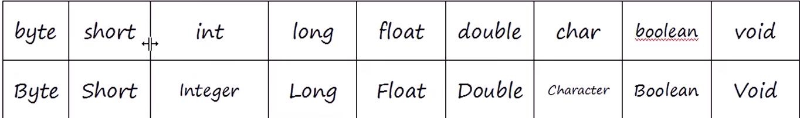

# 〇、Java基础补充

1. `final`关键字

* 修饰类

  该类不允许被继承

* 修饰方法

  该方法不允许被覆盖重写

* 修饰局部变量

  * 变量在第一次初始化赋值后，不允许再次修改数据
  * 如果是引用类型，则不能再次修改引用地址
  * `final`变量是引用类型时，引用类型的内部内容是可以修改的。

* 修饰成员变量

  * 成员修饰的成员变量，要么手动赋值，要么通过构造方法进行赋值
    * 必须保证所有类中所有重构构造方法都有对`final`成员变量进行赋值

2. 抽象方法

3. 抽象类

4. 内部类

   1. 成员内部类

      成员内部类看起来像是外部类的一个成员，可以使用private、public等访问限制符修饰。也可以使用static修饰。根据是否使用static，成员内部类分为：

      * 静态内部类

        使用static修饰的内部类称为静态内部类。并且只有内部类才能被声明为static，而外部类不可以。

        * 静态内部类不依赖于外围类的对象
        * 静态内部类不能使用外围类的非static成员和方法
        * 静态内部类允许有static属性、方法

        ```java
        public class Main {
        
            private int i;
            private static  int j = 10;
            public static void main(String[] args) {
                InnerClass innerClass = new InnerClass();//创建静态内部类对象
                innerClass.foo();
                Main.InnerClass.sayHello();//调用内部类静态方法
        
            }
            public static class InnerClass{
                static int j = Main.j;
                public static void sayHello(){
                    System.out.println("Hello!");
                }
                public void foo(){};
            }
        }
        ```

      * 非静态内部类

        由于**非静态内部类在编译完成后隐含地保存着一个外围类的对象的引用**

        * 非静态内部类可以访问外部类的所有信息（如果有重名，使用**外部类.this.变量/方法**的方式来调用外部类的变量或方法）
        * 创建内部类对象时，必须先使用外围类的对象来创建
        * 外围类可以访问成员内部类信息，但必须先创建一个内部类的对象，再使用这个对象来访问
        * **非静态内部类不能存在static的变量和方法**，可以存在某一些static final类型的常量（具体指的是编译期常量）

        ```java
        public class OutClass {
            private int a;
            private static int b;
            private class InterClass{
                private int innerA;
                void foo(){
                    OutClass.this.a = 10;//内部类访问外部类成员变量
                }
            }
            public OutClass(){
                InterClass ic = new InterClass();
                ic.innerA = 10;//外部类可以通过内部类对象访问内部类成员变量
            }
        
            public static void main(String[] args) {
                OutClass oc = new OutClass();
                OutClass.InterClass ic = oc.new InterClass();//创建非静态内部类对象需要通过外部类对象创建
            }
        }
        ```

   2. 局部内部类

      略

   3. 匿名内部类

      略

5. `abstract`

   * 抽象方法：

     `abstract`修饰，只有方法的定义，没有具体的实现；

   * 抽象类

     `abstract`修饰，包含抽象方法的类必须是抽象类，不能被示例化

# 一、Object

一个类所产生的的对象想要被克隆，那么这个类必须实现`Cloneable`接口。`Cloneable`接口中没有任何的方法和属性，仅仅用作一个标志。

1. `Clone()`方法产生了一个新对象，新对象的属性值和源对象一样。

   ```java
   public class Main implements Cloneable {
       int i;
       public static void main(String[] args) throws CloneNotSupportedException {
           Main main = new Main();
           Main m2 = (Main) main.clone();
           System.out.println(main.i == m2.i);//true
           System.out.println(main == m2);//false
       }
   }
   ```

   `Object`的`Clone()`方法受`protect`修饰，只能在**本类、子类、或者同包类**中使用。

   ```java
   public class Main implements Cloneable {
       int i;
       public static void main(String[] args) {
           Person p = new Person();
           Person p2 = p.clone();//报错
       }
   }
   
   class Person{
       int i;
   }
   ```

2. `finalize()` 通知GC进行垃圾回收

   > Java不允许手动回收垃圾的。

   **对GC仅仅是通知作用，GC不一定启动！**

3. 当直接打印对象时，实际上底层默认调用对象的`toString()`方法

# 二、String

1. 字符串类型比较相关问题

   （略）

   ```java
          String s1 = "ab";
          String s2 = new String("ab");
          String s3 = "a" + "b";
          String s4 = "a";
          s4 = s4 + "b";
           System.out.println(s1 == s2);//false
           System.out.println(s1 == s3);//true
           System.out.println(s1==s4);//false
   ```

2. 拼接两个字符串（`+`）

   * 两个字面量拼接，编译的时候会进行自动的计算优化

     ```java
     String s3 = "a" + "b";
     //String s3 = "ab";
     ```

   * 字符串使用`+`拼接时，底层实际是调用了`StringBuilder`中的`append()`方法。

     ```java
     		 String s4 = "a";
     //       s4 = s4 + "b";
     //       s4 = new StringBuilder(s4).append("b").toString();
     ```

   * 使用`StringBuilder`拼接字符串可以减少程序开销。

   * `StringBuilder`和`StringBuffer`中的方法签名一模一样，但是

     * `StringBuffer`是线程安全的
     * `StringBuilder`是线程不安全的

   * 将字符数组转换为`String`类型

     ```JAVA
     char[] charArr = {'我', '是', '咸', '鱼'};
     String str1 = new String(charArr);
     String str2 = new String(charArr, 2, 2);//咸鱼
     ```

   * `concat()`将指定的字符串连接到该字符串的末尾。

     ```java
         String str  = "This is a ";
         str = str.concat("String Object");
         System.out.println(str);
     ```
   
   * `contains()`判断字符串是否包含指定的子串
   
   * `endsWith()`判断后缀
   
   * `startsWith()`判断前缀
   
   * `getBytes()`将字符串转换为字节数组
   
     ```java
     String str = "Thi is a String Object";
     byte[] bytes = str.getBytes(StandardCharsets.UTF_8);//使用指定字符集编、解码
     str = new String(bytes, StandardCharsets.UTF_8);
     str.getBytes();
     ```
   
   * `indexof()` 获取字符串中指定元素第一次出现的下标
   
     找不到返回值为-1
   
     获取字符串中所有`i` 的下标
   
     ```java
     public static void main(String[] args) {
         String str  = "This is a ";
         str = str.concat("String Object");
         int res = -1;
         char[] chars = str.toCharArray();
         while ((res = str.indexOf('i', res + 1)) != -1){
             System.out.println(res + ": " + chars[res]);
         }
     }
     ```
   
   * `intern()`强制返回常量池中的值
   
     ```java
         public static void main(String[] args) {
             String str  = "This is a String Object";
             String str2 = new String(str);
             System.out.println(str == str2);//false
             System.out.println(str == str.intern());//true
         }
     ```
   
   * `isEmpty()`判断字符串是否为空
   
   * `replace()`
   
   * `subString()`从指定下标开始截取子字符串
   
     一般表示范围的时候，习惯上包头不包尾
   
   * `trim()`去除字符串前后空白字符
   
   * `String.valueof()`:
   
     对一个对象进行`valueof()`操作的时候，实际上调用了这个对象的`toString()`
   
     * 字符数组是一个例外
   
       ```java
       public static String valueOf(char data[]) {
           return new String(data);
       }
       ```
   
   # 三、Math
   
   最终类，针对基本类型提供基本的数学运算。
   
   （略）
   
   1. `Math.ceil()`向上取整
   
   2. `Math.floor()`:向下取整
   
   3. `Math.round()`:四舍五入
   
   4. `Math.E`:自然底数
   
   5. `Math.PI`:圆周率
   
   6. `Math.random()`:返回[0,1)的随机小数
   
   7. `BigDecimal`类
   
      精确存储和运算小数的类，要求参数以字符串形式传递。
   
   8. `BigInteger`
   
   # 四、包装类
   
   
   
   
   
   1. 自动装箱和封箱
   
      * 将基本类型的变量直接赋值给对应的引用类型的变量：自动装箱
   
      * 当进行自动封箱的时候，底层会调用默认当前类中的`valueOf()`方法进行封箱
   
        ```java
        int i  = 10;
        Integer integer = i;//Integer integer = Integer.valueOf(i);
        ```
   
   2. 自动拆箱
   
      * 将引用类型的对象直接赋值给了对应的基本类型的变量：自动拆箱
   
      * 当进行自动拆箱的时候，底层会默认调用对应对象身上的`***Value()`进行拆箱
   
        ```java
        Integer integer = new Integer(10);
        int i = integer;//i = integer.intValue();
        ```
   
   3. 对四种数值类型而言（Byte, Short,Integer,Long），`***.valueOf()`会进行缓存[-128-127]数值区间的对象
   
      ```java
      Integer i = 65;//Integer.valueOf(65)
      Integer i2 = 65;
      System.out.println(i == i2);//true, 值在[-128, 127]，对象被缓存
      Integer i3 = 128;
      Integer i4 = 128;
      System.out.println(i3 == i4);//false
      ```
   
   4. 调用包装类的`***.parse***()`方法，将字符串转换为与包装类对应的基本类型
   
      ```java
      int i = Integer.parseInt("231");
      double d = Double.parseDouble("3.45");
      ```
   
   5. hashCode
   
      对于八种包装类型的哈希码是固定的。
   
      字面量的哈希码是固定的。
   
      `null`的哈希码规定为0.
   
      所有字面量都是存储在运行时常量池的。
   
      * 常量池存储字面量和自定义常量。
   
   6. `Double.NAN`
   
      * 非数字
      * 唯一
      * 和任何值都不相等，包括自己本身
   
   7. 包装类型和基本类型进行运算的时候，会自动拆箱
   
      ```java
      Integer integer = new Integer(100);
      int i = 100;
      System.out.println(integer == i);//true
      ```