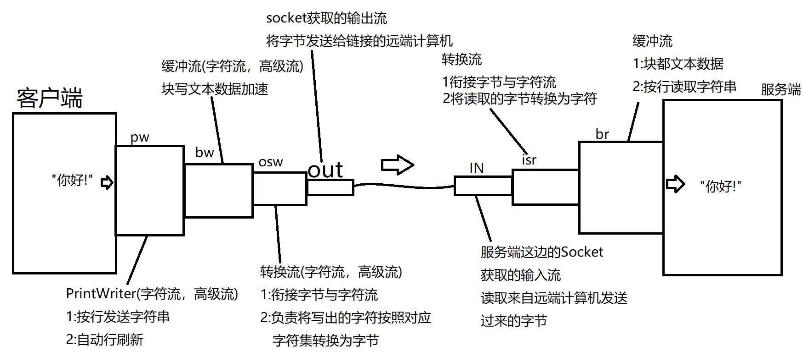
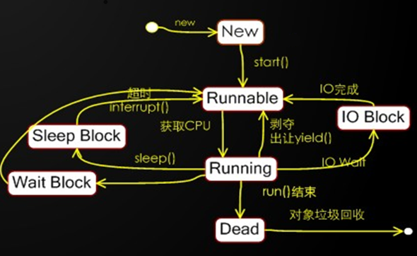

# 一、集合

## 1. List集

`java.util.List`接口,继承自Collection.

List集合是可重复集,并且有序,提供了一套可以通过下标操作元素的方法

常用实现类:

- `java.util.ArrayList`:内部使用数组实现,查询性能更好.
- `java.util.LinkedList`:内部使用链表实现,首尾增删元素性能更好.

### 1. List集合常见方法

1. `get()`与`set()`
   
   ```java
   package collection;
   
   import java.util.ArrayList;
   import java.util.List;
   
   /**
    *  List集合
    *  List是Collection下面常见的一类集合。
    *  java.util.List接口是所有List的接口，它继承自Collection。
    *  常见的实现类:
    *  java.util.ArrayList:内部由数组实现，查询性能更好。
    *  java.util.LinkedList:内部由链表实现，增删性能更好。
    *
    *  List集合的特点是:可以存放重复元素，并且有序。其提供了一套可以通过下标
    *  操作元素的方法。
    */
   public class ListDemo {
       public static void main(String[] args) {
           List<String> list = new ArrayList<>();
   //        List<String> list = new LinkedList<>();
   
           list.add("one");
           list.add("two");
           list.add("three");
           list.add("four");
           list.add("five");
   
           /*
               E get(int index)
               获取指定下标对应的元素
            */
           //获取第三个元素
           String e = list.get(2);
           System.out.println(e);
   
           for(int i=0;i<list.size();i++){
               e = list.get(i);
               System.out.println(e);
           }
   
           /*
               E set(int index,E e)
               将给定元素设置到指定位置，返回值为该位置原有的元素。
               替换元素操作
            */
           //[one,six,three,four,five]
           String old = list.set(1,"six");
           System.out.println(list);
           System.out.println("被替换的元素是:"+old);
       }
   }
   ```

2. 重载的`add()`和`remove()`
   
   ```java
   package collection;
   
   import java.util.ArrayList;
   import java.util.List;
   
   /**
    *  List subList(int start,int end)
    *  获取当前集合中指定范围内的子集。两个参数为开始与结束的下标(含头不含尾)
    */
   public class ListDemo3 {
       public static void main(String[] args) {
           List<Integer> list = new ArrayList<>();
           for(int i=0;i<10;i++){
               list.add(i);
           }
           System.out.println(list);
           //获取3-7这部分
           List<Integer> subList = list.subList(3,8);
           System.out.println(subList);
           //将子集每个元素扩大10倍
           for(int i=0;i<subList.size();i++){
               subList.set(i,subList.get(i) * 10);
           }
           //[30,40,50,60,70
           System.out.println(subList);
           /*
               对子集元素的操作就是对原集合对应元素的操作
            */
           System.out.println(list);
   
           //删除list集合中的2-8
           list.subList(2,9).clear();
           System.out.println(list);
   
       }
   }
   ```

3. `subList()`方法
   
   ```java
   package collection;
   
   import java.util.ArrayList;
   import java.util.List;
   
   /**
    *  List subList(int start,int end)
    *  获取当前集合中指定范围内的子集。两个参数为开始与结束的下标(含头不含尾)
    */
   public class ListDemo3 {
       public static void main(String[] args) {
           List<Integer> list = new ArrayList<>();
           for(int i=0;i<10;i++){
               list.add(i);
           }
           System.out.println(list);
           //获取3-7这部分
           List<Integer> subList = list.subList(3,8);
           System.out.println(subList);
           //将子集每个元素扩大10倍
           for(int i=0;i<subList.size();i++){
               subList.set(i,subList.get(i) * 10);
           }
           //[30,40,50,60,70
           System.out.println(subList);
           /*
               对子集元素的操作就是对原集合对应元素的操作
            */
           System.out.println(list);
   
           //删除list集合中的2-8
           list.subList(2,9).clear();
           System.out.println(list);
   
       }
   }
   ```

### 2. 集合的排序

`java.util.Collections`类: 

* Collections是集合的工具类,里面定义了很多静态方法用于操作集合.
1. `Collections.sort(List list)`方法
   
   可以对List集合进行自然排序(从小到大)
   
   ```java
   package collection;
   
   import java.util.ArrayList;
   import java.util.Collections;
   import java.util.List;
   import java.util.Random;
   
   /**
    * 集合的排序
    * 集合的工具类:java.util.Collections提供了一个静态方法sort,可以对List集合
    * 进行自然排序
    */
   public class SortListDemo1 {
       public static void main(String[] args) {
           List<Integer> list = new ArrayList<>();
           Random random = new Random();
           for(int i=0;i<10;i++){
               list.add(random.nextInt(100));
           }
           System.out.println(list);
           Collections.sort(list);
           System.out.println(list);
       }
   }
   ```

2. 排序自定义类型元素
   
   ```java
   package collection;
   
   import java.util.ArrayList;
   import java.util.Collections;
   import java.util.List;
   
   /**
    * 排序自定义类型元素
    */
   public class SortListDemo2 {
       public static void main(String[] args) {
           List<Point> list = new ArrayList<>();
           list.add(new Point(1,2));
           list.add(new Point(97,88));
           list.add(new Point(7,6));
           list.add(new Point(9,9));
           list.add(new Point(5,4));
           list.add(new Point(2,3));
           System.out.println(list);
           /*
               编译不通过的原因:
               Collections.sort(List list)该方法要求集合中的元素类型必须实现接口:
               Comparable,该接口中有一个抽象方法compareTo,这个方法用来定义元素之间比较
               大小的规则.所以只有实现了该接口的元素才能利用这个方法比较出大小进而实现排序
               操作.
            */
           Collections.sort(list);//编译不通过 compare比较  comparable可以比较的
           System.out.println(list);
       }
   }
   ```
   
   > 实际开发中,我们并不会让我们自己定义的类(如果该类作为集合元素使用)去实现Comparable接口,因为这对我们的程序有**侵入性**.
   > 
   > 侵入性:当我们调用某个API功能时,其要求我们为其修改其他额外的代码,这个现象就是侵入性.侵入性越强的API越不利于程序的后期可维护性.应当尽量避免.

3. 重载的`Collections.sort(List list,Comparator c)`方法
   
   ```java
   package collection;
   
   import java.util.ArrayList;
   import java.util.Collections;
   import java.util.Comparator;
   import java.util.List;
   
   /**
    * 排序自定义类型元素
    */
   public class SortListDemo2 {
       public static void main(String[] args) {
           List<Point> list = new ArrayList<>();
           list.add(new Point(1,2));
           list.add(new Point(97,88));
           list.add(new Point(7,6));
           list.add(new Point(9,9));
           list.add(new Point(5,4));
           list.add(new Point(2,3));
   
           System.out.println(list);
           /*
               Collections.sort(List list)在排序List集合时要求集合元素必须实现了
               Comparable接口。实现了该接口的类必须重写一个方法compareTo用与定义比较
               大小的规则，从而进行元素间的比较后排序。否则编译不通过。
   
               侵入性:
               当我们调用某个API时，其反过来要求我们为其修改其他额外的代码，这种现象就
               成为侵入性。侵入性不利于程序后期的维护，尽可能避免。
               compare:比较
            */
   //        Collections.sort(list);
   
            //匿名内部类的形式创建一个比较器
           Comparator<Point> com = new Comparator<Point>() {
               @Override
               /**
                * 实现比较器接口后必须重写方法compare.
                * 该方法用来定义参数o1与参数o2的比较大小规则
                * 返回值用来表示o1与o2的大小关系
                */
               public int compare(Point o1, Point o2) {
                   int len1 = o1.getX() * o1.getX() + o1.getY() * o1.getY();
                   int len2 = o2.getX() * o2.getX() + o2.getY() * o2.getY();
                   return len1-len2;
               }
           };
           Collections.sort(list,com);//回调模式
   
           System.out.println(list);
       }
   }
   ```

4. 最终没有侵入性的写法
   
   ```java
   package collection;
   
   import java.util.ArrayList;
   import java.util.Collections;
   import java.util.Comparator;
   import java.util.List;
   
   /**
    * 排序自定义类型元素
    */
   public class SortListDemo2 {
       public static void main(String[] args) {
           List<Point> list = new ArrayList<>();
           list.add(new Point(1,2));
           list.add(new Point(97,88));
           list.add(new Point(7,6));
           list.add(new Point(9,9));
           list.add(new Point(5,4));
           list.add(new Point(2,3));
   
           System.out.println(list);
           /*
               Collections.sort(List list)在排序List集合时要求集合元素必须实现了
               Comparable接口。实现了该接口的类必须重写一个方法compareTo用与定义比较
               大小的规则，从而进行元素间的比较后排序。否则编译不通过。
   
               侵入性:
               当我们调用某个API时，其反过来要求我们为其修改其他额外的代码，这种现象就
               称为侵入性。侵入性不利于程序后期的维护，尽可能避免。
               compare:比较
            */
   //        Collections.sort(list);
   
           //匿名内部类的形式创建一个比较器
   //        Comparator<Point> com = new Comparator<Point>() {
   //            @Override
   //            /**
   //             * 实现比较器接口后必须重写方法compare.
   //             * 该方法用来定义参数o1与参数o2的比较大小规则
   //             * 返回值用来表示o1与o2的大小关系
   //             */
   //            public int compare(Point o1, Point o2) {
   //                int len1 = o1.getX() * o1.getX() + o1.getY() * o1.getY();
   //                int len2 = o2.getX() * o2.getX() + o2.getY() * o2.getY();
   //                return len1-len2;
   //            }
   //        };
   //        Collections.sort(list,com);//回调模式
   
   //        Collections.sort(list,new Comparator<Point>() {
   //            public int compare(Point o1, Point o2) {
   //                int len1 = o1.getX() * o1.getX() + o1.getY() * o1.getY();
   //                int len2 = o2.getX() * o2.getX() + o2.getY() * o2.getY();
   //                return len1-len2;
   //            }
   //        });
   
           Collections.sort(list,(o1,o2)->
                   o1.getX() * o1.getX() + o1.getY() * o1.getY() -
                   o2.getX() * o2.getX() - o2.getY() * o2.getY()
           );
   
           System.out.println(list);
       }
   }
   ```

### 3. 小结

`List`集合有两个常用的实现类:

* `java.util.ArrayList`:内部使用数组实现，查询性能更好。

* `java.util.LinkedList`:内部使用链表实现，增删性能更好，首尾增删性能最佳。

性能没有苛刻要求时，通常使用`ArrayList`。

#### 常用方法

`E get(int index)`:获取指定下标index处对应的元素

`E set(int index, E e)`:将给定元素设置到index指定的位置，返回值为该位置被替换的元素。

`void add(int index,E e)`:将给定元素插入到index指定的位置

`E remove(int index)`:删除并返回下标index处对应的元素。

`List subList(int start,int end)`:获取当前集合中start到end之间的子集。(含头不含尾)

#### 集合与数组的互转操作

集合转换为数组，使用集合的toArray方法即可。

数组转换为集合，只能转换为List集合，使用的是Arrays.asList()方法。


# 二、File类

File类的每一个实例可以表示硬盘(文件系统)中的一个文件或目录(实际上表示的是一个抽象路径)

使用File可以做到:

- 访问其表示的文件或目录的属性信息,例如:名字,大小,修改时间等等
- 创建和删除文件或目录
- 访问一个目录中的子项

但是File不能访问文件数据.

```java
public class FileDemo {
    public static void main(String[] args) {
        //使用File访问当前项目目录下的demo.txt文件
        /*
            创建File时要指定路径，而路径通常使用相对路径。
            相对路径的好处在于有良好的跨平台性。
            "./"是相对路径中使用最多的，表示"当前目录"，而当前目录是哪里
            取决于程序运行环境而定，在idea中运行java程序时，这里指定的
            当前目录就是当前程序所在的项目目录。
         */
//        File file = new File("c:/xxx/xxx/xx/xxx.txt");
        File file = new File("./demo1.2.3.423.txt");
        //获取名字
        String name = file.getName();
        System.out.println(name);
        //获取文件大小(单位是字节)
        long len = file.length();
        System.out.println(len+"字节");
        //是否可读可写
        boolean cr = file.canRead();
        boolean cw = file.canWrite();
        System.out.println("是否可读:"+cr);
        System.out.println("是否可写:"+cw);
        //是否隐藏
        boolean ih = file.isHidden();
        System.out.println("是否隐藏:"+ih);
    }

}
```

## 1. 创建文件

`createNewFile()`方法，可以创建一个新文件

```java
package file;

import java.io.File;
import java.io.IOException;

/**
 * 使用File创建一个新文件
 */
public class CreateNewFileDemo {
    public static void main(String[] args) throws IOException {
        //在当前目录下新建一个文件:test.txt
        File file = new File("./test.txt");
        //boolean exists()判断当前File表示的位置是否已经实际存在该文件或目录
        if(file.exists()){
            System.out.println("该文件已存在!");
        }else{
            file.createNewFile();//将File表示的文件创建出来
            System.out.println("文件已创建!");
        }

    }
}
```

## 2.删除一个文件

`delete()`方法可以将File表示的文件删除.

```java
package file;

import java.io.File;

/**
 * 使用File删除一个文件
 */
public class DeleteFileDemo {
    public static void main(String[] args) {
        //将当前目录下的test.txt文件删除
        /*
            相对路径中"./"可以忽略不写，默认就是从当前目录开始的。
         */
        File file = new File("test.txt");
        if(file.exists()){
            file.delete();
            System.out.println("文件已删除!");
        }else{
            System.out.println("文件不存在!");
        }
    }
}
```

## 3.创建目录

`mkdir()`:创建当前File表示的目录

`mkdirs()`:创建当前File表示的目录，同时将所有不存在的父目录一同创建

```java
package file;

import java.io.File;

/**
 * 使用File创建目录
 */
public class MkDirDemo {
    public static void main(String[] args) {
        //在当前目录下新建一个目录:demo
//        File dir = new File("demo");
        File dir = new File("./a/b/c/d/e/f");

        if(dir.exists()){
            System.out.println("该目录已存在!");
        }else{
//            dir.mkdir();//创建目录时要求所在的目录必须存在
            dir.mkdirs();//创建目录时会将路径上所有不存在的目录一同创建
            System.out.println("目录已创建!");
        }
    }
}
```

## 4. 删除目录

`delete()`方法可以删除一个目录，但是只能删除空目录。

```java
package file;

import java.io.File;

/**
 * 删除一个目录
 */
public class DeleteDirDemo {
    public static void main(String[] args) {
        //将当前目录下的demo目录删除
        File dir = new File("demo");
//        File dir = new File("a");
        if(dir.exists()){
            dir.delete();//delete方法删除目录时只能删除空目录
            System.out.println("目录已删除!");
        }else{
            System.out.println("目录不存在!");
        }
    }
}
```

## 5.访问一个目录中所有子项

`listFiles`方法可以访问一个目录中的所有子项.

```java
package file;

import java.io.File;

/**
 * 访问一个目录中的所有子项
 */
public class ListFilesDemo1 {
    public static void main(String[] args) {
        //获取当前目录中的所有子项
        File dir = new File(".");
        /*
            boolean isFile()
            判断当前File表示的是否为一个文件
            boolean isDirectory()
            判断当前File表示的是否为一个目录
         */
        if(dir.isDirectory()){
            /*
                File[] listFiles()
                将当前目录中的所有子项返回。返回的数组中每个File实例表示其中的一个子项
             */
            File[] subs = dir.listFiles();
            System.out.println("当前目录包含"+subs.length+"个子项");
            for(int i=0;i<subs.length;i++){
                File sub = subs[i];
                System.out.println(sub.getName());
            }
        }
    }
}
```

## 6. 获取目录中符合特定条件的子项

重载的`listFiles`方法:`File[] listFiles(FileFilter)`

该方法要求传入一个文件过滤器，并仅将满足该过滤器要求的子项返回。

```java
package file;

import java.io.File;
import java.io.FileFilter;

/**
 * 重载的listFiles方法，允许我们传入一个文件过滤器从而可以有条件的获取一个目录
 * 中的子项。
 */
public class ListFilesDemo2 {
    public static void main(String[] args) {
        /*
            需求:获取当前目录中所有名字以"."开始的子项
         */
        File dir = new File(".");
        if(dir.isDirectory()){
//            FileFilter filter = new FileFilter(){//匿名内部类创建过滤器
//                public boolean accept(File file) {
//                    String name = file.getName();
//                    boolean starts = name.startsWith(".");//名字是否以"."开始
//                    System.out.println("过滤器过滤:"+name+",是否符合要求:"+starts);
//                    return starts;
//                }
//            };
//            File[] subs = dir.listFiles(filter);//方法内部会调用accept方法


            File[] subs = dir.listFiles(new FileFilter(){
                public boolean accept(File file) {
                    return file.getName().startsWith(".");
                }
            });
            System.out.println(subs.length);
        }
    }
}
```

## 7. 小结

常用构造器:

- `File(String pathname)`
- `File(File parent,String name)`可参考文档了解

### 常用方法

- `length()`：返回一个long值，表示占用的磁盘空间，单位为字节。
- `canRead()`：File表示的文件或目录是否可读
- `canWrite()`：File表示的文件或目录是否可写
- `isHidden()`：File表示的文件或目录是否为隐藏的
- `createNewFile()`：创建一个新文件，如果指定的文件所在的目录不存在会抛出异常`java.io.FileNotFoundException`
- `mkdir`：创建一个目录
- `mkdirs`：创建一个目录，并且会将所有不存在的父目录一同创建出来，推荐使用。
- `delete()`：删除当前文件或目录，如果目录不是空的则删除失败。
- `exists()`：判断File表示的文件或目录是否真实存在。true:存在 false:不存在
- `isFile()`：判断当前File表示的是否为一个文件。
- `isDirectory()`：判断当前File表示的是否为一个目录
- `listFiles()`：获取File表示的目录中的所有子项
- `listFiles(FileFilter filter)`：获取File表示的目录中满足filter过滤器要求的所有子项

# 三、Lambda表达式

JDK8之后,java支持了lambda表达式这个特性.

- lambda可以用更精简的代码创建匿名内部类.但是该匿名内部类实现的接口只能有一个抽象方法,否则无法使用!
- lambda表达式是编译器认可的,最终会将其改为内部类编译到class文件中

```java
package lambda;

import java.io.File;
import java.io.FileFilter;

/**
 * JDK8之后java支持了lambda表达式这个特性
 * lambda表达式可以用更精简的语法创建匿名内部类，但是实现的接口只能有一个抽象
 * 方法，否则无法使用。
 * lambda表达式是编译器认可的，最终会被改为内部类形式编译到class文件中。
 *
 * 语法:
 * (参数列表)->{
 *     方法体
 * }
 */
public class LambdaDemo {
    public static void main(String[] args) {
        //匿名内部类形式创建FileFilter
        FileFilter filter = new FileFilter() {
            public boolean accept(File file) {
                return file.getName().startsWith(".");
            }
        };

        FileFilter filter2 = (File file)->{
            return file.getName().startsWith(".");
        };

        //lambda表达式中参数的类型可以忽略不写
        FileFilter filter3 = (file)->{
            return file.getName().startsWith(".");
        };

        /*
            lambda表达式方法体中若只有一句代码，则{}可以省略
            如果这句话有return关键字，那么return也要一并省略!
         */
        FileFilter filter4 = (file)->file.getName().startsWith(".");
    }
}
```

# 四、JAVA IO

- java io可以让我们用标准的读写操作来完成对不同设备的读写数据工作.
- java将IO按照方向划分为输入与输出,参照点是我们写的程序.
- 输入:用来读取数据的,是从外界到程序的方向,用于获取数据.
- 输出:用来写出数据的,是从程序到外界的方向,用于发送数据.

java将IO比喻为"流",即:stream. 就像生活中的"电流","水流"一样,它是以同一个方向顺序移动的过程.只不过这里流动的是字节(2进制数据).所以在IO中有输入流和输出流之分,我们理解他们是连接程序与另一端的"管道",用于获取或发送数据到另一端.

**Java定义了两个超类(抽象类):**

- `java.io.InputStream`:所有字节输入流的超类,其中定义了读取数据的方法.因此将来不管读取的是什么设备(连接该设备的流)都有这些读取的方法,因此我们可以用相同的方法读取不同设备中的数据
- `java.io.OutputStream`:所有字节输出流的超类,其中定义了写出数据的方法.

**java将流分为两类:节点流与处理流:**

- 节点流:也称为低级流.节点流的另一端是明确的,是实际读写数据的流,读写一定是建立在节点流基础上进行的.

- 处理流:也称为高级流.处理流不能独立存在,必须连接在其他流上,目的是当数据流经当前流时对数据进行加工处理来简化我们对数据的该操作.
  
  **实际应用中,我们可以通过串联一组高级流到某个低级流上以流水线式的加工处理对某设备的数据进行读写,这个过程也成为流的连接,这也是IO的精髓所在.**

## 1. 文件流

文件流是一对低级流,用于读写文件数据的流.用于连接程序与文件(硬盘)的"管道".负责读写文件数据.

### 1. 文件输出流: java.io.FileOutputStream

```java
package io;

import java.io.File;
import java.io.FileNotFoundException;
import java.io.FileOutputStream;
import java.io.IOException;
public class FOSDemo {
    public static void main(String[] args) throws IOException {
        //需求:向当前目录的文件fos.dat中写入数据
        /*
            在创建文件输出流时，文件输出流常见的构造器:
            FileOutputStream(String filename)
            FileOutputStream(File file)
            上述两种构造器都会在创建时将该文件创建出来(如果该文件不存在才会这样做)，
            自动创建该文件的前提是该文件所在的目录必须存在，否则会抛出异常。
         */
        //        File file = new File("./fos.dat");
        //        FileOutputStream fos = new FileOutputStream(file);
        /*
            一个小技巧:在指定相对路径时，如果是从"当前目录"(./)开始的,那么"./"是可以忽略不写的
                      因为在相对路径中，默认就是从"./"开始
         */
//        FileOutputStream fos = new FileOutputStream("./fos.dat");
        FileOutputStream fos = new FileOutputStream("fos.dat");//与上面一句位置相同

        /*
            OutputStream(所有字节输出流的超类)中定义了写出字节的方法:

            其中:
            void write(int d)
            写出一个字节，将给定的参数int值对应的2进制的"低八位"写出。

            文件输出流继承OutputStream后就重写了该方法，作用是将该字节写入到文件中。
         */

        /*
            向文件中写入1个字节
            fow.write(1)
            将int值的1对应的2进制的"低八位"写如到文件第一个字节位置上

            1个int值占4个字节，每个字节是一个8为2进制
            int 1的2进制样子:
            00000000 00000000 00000000 00000001
                                       ^^^^^^^^
                                       写出的字节

            write方法调用后,fos.dat文件中就有了1个字节，内容为:
            00000001

            再次调用:
            fos.write(5)
            int 5的2进制样子:
            00000000 00000000 00000000 00000101
                                       ^^^^^^^^
                                       写出的字节
            write方法调用后,fos.dat文件中就有了2个字节，内容为:
            00000001 00000101
            上次写的   本次写的
         */

        fos.write(1);
        fos.write(5);

        System.out.println("写出完毕!");
        //注意！流使用完毕后要关闭，来释放底层资源
        fos.close();
    }
}
```

### 2. 文件输入流

```java
package io;

import java.io.FileInputStream;
import java.io.FileNotFoundException;
import java.io.IOException;

/**
 * 使用文件输入流读取文件中的数据
 */
public class FISDemo {
    public static void main(String[] args) throws IOException {
        //将fos.dat文件中的字节读取回来
        /*
            fos.dat文件中的数据:
            00000001 00000010
         */
        FileInputStream fis = new FileInputStream("fos.dat");
        /*
            java.io.InputStream(所有字节输入流的超类)定义着读取字节的相关方法
            int read()
            读取1个字节并以int型整数返回读取到的字节内容，返回的int值中对应的2进制的"低八位"就是读取到的数据。
            如果返回的int值为整数-1(这是一个特殊值，32位2进制全都是1)表达的是流读取到了末尾了。

            int read(byte[] data)

            文件输入流重写了上述两个方法用来从文件中读取对应的字节。
         */

        /*
             fos.dat文件中的数据:
             00000001 00000010
             ^^^^^^^^
           第一次读取的字节

             当我们第一次调用:
             int d = fis.read();//读取的是文件中第一个字节

             该int值d对应的2进制:
             00000000 00000000 00000000 00000001
             |------自动补充24个0-------| ^^^^^^^^
                                        读取到的数据
             而该2进制对应的整数就是1.
         */
        int d = fis.read();//读取到的就是整数1
        System.out.println(d);
        /*
            fos.dat文件中的数据:
             00000001 00000010
                      ^^^^^^^^
                     第二次读取的字节

             当我们第二次调用:
             d = fis.read();//读取的是文件中第二个字节

             该int值d对应的2进制:
             00000000 00000000 00000000 00000010
             |------自动补充24个0-------| ^^^^^^^^
                                        读取到的数据
             而该2进制对应的整数就是2.
         */
        d = fis.read();//2
        System.out.println(d);

        /*
            fos.dat文件中的数据:
             00000001 00000010 文件末尾
                               ^^^^^^^^
                              没有第三个字节

             当我们第三次调用:
             d = fis.read();//读取到文件末尾了!

             该int值d对应的2进制:
             11111111 11111111 11111111 11111111
             该数字是正常读取1个字节永远表达不了的值。并且-1的2进制格式好记。因此用它表达读取
             到了末尾。

         */
        d = fis.read();//-1
        System.out.println(d);

        fis.close();
    }
}
```

### 3. 文件复制

```java
package io;

import java.io.FileInputStream;
import java.io.FileOutputStream;
import java.io.IOException;

/**
 * 利用文件输入流与输出流实现文件的复制操作
 */
public class CopyDemo {
  public static void main(String[] args) throws IOException {
    //用文件输入流读取待复制的文件
//        FileInputStream fis = new FileInputStream("image.jpg");
    FileInputStream fis = new FileInputStream("01.rmvb");
    //用文件输出流向复制文件中写入复制的数据
//        FileOutputStream fos = new FileOutputStream("image_cp.jpg");
    FileOutputStream fos = new FileOutputStream("01_cp.rmvb");
        /*
            原文件image.jpg中的数据
            10100011 00111100 00001111 11110000....
            ^^^^^^^^
            读取该字节

            第一次调用:
            int d = fis.read();
            d的2进制:00000000 00000000 00000000 10100011
                                               读到的字节


            fos向复制的文件image_cp.jpg中写入字节

            第一次调用:
            fos.write(d);
            作用:将给定的int值d的2进制的"低八位"写入到文件中
            d的2进制:00000000 00000000 00000000 10100011
                                               写出字节
            调用后image_cp.jpg文件数据:
             10100011
         */
        /*
            循环条件是只要文件没有读到末尾就应该复制
            如何直到读取到末尾了呢?
            前提是:要先尝试读取一个字节，如果返回值是-1就说明读到末尾了
            如果返回值不是-1，则说明读取到的是一个字节的内容，就要将他写入到复制文件中
         */
    int d;//先定义一个变量，用于记录每次读取到的数据
    long start = System.currentTimeMillis();//获取当前系统时间
    while ((d = fis.read()) != -1) {
      fos.write(d);
    }
    long end = System.currentTimeMillis();
    System.out.println("复制完毕!耗时:" + (end - start) + "ms");
    fis.close();
    fos.close();
  }
}
```

### 4. 块读写的文件复制操作

`int read(byte[] data) `一次性从文件中读取给定的字节数组总长度的字节量，并存入到该数组中。 返回值为实际读取到的字节量。若返回值为-1则表示读取到了文件末尾。

块写操作`void write(byte[] data) `一次性将给定的字节数组所有字节写入到文件中

`void write(byte[] data,int offset,int len) `一次性将给定的字节数组从下标`offset`处开始的连续len个字节写入文件.

```java
package io;

import java.io.FileInputStream;
import java.io.FileOutputStream;
import java.io.IOException;

/**
 * 通过提高每次读写的数据，减少读写次数可以提高读写效率。
 */
public class CopyDemo2 {
  public static void main(String[] args) throws IOException {
    FileInputStream fis = new FileInputStream("01.rmvb");
    FileOutputStream fos = new FileOutputStream("01_cp.rmvb");
        /*
            块读:一次性读取一组字节
            块写:一次性将写出一组字节

            java.io.InputStream上定义了块读字节的方法:
            int read(byte[] data)
            一次性读取给定字节数组length个字节并从头开始装入到数组中。返回值为实际读取到的字节量
            如果返回值为-1则表示流读取到了末尾。
            文件流重写了该方法，作用是块读文件里的数据。

            java.io.OutputStream上定义了块写字节的方法:
            void write(byte[] data)
            一次性将给定的字节数组中所有的字节写出。

            void write(byte[] data,int offset,int len)
            一次性将给定的字节数组data中从下标offset处开始的连续len个字节写出。


            原文件数据(假设文件共6个字节):
            11110000 00001111 01010101 11111111 00000000 10101010

            byte[] buf = new byte[4];//创建一个长度为4的字节数组
            buf默认的样子(每个元素若以2进制表现):{00000000,00000000,00000000,00000000}
            int len;//记录每次实际读取的字节数

            当第一次调用:
            len = fis.read(buf);
            由于字节数组buf的长度为4.因此可以一次性最多从文件中读取4个字节并装入到buf数组中
            返回值len表示的整数是这次实际读取到了几个字节。

            原文件数据(假设文件共6个字节):
            11110000 00001111 01010101 11111111 00000000 10101010
            ^^^^^^^^ ^^^^^^^^ ^^^^^^^^ ^^^^^^^^
                     第一次读取的4个字节

            buf:{11110000，00001111，01010101，11111111}
            len:4 表示本次读取到了4个字节


            第二次调用:
            len = fis.read(buf);

            原文件数据(假设文件共6个字节):
            11110000 00001111 01010101 11111111 00000000 10101010 文件末尾了
                                                ^^^^^^^^ ^^^^^^^^ ^^^^^^^^ ^^^^^^^^
                                                本次实际只能读取到2个字节
            buf:{00000000，10101010，01010101，11111111}
                 |本次新读的2字节数据| |---上次的旧数据---|
            len:2表示本次实际只读取到了2个字节。它的意义就是告诉你buf数组中前几个字节是本次真实
                读取到的数据


            第三次调用:
            len = fis.read(buf);
            原文件数据(假设文件共6个字节):
            11110000 00001111 01010101 11111111 00000000 10101010 文件末尾了
                                                                  ^^^^^^^^ ^^^^^^^^ ^^^^^^^^ ^^^^^^^^
            buf:{00000000，10101010，01010101，11111111} 没有任何变化!
            len:-1 表示本次读取时已经是文件末尾了!!
         */
        /*
            00000000 8位2进制 1byte  1字节
            1024byte = 1kb
            1024kb = 1mb
            1024mb = 1gb
            1024gb = 1tb
         */
        /*
            编译完该句代码:byte[] buf = new byte[10240];

            在实际开发中，有时候用一个计算表达式更能表现这个值的含义时，我们不妨使用计算表达式
            long t = 864000000;
            long t = 60 * 60 * 24 * 1000;

         */
    byte[] buf = new byte[1024 * 10];//10kb
    int len;//记录每次实际读取到的字节数
    long start = System.currentTimeMillis();
    while ((len = fis.read(buf)) != -1) {
      fos.write(buf, 0, len);
    }
    long end = System.currentTimeMillis();
    System.out.println("复制完毕,耗时:" + (end - start) + "ms");
    fis.close();
    fos.close();
  }
}
```

### 5. 写文本数据

String提供方法: `byte[] getBytes(String charsetName) `将当前字符串转换为一组字节

参数为字符集的名字，常用的是UTF-8。 其中中文字3字节表示1个，英文1字节表示1个。

```java
package io;

import java.io.FileNotFoundException;
import java.io.FileOutputStream;
import java.io.IOException;
import java.nio.charset.StandardCharsets;

/**
 * 使用文件输出流向文件中写入文本数据
 */
public class WriteStringDemo {
    public static void main(String[] args) throws IOException {
        /*
            1:创建一个文件输出流
            2:将写出的文字先转换为2进制(一组字节)
            3:关闭流

            文件流有两种创建方式:
            1:覆盖模式，对应的构造器:
              FileOutputStream(String filename)
              FileOutputStream(File file)
              所谓覆盖模式:文件流在创建是若发现该文件已存在，则会将该文件原内容全部删除。然后
              在陆续将通过该流写出的内容保存到文件中。        
         */
        FileOutputStream fos = new FileOutputStream("fos.txt",true);
        String line = "让我再看你一遍，从南到北。";
        /*
            String提供了将内容转换为一组字节的方法:getBytes()
            java.nio.charset.StandardCharsets
         */
        byte[] data = line.getBytes(StandardCharsets.UTF_8);
        fos.write(data);

        line = "像是北五环路蒙住的双眼。";
        data = line.getBytes(StandardCharsets.UTF_8);
        fos.write(data);       

        System.out.println("写出完毕!");
        fos.close();
    }
}
```

### 6.文件输出流-追加模式

重载的构造方法可以将文件输出流创建为追加模式

- `FileOutputStream(String path,boolean append)`
- `FileOutputStream(File file,boolean append)`

当第二个参数传入true时，文件流为追加模式，即:指定的文件若存在，则原有数据保留，新写入的数据会被顺序的追加到文件中

```java
package io;

import java.io.FileNotFoundException;
import java.io.FileOutputStream;
import java.io.IOException;
import java.nio.charset.StandardCharsets;

/**
 * 使用文件输出流向文件中写入文本数据
 */
public class WriteStringDemo {
    public static void main(String[] args) throws IOException {
        /*
            1:创建一个文件输出流
            2:将写出的文字先转换为2进制(一组字节)
            3:关闭流

            文件流有两种创建方式:
            1:覆盖模式，对应的构造器:
              FileOutputStream(String filename)
              FileOutputStream(File file)
              所谓覆盖模式:文件流在创建是若发现该文件已存在，则会将该文件原内容全部删除。然后
              在陆续将通过该流写出的内容保存到文件中。

            2:追加模式，对应的构造器
              FileOutputStream(String filename,boolean append)
              FileOutputStream(File file,boolean append)
              当第二个参数为true时，那么就是追加模式。
              所谓追加模式:文件流在创建时若发现该文件已存在，则原内容都保留。通过当前流陆续写出
              的内容都会被陆续追加到文件末尾。
         */
        FileOutputStream fos = new FileOutputStream("fos.txt",true);

        String line = "斯国一!";
        byte[] data = line.getBytes(StandardCharsets.UTF_8);
        fos.write(data);

        line = "奥里给!";
        data = line.getBytes(StandardCharsets.UTF_8);
        fos.write(data);


        System.out.println("写出完毕!");
        fos.close();
    }
}
```

### 7. 读取文本数据

```java
package io;

import java.io.FileInputStream;
import java.io.FileNotFoundException;
import java.io.IOException;
import java.nio.charset.StandardCharsets;

/**
 * 从文件中读取文本数据
 */
public class ReadStringDemo {
    public static void main(String[] args) throws IOException {
        /*
            1:创建一个文件输入流
            2:从文件中将字节都读取回来
            3:将读取到的字节转换回字符串
         */
        FileInputStream fis = new FileInputStream("fos.txt");

        byte[] data = new byte[1024];//1kb
        int len = fis.read(data);//块读操作，返回值表达实际读取到了多少字节
        System.out.println("实际读取了:"+len+"个字节");
        /*
            String提供了构造方法可以将一个字节数组还原为字符串
            String(byte[] data,Charset charset)
            将给定的字节数组data中所有字节按照给定的字符集转换为字符串。

            String(byte[] data,int offset,int len,Charset charset)
            将给定的字节数组data从下标offset处开始的连续len个字节按照指定的字符集转换为字符串
         */
        String line = new String(data,0,len,StandardCharsets.UTF_8);
        System.out.println(line.length());//输出字符串长度
        System.out.println(line);

        fis.close();
    }
}
```

## 2. 高级流

### 1.流连接示意图


### 2. 缓冲流

`java.io.BufferedOutputStream和BufferedInputStream.`

缓冲流是一对高级流,作用是提高读写数据的效率.

缓冲流内部有一个字节数组,默认长度是8K.缓冲流读写数据时一定是将数据的读写方式转换为块读写来保证读写效率.

1. 使用缓冲流完成文件复制操作

   

   ```java
   package io;
   
   import java.io.*;
   
   /**
    * java将流分为节点流与处理流两类
    * 节点流:也称为低级流，是真实连接程序与另一端的"管道",负责实际读写数据的流。
    *       读写一定是建立在节点流的基础上进行的。
    *       节点流好比家里的"自来水管"。连接我们的家庭与自来水厂，负责搬运水。
    * 处理流:也称为高级流，不能独立存在，必须连接在其他流上，目的是当数据经过当前流时
    *       对其进行某种加工处理，简化我们对数据的同等操作。
    *       高级流好比家里常见的对水做加工的设备，比如"净水器"，"热水器"。
    *       有了它们我们就不必再自己对水进行加工了。
    * 实际开发中我们经常会串联一组高级流最终连接到低级流上，在读写操作时以流水线式的加工
    * 完成复杂IO操作。这个过程也称为"流的连接"。
    *
    * 缓冲流，是一对高级流，作用是加快读写效率。
    * java.io.BufferedInputStream和java.io.BufferedOutputStream
    *
    */
   public class CopyDemo3 {
       public static void main(String[] args) throws IOException {
           FileInputStream fis = new FileInputStream("ppt.pptx");
           BufferedInputStream bis = new BufferedInputStream(fis);
           FileOutputStream fos = new FileOutputStream("ppt_cp.pptx");
           BufferedOutputStream bos = new BufferedOutputStream(fos);
           int d;
           long start = System.currentTimeMillis();
           while((d = bis.read())!=-1){//使用缓冲流读取字节
               bos.write(d);//使用缓冲流写出字节
           }
           long end = System.currentTimeMillis();
           System.out.println("耗时:"+(end-start)+"ms");
           bis.close();//关闭流时只需要关闭高级流即可，它会自动关闭它连接的流
           bos.close();
       }
   }
   ```

2. 缓冲输出流写出数据时的缓冲区问题

   通过缓冲流写出的数据会被临时存入缓冲流内部的字节数组,直到数组存满数据才会真实写出一次。

   ```java
   package io;
   
   import java.io.BufferedOutputStream;
   import java.io.FileNotFoundException;
   import java.io.FileOutputStream;
   import java.io.IOException;
   import java.nio.charset.StandardCharsets;
   
   /**
    * 缓冲输出流写出数据的缓冲区问题
    */
   public class BOS_FlushDemo {
       public static void main(String[] args) throws IOException {
           FileOutputStream fos = new FileOutputStream("bos.txt");
           BufferedOutputStream bos = new BufferedOutputStream(fos);
   
           String line = "奥里给!";
           byte[] data = line.getBytes(StandardCharsets.UTF_8);
           bos.write(data);
           System.out.println("写出完毕!");
           /*
               缓冲流的flush方法用于强制将缓冲区中已经缓存的数据一次性写出。
               注:该方法实际上实在字节输出流的超类OutputStream上定义的，并非只有缓冲输出流有这个方法。但是实际上只有缓冲输出流的该方法有实际意义，其他的流实现
               该方法的目的仅仅是为了在流连接过程中传递flush动作给缓冲输出流。
            */
           bos.flush();//冲
   
           bos.close();
   
       }
   }
   ```

### 3. 对象流

`java.io.ObjectOutputStream和ObjectInputSteam`

对象流是一对高级流，在流连接中的作用是进行对象的序列化与反序列化。

对象序列化:将一个java对象按照其结构转换为一组字节的过程

对象反序列化:将一组字节还原为java对象(前提是这组字节是一个对象序列化得到的字节)

对象序列化的流连接操作原理图：


```java
package io;

import java.io.FileNotFoundException;
import java.io.FileOutputStream;
import java.io.IOException;
import java.io.ObjectOutputStream;

/**
 * 对象流(是一对高级流)
 * java.io.ObjectInputStream和ObjectOutputStream
 * 对象流在流连接中的作用是进行对象的序列化与反序列化
 * 其中对象输出流负责对象序列化。对象输入流负责对象反序列化
 *
 * 所谓对象序列化:
 * 将写出的对象按照其结构转换为一组字节的过程。
 */
public class OOSDemo {
    public static void main(String[] args) throws IOException {
        String name = "苍老师";
        int age = 55;
        String gender = "男";
        String[] otherInfo = {"摄影技术一流","喜欢拍片儿","是一名技术老师"};
        //将该Person对象写入文件person.obj中
        Person p = new Person(name,age,gender,otherInfo);

        FileOutputStream fos = new FileOutputStream("person.obj");
        ObjectOutputStream oos = new ObjectOutputStream(fos);
        /*
            对象输出流提供了一个直接写出对象的方法(进行对象序列化的操作)
            void writeObject(Object obj)

            序列化时可能出现异常：
            java.io.NotSerializableException: io.Person
            注:冒号后面的io.Person是指序列化的就是这个类的实例出现的错误
            原因:
            对象输出流在进行序列化对象时，要求该对象所属的类必须实现接口:java.io.Serializable接口
            并且该类中所有引用类型属性也必须实现该接口，否则会抛出上述异常。

         */
        oos.writeObject(p);
        System.out.println("写出完毕!");
        oos.close();
    }
}
```

对象反序列化：

```java
package io;

import java.io.FileInputStream;
import java.io.FileNotFoundException;
import java.io.IOException;
import java.io.ObjectInputStream;

/**
 * 使用对象输入流完成对象的反序列化
 */
public class OISDemo {
    public static void main(String[] args) throws IOException, ClassNotFoundException {
        //从person.obj文件中将对象反序列化回来
        FileInputStream fis = new FileInputStream("person.obj");
        ObjectInputStream ois = new ObjectInputStream(fis);
        /*
            Object readObject()
            该方法会进行对象的反序列化，如果对象流通过其连接的流读取的字节分析并非
            是一个java对象时，会抛出异常:ClassNotFoundException
         */
        Person p = (Person)ois.readObject();
        System.out.println(p);
    }
}
```

需要进行序列化的类必须实现接口:`java.io.Serializable` 实现序列化接口后最好主动定义序列化版本号这个常量。 这样一来对象序列化时就不会根据类的结构生成一个版本号,而是使用该固定值。 那么反序列化时，只要还原的对象和当前类的版本号一致就可以进行还原。

`transient`关键字可以修饰属性，用于在进行对象序列化时忽略不必要的属性，达到对象瘦身的目的

```java
package io;

import java.io.Serializable;
import java.util.Arrays;

/**
 * 使用当前类实例测试对象流的读写操作
 */
public class Person implements Serializable {
    public static final long serialVersionUID = 1L;
    private String name;//姓名
    private int age;//年龄
    private String gender;//性别
    private String[] otherInfo;//其他信息

    public Person(String name, int age, String gender, String[] otherInfo) {
        this.name = name;
        this.age = age;
        this.gender = gender;
        this.otherInfo = otherInfo;
    }

    public String getName() {
        return name;
    }

    public void setName(String name) {
        this.name = name;
    }

    public int getAge() {
        return age;
    }

    public void setAge(int age) {
        this.age = age;
    }

    public String getGender() {
        return gender;
    }

    public void setGender(String gender) {
        this.gender = gender;
    }

    public String[] getOtherInfo() {
        return otherInfo;
    }

    public void setOtherInfo(String[] otherInfo) {
        this.otherInfo = otherInfo;
    }

    @Override
    public String toString() {
        return "Person{" +
                "name='" + name + '\'' +
                ", age=" + age +
                ", gender='" + gender + '\'' +
                ", otherInfo=" + Arrays.toString(otherInfo) +
                '}';
    }
}
```

## 3.字符流和转换流

### 1. 字符流

- java将流按照读写单位划分为字节流与字符流.
- `java.io.InputStream`和`OutputStream`是所有字节流的超类
- 而`java.io.Reader和Writer`则是所有字符流的超类,它们和字节流的超类是平级关系.
- `Reader`和`Write`是两个抽象类,里面规定了所有字符流都必须具备的读写字符的相关方法.
- 字符流最小读写单位为字符(char),但是底层实际还是读写字节,只是字符与字节的转换工作由字符流完成.

### 2. 转换流

`java.io.InputStreamReader`和`OutputStreamWriter`

它们是字符流非常常用的一对实现类同时也是一对高级流,实际开发中我们不直接操作它们,但是它们在流连接中是非常重要的一环.

1. 使用转换输出流向文件中写入文本数据

   

   ```java
   package io;
   
   import java.io.*;
   import java.nio.charset.StandardCharsets;
   
   /**
    * 字符流是以字符为最小单位(char)读写数据的。
    * 注:底层实际还是读写字节，只不过字符与字节的转换由字符流自动完成了。
    * 由于字符流最小读写单位为字符，因此字符流【只适合读写文本数据】
    *
    * 转换流(是一对高级流，同时是一对字符流)
    * 作用:
    * 1:衔接字节流与其他字符流
    * 2:将字符与字节相互转换
    * 实际开发中我们不会直接使用这一对流，但是在流连接中它是重要的一环。
    */
   public class OSWDemo {
       public static void main(String[] args) throws IOException {
           /*
               使用这一对流演示转换流的读写字符方法
   
               java.io.Writer所有字符输出流的超类上，定义了写出字符的相关方法
               void write(int d)写出一个字符，实际传入的应当是一个char。
               void write(char[] data)
               void write(char[] data,int offset,int len)
               void write(String str) 直接写出一个字符串
            */
           FileOutputStream fos = new FileOutputStream("osw.txt");
           OutputStreamWriter osw = new OutputStreamWriter(fos,StandardCharsets.UTF_8);
   
           String line = "如果你突然打了个喷嚏，那一定就是我在想你。";
           osw.write(line);//转换流的write(String str)会将写出的字符串转换为字节然后写出
           osw.write("如果半夜被手机吵醒，那一定就是我关心。");
           System.out.println("写出完毕!");
           osw.close();
       }
   }
   ```

2. 使用转换输入流读取文本文件

   ```java
   package io;
   
   import java.io.*;
   
   /**
    * 转换字符输入流
    * 可以将读取的字节按照指定的字符集转换为字符
    */
   public class ISRDemo {
       public static void main(String[] args) throws IOException {
           //将osw.txt文件中的所有文字读取回来.
           FileInputStream fis = new FileInputStream("osw.txt");
           InputStreamReader isr = new InputStreamReader(fis,"UTF-8");
           /*
               字符流读一个字符的read方法定义:
               int read()
               读取一个字符,返回的int值实际上表示的是一个char(低16位有效).如果返回的
               int值表示的是-1则说明EOF
            */
           //测试读取文件中第一个字
   //        int d = isr.read();
   //        char c = (char)d;
   //        System.out.println(c);
   
           //循环将文件所有字符读取回来
           int d;
           while((d = isr.read()) != -1){
               System.out.print((char)d);
           }
           isr.close();
       }
   }
   ```

3. 转换流的意义:

   实际开发中我们还有功能更好用的字符高级流.但是其他的字符高级流都有一个共通点:不能直接连接在字节流上.而实际操作设备的流都是低级流同时也都是字节流.因此不能直接在流连接中串联起来.转换流是一对可以连接在字节流上的字符流,其他的高级字符流可以连接在转换流上.在流连接中起到"转换器"的作用(负责字符与字节的实际转换)

### 3. 缓冲字符流

1. 缓冲字符输出流`java.io.PrintWriter`

   `java.io.BufferedWriter和BufferedReader`缓冲字符流内部也有一个缓冲区,读写文本数据以块读写形式加快效率.并且缓冲流有一个特别的功能:可以按行读写文本数据.

   `java.io.PrintWriter`具有自动行刷新的缓冲字符输出流,实际开发中更常用.它内部总是会自动连接`BufferedWriter`作为块写加速使用.

   

   ```java
   package io;
   
   import java.io.FileNotFoundException;
   import java.io.FileOutputStream;
   import java.io.PrintWriter;
   import java.io.UnsupportedEncodingException;
   
   /**
    * 缓冲字符流(是一对高级流)
    * java.io.BufferedWriter和BufferedReader
    * 缓冲流内部维护一个char数组，默认长度8k.以块读写方式读写字符数据保证效率
    *
    * java.io.PrintWriter则是具有自动行刷新的换成字符输出流(实际缓冲功能是靠BufferedWriter
    * 实现的，它内部总是连接着这个流。)
    *
    * 使用缓冲字符流后就可以实现按行读写字符串，并且读写效率高。
    */
   public class PWDemo1 {
       public static void main(String[] args) throws FileNotFoundException, UnsupportedEncodingException {
           //按行向文件pw.txt中写入字符串
           /*
               PrintWriter继承自Writer.
               它提供很多构造方法，其中就有可以直接对文件进行写操作的构造器
               PrintWriter(File file)
               PrintWriter(String filename)
            */
   //        PrintWriter pw = new PrintWriter("pw.txt");
           /*
               这里可以按照指定的字符集写出字符串到文本文件中。但是字符集只能以字符串形式
               表达。因此注意拼写。字符集不区分大小写。
               但是如果字符集名字拼写错误，会抛出异常:
               UnsupportedEncodingException
               不支持的    字符集    异常
            */
           PrintWriter pw = new PrintWriter("pw.txt","UTF-8");
           /*
               println()方法是输出字符出后带上换行符
               print()方法输出字符串后不带换行符
            */
           pw.println("夜空中最亮的星，能否听清。");
           pw.println("那仰望的人，心底的孤独和叹息。");
           System.out.println("写出完毕!");
           pw.close();
   
       }
   }
   
   ```

   在流链接中使用`PrintWriter`

   ```java
   package com.tedu.myfirstspringboot.Controller;
   
   import com.tedu.myfirstspringboot.Entity.Article;
   import org.springframework.stereotype.Controller;
   import org.springframework.web.bind.annotation.RequestMapping;
   
   import javax.servlet.http.HttpServletRequest;
   import javax.servlet.http.HttpServletResponse;
   import java.io.File;
   import java.io.FileOutputStream;
   import java.io.IOException;
   import java.io.ObjectOutputStream;
   
   @Controller
   public class ArticleController {
       public static File fileDir;
       static {
           fileDir = new File("./article");
           if(!fileDir.exists()){
               fileDir.mkdirs();
           }
       }
       @RequestMapping("/writeArticle")
       public void writerArticle(HttpServletRequest request, HttpServletResponse response){
           String title = request.getParameter("title");
           String author = request.getParameter("author");
           String content = request.getParameter("content");
   
           File articleFile = new File(fileDir, title + ".obj");
   
           if(title == null || title.trim().isEmpty()
           || author == null || author.trim().isEmpty()
           || content == null || content.trim().isEmpty()
           || articleFile.exists()){
               //发表未成功
               try {
                   response.sendRedirect("/article_fail.html");
                   return;
               } catch (IOException e) {
                   e.printStackTrace();
               }
           }
   
           try{
               FileOutputStream fos = new FileOutputStream(articleFile);
               ObjectOutputStream oos = new ObjectOutputStream(fos);
               Article article = new Article(author, title, content);
               oos.writeObject(article);
               response.sendRedirect("/article_success.html");
           }catch (Exception e){
               e.printStackTrace();
           }
       }
   }
   
   ```

   `PrintWriter`的自动行刷新功能

   如果实例化PW时第一个参数传入的是一个流，则此时可以再传入一个boolean型的参数，此值为true时就打开了自动行刷新功能。 即: 每当我们用PW的`println`方法写出一行字符串后会自动flush.

   ```java
   package io;
   
   import java.io.*;
   import java.nio.charset.StandardCharsets;
   import java.util.Scanner;
   
   /**
    * 练习PrintWriter的流连接操作
    */
   public class PWDemo2 {
       public static void main(String[] args) throws FileNotFoundException {
           //文件输出流(低级流，字节流) 作用:向文件中写出字节
           FileOutputStream fos = new FileOutputStream("pw2.txt");
           //转换输出流(高级流，字符流) 作用:1衔接字符与字节流的 2:将写出的字符转换为字节
           OutputStreamWriter osw = new OutputStreamWriter(fos, StandardCharsets.UTF_8);
           //缓冲字符输出流(高级流，字符流) 作用:块写文本数据加速的(内部有一个8k的char数组)
           BufferedWriter bw = new BufferedWriter(osw);
           //具有自动行刷新功能(高级流，字符流) 作用:1按行写出字符串(println) 2:自动行刷新
           /*
               当我们创建PrintWriter时，构造方法里第一个参数为一个流，那么就支持再传入
               一个boolean值参数表示是否打开自动行刷新功能，传入true则打开。
               此时每当我们调用它的println方法写出一行字符串后就会自动flush()一次。
               注意:print方法和write方法写出字符串时并不会自动flush()!!!!
            */
           PrintWriter pw = new PrintWriter(bw,true);
   
           /*
               完成一个简易记事本工具
               将控制台上输入的每一行字符串按行写入到该文件中
               如果单独输入exit,则程序退出。
               思路:
               用一个死循环，重复做下面的工作
               1:在控制台上输入一行字符串
               2:判断输入的字符串是否为"exit"
                 若是:则break掉循环退出程序
                 若不是:则将输入的字符串通过println方法写入文件
            */
           Scanner scanner = new Scanner(System.in);
           while(true) {
              String line = scanner.nextLine();
              if("exit".equals(line)){
                   break;
              }
              pw.println(line);
   //           pw.print("");//不会自动flush
   //           pw.write("");//不会自动flush
           }
           System.out.println("写出完毕!");
   
           pw.close();
       }
   }
   ```

2. 缓冲字符输入流:`java.io.BufferedReader`

   是一个高级的字符流，特点是块读文本数据，并且可以按行读取字符串。

   ```java
   package io;
   
   import java.io.*;
   
   /**
    * 使用缓冲字符输入流按行读取字符串
    * 该高级流的主要作用:
    * 1:块读文本数据加速(内部有一个默认8k的char数组)
    * 2:可以按行读取字符串
    */
   public class BRDemo {
       public static void main(String[] args) throws IOException {
           //将当前源代码输出到控制台上
           /*
               思路:
               读取当前源代码文件，按行读取，并且将读取到的每一行字符串都输出到控制台上即可
            */
           //文件输入流(低级流，字节流) 作用:从文件中读取字节
           FileInputStream fis = new FileInputStream("./src/io/BRDemo.java");
           //转换输入流(字符流，高级流) 作用:1衔接字节与字符流 2将读取的字节转换为字符
           InputStreamReader isr = new InputStreamReader(fis);
           //缓冲字符输入流(字符流，高级流) 作用:1块读字符数据加速  2按行读取字符串
           BufferedReader br = new BufferedReader(isr);
           /*
               BufferedReader缓冲字符输入流
               提供了一个独有的方法:readLine()
               作用:读取一行字符串。连续读取若干字符直到遇到了换行符位置，并将换行符之前的
                   内容返回。注意:返回的字符串里不包含最后的换行符。
                   特殊情况:
                   如果这一行只有一个换行符，那么返回值为空字符串:""
                   如果读取到了流的末尾，那么返回值为null。
   
               实际运行时:
               当我们第一次调用readLine()方法时，缓冲字符输入流实际会一次性读取8k的char
               回来并存入内部的char数组中(块读文本操作)。readLine方法只将char数组中从头
               开始一直到第一个换行符位置的内容以一个字符串形式返回。
            */
           String line;
           while((line = br.readLine()) != null){
               System.out.println(line);
           }
   
           br.close();
       }
   }
   ```

   

## 4. 小结


java将流分为两类:节点流与处理流:

- **节点流**:也称为**低级流**.

  节点流的另一端是明确的,是实际读写数据的流,读写一定是建立在节点流基础上进行的.

- **处理流**:也称为**高级流**.

  处理流不能独立存在,必须连接在其他流上,目的是当数据流经当前流时对数据进行加工处理来简化我们对数据的该操作.

实际应用中,我们可以通过串联一组高级流到某个低级流上以流水线式的加工处理对某设备的数据进行读写,这个过程也成为流的连接,这也是IO的精髓所在.

### 1. 缓冲流

缓冲流是一对高级流，在流链接中链接它的**目的是加快读写效率**。缓冲流内部**默认缓冲区为8kb**，缓冲流**总是块读写数据来提高读写效率**。

1. `java.io.BufferedOutputStream`缓冲字节输出流，继承自`java.io.OutputStream`

   * 常用构造器

     * `BufferedOutputStream(OutputStream out)`：创建一个默认8kb大小缓冲区的缓冲字节输出流，并连接到参数指定的字节输出流上。
     * `BufferedOutputStream(OutputStream out,int size)`：创建一个size指定大小(单位是字节)缓冲区的缓冲字节输出流，并连接到参数指定的字节输出流上。

   * 常用办法

     * `flush()`: 强制将缓冲区中已经缓存的数据一次性写出

       缓冲流的写出方法功能与OutputStream上一致，需要知道的时write方法调用后并非实际写出，而是先将数据存入缓冲区(内部的字节数组中)，当缓冲区满了时会自动写出一次。

2. `java.io.BufferedInputStream`缓冲字节输出流，继承自`java.io.InputStream`

   * 常用构造器

     * `BufferedInputStream(InputStream in)`：创建一个默认8kb大小缓冲区的缓冲字节输入流，并连接到参数指定的字节输入流上。
     * `BufferedInputStream(InputStream in,int size)`：创建一个size指定大小(单位是字节)缓冲区的缓冲字节输入流，并连接到参数指定的字节输入流上。

   * 常用方法

     缓冲流的读取方法功能与InputStream上一致，需要知道的时read方法调用后缓冲流会一次性读取缓冲区大小的字节数据并存入缓冲区，然后再根据我们调用read方法读取的字节数进行返回，直到缓冲区所有数据都已经通过read方法返回后会再次读取一组数据进缓冲区。即:块读取操作

### 2. 对象流

对象流是一对高级流，在流链接中的作用是完成对象的**序列化**与**反序列化**

**序列化**：是对象输出流的工作，将一个对象按照其结构转换为一组字节的过程。

**反序列化**：是对象输入流的工作，将一组字节还原为对象的过程。

1. `java.io.ObjectInputStream`对象输入流，继承自`java.io.InputStream`

   * 常用构造器

     * `ObjectInputStream(InputStream in)`：创建一个对象输入流并连接到参数in这个输入流上。

   * 常用方法

     * `Object readObject()`：进行对象反序列化，将读取的字节转换为一个对象并以Object形式返回(多态)。

       如果读取的字节表示的不是一个java对象会抛出异常:`java.io.ClassNotFoundException`

2. `java.io.ObjectOutputStream`对象输出流，继承自`java.io.OutputStream`

   * 常用构造器
     * `ObjectOutputStream(OutputStream out)`：创建一个对象输出流并连接到参数`out`这个输出流上
   * 常用方法
     * `void writeObject(Object obj)`：进行对象的序列化，将一个java对象序列化成一组字节后再通过连接的输出流将这组字节写出。

**如果序列化的对象没有实现可序列化接口:java.io.Serializable就会抛出异常:java.io.NotSerializableException**

序列化接口: `java.io.Serrializable`

该接口没有任何抽象方法，但是只有实现了该接口的类的实例才能进行序列化与反序列化。

实现了序列化接口的类建议显示的定义常量:`static final long serialVersionUID = 1L`;

可以为属性添加关键字`transient`，被该关键字修饰的属性在序列化是会被忽略，达到对象**序列化瘦身**的目的。

### 3. 字符流

java将流按照读写单位划分为**字节**与**字符流**。字节流以字节为单位读写，字符流以字符为单位读写。

1. 转换流`java.io.InputStreamReader`和`OutputStreamWriter`

   功能无需掌握，了解其核心意义:

   1:衔接其它字节与字符流

   2:将字符与字节进行转换

   相当于是现实中的"转换器"

2. 缓冲字符输出流

   缓冲字符输出流需要记住的是`PrintWriter和BufferedReader`

   作用

   * 块写或块读文本数据加速
   * 可以按行写或读字符串

3. 具有自动行刷新的缓冲字符输出流`java.io.PrintWriter `

   * 常用构造器
     * 以下两种构造器内部会自动完成流连接操作。
       * `PrintWriter(String filename)` :可以直接对给定路径的文件进行写操作
       * `PrintWriter(File file)`:可以直接对File表示的文件进行写操作
     * `PrintWriter(OutputStream out)`:将PW链接在其它字符流上
     * `PrintWriter(Writer writer)`
     * 以下两个构造器可以在链接到流上的同时传入第二个参数，如果该值为true则开启了自动行刷新功能。
       * `PrintWriter(OutputStream out,boolean autoflush)`:将PW链接在其它字符流上
       * `PrintWriter(Writer writer,boolean autoflush)`
   * 常用方法
     * `void println(String line)`：按行写出一行字符串
       * 特点：
         * 自动行刷新，当打开了该功能后，每当使用`println`方法写出一行字符串后就会自动flush一次

# 五、Java异常处理机制

- 异常处理机制是用来处理那些可能存在的异常，但是无法通过修改逻辑完全规避的场景。
- 而如果通过修改逻辑可以规避的异常是bug，不应当用异常处理机制在运行期间解决！应当在编码时及时修正

`try`语句块用来包含可能出错的代码片段

`catch`用来捕获并处理对应的异常，可以定义多个，也可以合并多个异常在一个`catch`中。

`finally`是异常的最后一块，只要程序执行到try中则必走。一般用于释放资源这类操作。

`throw`用于主动对外抛出异常。要么是满足语法不满足业务主动抛出异常，要么就是实际发生了异常但是不应当在当前代码片段被解决是抛出。具体情况要结合实际业务分析。

`throws`用于在方法声明时声明该异常的抛出，使得调用者必须处理该异常。

## 1. 含有throws的方法被子类重写时的规则

```java
package exception;

import java.awt.*;
import java.io.FileNotFoundException;
import java.io.IOException;
import java.sql.SQLException;

/**
 * 子类重写超类含有throws声明异常抛出的方法时对throws的几种特殊的重写规则
 */
public class ThrowsDemo {
    public void dosome()throws IOException, AWTException {}
}
class SubClass extends ThrowsDemo{
//    public void dosome()throws IOException, AWTException {}

    //可以不再抛出任何异常
//    public void dosome(){}

    //可以仅抛出部分异常
//    public void dosome()throws IOException {}

    //可以抛出超类方法抛出异常的子类型异常
//    public void dosome()throws FileNotFoundException {}

    //不允许抛出额外异常(超类方法中没有的,并且没有继承关系的异常)
//    public void dosome()throws SQLException {}

    //不可以抛出超类方法抛出异常的超类型异常
//    public void dosome()throws Exception {}
}
```

## 2. Java异常分类

- 可检测异常：可检测异常经编译器验证，对于声明抛出异常的任何方法，编译器将强制执行处理或声明规则，不捕捉这个异常，编译器就通不过，不允许编译
- 非检测异常：非检测异常不遵循处理或者声明规则。在产生此类异常时，不一定非要采取任何适当操作，编译器不会检查是否已经解决了这样一个异常
- RuntimeException 类属于非检测异常，因为普通JVM操作引起的运行时异常随时可能发生，此类异常一般是由特定操作引发。但这些操作在java应用程序中会频繁出现。因此它们不受编译器检查与处理或声明规则的限制。

## 3. 常见的RuntimeException子类

- `IllegalArgumentException`：抛出的异常表明向方法传递了一个不合法或不正确的参数
- `NullPointerException`：当应用程序试图在需要对象的地方使用 `null` 时，抛出该异常
- `ArrayIndexOutOfBoundsException`：当使用的数组下标超出数组允许范围时，抛出该异常
- `ClassCastException`：当试图将对象强制转换为不是实例的子类时，抛出该异常
- `NumberFormatException`：当应用程序试图将字符串转换成一种数值类型，但该字符串不能转换为适当格式时，抛出该异常。

## 4. 异常中常用的方法

```java
package exception;
/**
 * 异常常见的方法
 */
public class ExceptionApiDemo {
    public static void main(String[] args) {
        System.out.println("程序开始了");

        try {
            String str = "abc";
            System.out.println(Integer.parseInt(str));
        } catch (NumberFormatException e) {
            //异常最常用的方法,用于将当前错误信息输出到控制台
            e.printStackTrace();

            //获取错误消息.记录日志的时候或提示给用户可以使用它
            String message = e.getMessage();
            System.out.println(message);

        }

        System.out.println("程序结束了");
    }
}
```

## 5. 自定义异常

自定义异常通常用来定义那些业务上的异常问题。

定义自定义异常需要注意以下问题:

- 异常的类名要做到见名知义
- 需要是Exception的子类
- 提供超类异常提供的所有种类构造器

```java
package exception;

/**
 * 非法的年龄异常
 *
 * 自定义异常通常用来说明业务上的错误.
 * 自定义异常要注意以下问题:
 * 1:定义的类名要做到见名知义
 * 2:必须是Exception的子类
 * 3:提供Exception所定义的所有构造方法
 */
public class IllegalAgeException extends Exception{
    public IllegalAgeException() {
    }

    public IllegalAgeException(String message) {
        super(message);
    }

    public IllegalAgeException(String message, Throwable cause) {
        super(message, cause);
    }

    public IllegalAgeException(Throwable cause) {
        super(cause);
    }

    public IllegalAgeException(String message, Throwable cause, boolean enableSuppression, boolean writableStackTrace) {
        super(message, cause, enableSuppression, writableStackTrace);
    }
}
```

```java
package exception;

/**
 * 测试异常的抛出
 */
public class Person {
    private int age;

    public int getAge() {
        return age;
    }

    /**
     * 当一个方法使用throws声明异常抛出时,调用此方法的代码片段就必须处理这个异常
     */
    public void setAge(int age) throws IllegalAgeException {
        if(age<0||age>100){
            //使用throw对外抛出一个异常
//            throw new RuntimeException("年龄不合法!");
            //除了RuntimeException之外,抛出什么异常就要在方法上声明throws什么异常
//            throw new Exception("年龄不合法!");

            //抛出自定义异常
            throw new IllegalAgeException("年龄超范围:"+age);

        }
        this.age = age;
    }
}
```

```java
package exception;

/**
 * throw关键字，用于主动对外抛出一个异常
 */
public class ThrowDemo {
    public static void main(String[] args){
        System.out.println("程序开始了...");
        try {
            Person p = new Person();
            /*
                当我们调用一个含有throws声明异常抛出的方法时,编译器要求
                我们必须添加处理异常的手段,否则编译不通过.而处理手段有两种
                1:使用try-catch捕获并处理异常
                2:在当前方法上继续使用throws声明该异常的抛出
                具体用哪种取决于异常处理的责任问题
             */
            p.setAge(100000);//典型的符合语法，但是不符合业务逻辑要求
            System.out.println("此人年龄:"+p.getAge()+"岁");
        } catch (IllegalAgeException e) {
            e.printStackTrace();
        }

        System.out.println("程序结束了...");
    }
}
```

## 6. 总结

异常处理机制是用来处理那些可能存在的异常，但是无法通过修改逻辑完全规避的场景。

而如果通过修改逻辑可以规避的异常是bug，不应当用异常处理机制在运行期间解决！应当在编码时及时修正。

# 六、Java网络编程

## 1. java.net.Socket

Socket(套接字)封装了TCP协议的通讯细节，是的我们使用它可以与服务端建立网络链接，并通过 它获取两个流(一个输入一个输出)，然后使用这两个流的读写操作完成与服务端的数据交互。

## 2. java.net.ServerSocket

`ServerSocket`运行在服务端，作用有两个:

1:向系统申请服务端口，客户端的`Socket`就是通过这个端口与服务端建立连接的。

2:监听服务端口，一旦一个客户端通过该端口建立连接则会自动创建一个`Socket`，并通过该`Socket`与客户端进行数据交互。

**如果我们把Socket比喻为电话，那么ServerSocket相当于是某客服中心的总机。**

与服务端建立连接案例:

```java
package socket;

import java.io.IOException;
import java.net.Socket;

/**
 * 聊天室客户端
 */
public class Client {
    /*
        java.net.Socket 套接字
        Socket封装了TCP协议的通讯细节，我们通过它可以与远端计算机建立链接，
        并通过它获取两个流(一个输入，一个输出)，然后对两个流的数据读写完成
        与远端计算机的数据交互工作。
        我们可以把Socket想象成是一个电话，电话有一个听筒(输入流)，一个麦克
        风(输出流)，通过它们就可以与对方交流了。
     */
    private Socket socket;

    /**
     * 构造方法，用来初始化客户端
     */
    public Client(){
        try {
            System.out.println("正在链接服务端...");
            /*
                实例化Socket时要传入两个参数
                参数1:服务端的地址信息
                     可以是IP地址，如果链接本机可以写"localhost"
                参数2:服务端开启的服务端口
                我们通过IP找到网络上的服务端计算机，通过端口链接运行在该机器上
                的服务端应用程序。
                实例化的过程就是链接的过程，如果链接失败会抛出异常:
                java.net.ConnectException: Connection refused: connect
             */
            socket = new Socket("localhost",8088);
            System.out.println("与服务端建立链接!");
        } catch (IOException e) {
            e.printStackTrace();
        }
    }

    /**
     * 客户端开始工作的方法
     */
    public void start(){

    }

    public static void main(String[] args) {
        Client client = new Client();
        client.start();
    }
}
```

```java
package socket;

import java.io.IOException;
import java.net.ServerSocket;
import java.net.Socket;

/**
 * 聊天室服务端
 */
public class Server {
    /**
     * 运行在服务端的ServerSocket主要完成两个工作:
     * 1:向服务端操作系统申请服务端口，客户端就是通过这个端口与ServerSocket建立链接
     * 2:监听端口，一旦一个客户端建立链接，会立即返回一个Socket。通过这个Socket
     *   就可以和该客户端交互了
     *
     * 我们可以把ServerSocket想象成某客服的"总机"。用户打电话到总机，总机分配一个
     * 电话使得服务端与你沟通。
     */
    private ServerSocket serverSocket;

    /**
     * 服务端构造方法，用来初始化
     */
    public Server(){
        try {
            System.out.println("正在启动服务端...");
            /*
                实例化ServerSocket时要指定服务端口，该端口不能与操作系统其他
                应用程序占用的端口相同，否则会抛出异常:
                java.net.BindException:address already in use

                端口是一个数字，取值范围:0-65535之间。
                6000之前的的端口不要使用，密集绑定系统应用和流行应用程序。
             */
            serverSocket = new ServerSocket(8088);
            System.out.println("服务端启动完毕!");
        } catch (IOException e) {
            e.printStackTrace();
        }
    }

    /**
     * 服务端开始工作的方法
     */
    public void start(){
        try {
            System.out.println("等待客户端链接...");
            /*
                ServerSocket提供了接受客户端链接的方法:
                Socket accept()
                这个方法是一个阻塞方法，调用后方法"卡住"，此时开始等待客户端
                的链接，直到一个客户端链接，此时该方法会立即返回一个Socket实例
                通过这个Socket就可以与客户端进行交互了。
                
                可以理解为此操作是接电话，电话没响时就一直等。
             */
            Socket socket = serverSocket.accept();
            System.out.println("一个客户端链接了！");
        } catch (IOException e) {
            e.printStackTrace();
        }
    }

    public static void main(String[] args) {
        Server server = new Server();
        server.start();
    }
}
```

## 3. 客户端与服务端完成第一次通讯(发送一行字符串)

##### Socket提供了两个重要的方法:

`OutputStream getOutputStream()`

该方法会获取一个字节输出流，通过这个输出流写出的字节数据会通过网络发送给对方。

`InputStream getInputStream()`

通过该方法获取的字节输入流读取的是远端计算机发送过来的数据。



客户端代码：

```java
package socket;

import java.io.*;
import java.net.Socket;

/**
 * 聊天室客户端
 */
public class Client {
    /*
        java.net.Socket 套接字
        Socket封装了TCP协议的通讯细节，我们通过它可以与远端计算机建立链接，
        并通过它获取两个流(一个输入，一个输出)，然后对两个流的数据读写完成
        与远端计算机的数据交互工作。
        我们可以把Socket想象成是一个电话，电话有一个听筒(输入流)，一个麦克
        风(输出流)，通过它们就可以与对方交流了。
     */
    private Socket socket;

    /**
     * 构造方法，用来初始化客户端
     */
    public Client(){
        try {
            System.out.println("正在链接服务端...");
            /*
                实例化Socket时要传入两个参数
                参数1:服务端的地址信息
                     可以是IP地址，如果链接本机可以写"localhost"
                参数2:服务端开启的服务端口
                我们通过IP找到网络上的服务端计算机，通过端口链接运行在该机器上
                的服务端应用程序。
                实例化的过程就是链接的过程，如果链接失败会抛出异常:
                java.net.ConnectException: Connection refused: connect
             */
            socket = new Socket("localhost",8088);
            System.out.println("与服务端建立链接!");
        } catch (IOException e) {
            e.printStackTrace();
        }
    }

    /**
     * 客户端开始工作的方法
     */
    public void start(){
        try {
            /*
                Socket提供了一个方法:
                OutputStream getOutputStream()
                该方法获取的字节输出流写出的字节会通过网络发送给对方计算机。
             */
            //低级流，将字节通过网络发送给对方
            OutputStream out = socket.getOutputStream();
            //高级流，负责衔接字节流与字符流，并将写出的字符按指定字符集转字节
            OutputStreamWriter osw = new OutputStreamWriter(out,"UTF-8");
            //高级流，负责块写文本数据加速
            BufferedWriter bw = new BufferedWriter(osw);
            //高级流，负责按行写出字符串，自动行刷新
            PrintWriter pw = new PrintWriter(bw,true);

            pw.println("你好服务端!");

        } catch (IOException e) {
            e.printStackTrace();
        }
    }

    public static void main(String[] args) {
        Client client = new Client();
        client.start();
    }
}
```

服务端代码：

```java
package socket;

import java.io.BufferedReader;
import java.io.IOException;
import java.io.InputStream;
import java.io.InputStreamReader;
import java.net.ServerSocket;
import java.net.Socket;

/**
 * 聊天室服务端
 */
public class Server {
    /**
     * 运行在服务端的ServerSocket主要完成两个工作:
     * 1:向服务端操作系统申请服务端口，客户端就是通过这个端口与ServerSocket建立链接
     * 2:监听端口，一旦一个客户端建立链接，会立即返回一个Socket。通过这个Socket
     *   就可以和该客户端交互了
     *
     * 我们可以把ServerSocket想象成某客服的"总机"。用户打电话到总机，总机分配一个
     * 电话使得服务端与你沟通。
     */
    private ServerSocket serverSocket;

    /**
     * 服务端构造方法，用来初始化
     */
    public Server(){
        try {
            System.out.println("正在启动服务端...");
            /*
                实例化ServerSocket时要指定服务端口，该端口不能与操作系统其他
                应用程序占用的端口相同，否则会抛出异常:
                java.net.BindException:address already in use

                端口是一个数字，取值范围:0-65535之间。
                6000之前的的端口不要使用，密集绑定系统应用和流行应用程序。
             */
            serverSocket = new ServerSocket(8088);
            System.out.println("服务端启动完毕!");
        } catch (IOException e) {
            e.printStackTrace();
        }
    }

    /**
     * 服务端开始工作的方法
     */
    public void start(){
        try {
            System.out.println("等待客户端链接...");
            /*
                ServerSocket提供了接受客户端链接的方法:
                Socket accept()
                这个方法是一个阻塞方法，调用后方法"卡住"，此时开始等待客户端
                的链接，直到一个客户端链接，此时该方法会立即返回一个Socket实例
                通过这个Socket就可以与客户端进行交互了。

                可以理解为此操作是接电话，电话没响时就一直等。
             */
            Socket socket = serverSocket.accept();
            System.out.println("一个客户端链接了！");

            /*
                Socket提供的方法:
                InputStream getInputStream()
                获取的字节输入流读取的是对方计算机发送过来的字节
             */
            InputStream in = socket.getInputStream();
            InputStreamReader isr = new InputStreamReader(in,"UTF-8");
            BufferedReader br = new BufferedReader(isr);

            String message = br.readLine();
            System.out.println("客户端说:"+message);

        } catch (IOException e) {
            e.printStackTrace();
        }
    }

    public static void main(String[] args) {
        Server server = new Server();
        server.start();
    }
}
```

## 4. 实现客户端循环发消息给服务端

客户端代码：

```java
package socket;

import java.io.*;
import java.net.Socket;
import java.util.Scanner;

/**
 * 聊天室客户端
 */
public class Client {
    /*
        java.net.Socket 套接字
        Socket封装了TCP协议的通讯细节，我们通过它可以与远端计算机建立链接，
        并通过它获取两个流(一个输入，一个输出)，然后对两个流的数据读写完成
        与远端计算机的数据交互工作。
        我们可以把Socket想象成是一个电话，电话有一个听筒(输入流)，一个麦克
        风(输出流)，通过它们就可以与对方交流了。
     */
    private Socket socket;

    /**
     * 构造方法，用来初始化客户端
     */
    public Client(){
        try {
            System.out.println("正在链接服务端...");
            /*
                实例化Socket时要传入两个参数
                参数1:服务端的地址信息
                     可以是IP地址，如果链接本机可以写"localhost"
                参数2:服务端开启的服务端口
                我们通过IP找到网络上的服务端计算机，通过端口链接运行在该机器上
                的服务端应用程序。
                实例化的过程就是链接的过程，如果链接失败会抛出异常:
                java.net.ConnectException: Connection refused: connect
             */
            socket = new Socket("localhost",8088);
            System.out.println("与服务端建立链接!");
        } catch (IOException e) {
            e.printStackTrace();
        }
    }

    /**
     * 客户端开始工作的方法
     */
    public void start(){
        try {
            /*
                Socket提供了一个方法:
                OutputStream getOutputStream()
                该方法获取的字节输出流写出的字节会通过网络发送给对方计算机。
             */
            //低级流，将字节通过网络发送给对方
            OutputStream out = socket.getOutputStream();
            //高级流，负责衔接字节流与字符流，并将写出的字符按指定字符集转字节
            OutputStreamWriter osw = new OutputStreamWriter(out,"UTF-8");
            //高级流，负责块写文本数据加速
            BufferedWriter bw = new BufferedWriter(osw);
            //高级流，负责按行写出字符串，自动行刷新
            PrintWriter pw = new PrintWriter(bw,true);

            Scanner scanner = new Scanner(System.in);
            while(true) {
                String line = scanner.nextLine();
                if("exit".equalsIgnoreCase(line)){
                    break;
                }
                pw.println(line);
            }

        } catch (IOException e) {
            e.printStackTrace();
        } finally {
            try {
                /*
                    通讯完毕后调用socket的close方法。
                    该方法会给对方发送断开信号。
                 */
                socket.close();
            } catch (IOException e) {
                e.printStackTrace();
            }
        }
    }

    public static void main(String[] args) {
        Client client = new Client();
        client.start();
    }
}
```

服务端代码：

```java
package socket;

import java.io.BufferedReader;
import java.io.IOException;
import java.io.InputStream;
import java.io.InputStreamReader;
import java.net.ServerSocket;
import java.net.Socket;

/**
 * 聊天室服务端
 */
public class Server {
    /**
     * 运行在服务端的ServerSocket主要完成两个工作:
     * 1:向服务端操作系统申请服务端口，客户端就是通过这个端口与ServerSocket建立链接
     * 2:监听端口，一旦一个客户端建立链接，会立即返回一个Socket。通过这个Socket
     *   就可以和该客户端交互了
     *
     * 我们可以把ServerSocket想象成某客服的"总机"。用户打电话到总机，总机分配一个
     * 电话使得服务端与你沟通。
     */
    private ServerSocket serverSocket;

    /**
     * 服务端构造方法，用来初始化
     */
    public Server(){
        try {
            System.out.println("正在启动服务端...");
            /*
                实例化ServerSocket时要指定服务端口，该端口不能与操作系统其他
                应用程序占用的端口相同，否则会抛出异常:
                java.net.BindException:address already in use

                端口是一个数字，取值范围:0-65535之间。
                6000之前的的端口不要使用，密集绑定系统应用和流行应用程序。
             */
            serverSocket = new ServerSocket(8088);
            System.out.println("服务端启动完毕!");
        } catch (IOException e) {
            e.printStackTrace();
        }
    }

    /**
     * 服务端开始工作的方法
     */
    public void start(){
        try {
            System.out.println("等待客户端链接...");
            /*
                ServerSocket提供了接受客户端链接的方法:
                Socket accept()
                这个方法是一个阻塞方法，调用后方法"卡住"，此时开始等待客户端
                的链接，直到一个客户端链接，此时该方法会立即返回一个Socket实例
                通过这个Socket就可以与客户端进行交互了。

                可以理解为此操作是接电话，电话没响时就一直等。
             */
            Socket socket = serverSocket.accept();
            System.out.println("一个客户端链接了！");

            /*
                Socket提供的方法:
                InputStream getInputStream()
                获取的字节输入流读取的是对方计算机发送过来的字节
             */
            InputStream in = socket.getInputStream();
            InputStreamReader isr = new InputStreamReader(in,"UTF-8");
            BufferedReader br = new BufferedReader(isr);

            String message = null;
            while((message = br.readLine())!=null) {
                System.out.println("客户端说:" + message);
            }
        } catch (IOException e) {
            e.printStackTrace();
        }
    }

    public static void main(String[] args) {
        Server server = new Server();
        server.start();
    }
}
```

**需要注意的几个点:**

* 当客户端不再与服务端通讯时，需要调用socket.close()断开链接，此时会发送断开链接的信号给服务端。这时服务端的br.readLine()方法会返回null，表示客户端断开了链接。
* 当客户端链接后不输入信息发送给服务端时，服务端的br.readLine()方法是出于阻塞状态的，直到读取了一行来自客户端发送的字符串。

## 4.多客户端连接

之前只有第一个连接的客户端可以与服务端说话。

原因:

* 服务端只调用过一次accept方法，因此只有第一个客户端链接时服务端接受了链接并返回了Socket,此时可以与其交互。

而第二个客户端建立链接时，由于服务端没有再次调用accept，因此无法与其交互。


```java
package socket;

import java.io.BufferedReader;
import java.io.IOException;
import java.io.InputStream;
import java.io.InputStreamReader;
import java.net.ServerSocket;
import java.net.Socket;

/**
 * 聊天室服务端
 */
public class Server {
    /**
     * 运行在服务端的ServerSocket主要完成两个工作:
     * 1:向服务端操作系统申请服务端口，客户端就是通过这个端口与ServerSocket建立链接
     * 2:监听端口，一旦一个客户端建立链接，会立即返回一个Socket。通过这个Socket
     *   就可以和该客户端交互了
     *
     * 我们可以把ServerSocket想象成某客服的"总机"。用户打电话到总机，总机分配一个
     * 电话使得服务端与你沟通。
     */
    private ServerSocket serverSocket;

    /**
     * 服务端构造方法，用来初始化
     */
    public Server(){
        try {
            System.out.println("正在启动服务端...");
            /*
                实例化ServerSocket时要指定服务端口，该端口不能与操作系统其他
                应用程序占用的端口相同，否则会抛出异常:
                java.net.BindException:address already in use

                端口是一个数字，取值范围:0-65535之间。
                6000之前的的端口不要使用，密集绑定系统应用和流行应用程序。
             */
            serverSocket = new ServerSocket(8088);
            System.out.println("服务端启动完毕!");
        } catch (IOException e) {
            e.printStackTrace();
        }
    }

    /**
     * 服务端开始工作的方法
     */
    public void start(){
        try {
            while(true) {
                System.out.println("等待客户端链接...");
                /*
                    ServerSocket提供了接受客户端链接的方法:
                    Socket accept()
                    这个方法是一个阻塞方法，调用后方法"卡住"，此时开始等待客户端
                    的链接，直到一个客户端链接，此时该方法会立即返回一个Socket实例
                    通过这个Socket就可以与客户端进行交互了。

                    可以理解为此操作是接电话，电话没响时就一直等。
                 */
                Socket socket = serverSocket.accept();
                System.out.println("一个客户端链接了！");
                /*
                    Socket提供的方法:
                    InputStream getInputStream()
                    获取的字节输入流读取的是对方计算机发送过来的字节
                 */
                InputStream in = socket.getInputStream();
                InputStreamReader isr = new InputStreamReader(in, "UTF-8");
                BufferedReader br = new BufferedReader(isr);

                String message = null;
                while ((message = br.readLine()) != null) {
                    System.out.println("客户端说:" + message);
                }
            }
        } catch (IOException e) {
            e.printStackTrace();
        }
    }

    public static void main(String[] args) {
        Server server = new Server();
        server.start();
    }
}
```

添加循环操作后，发现依然无法实现。

原因在于:

外层的while循环里面嵌套了一个内层循环(循环读取客户端发送消息)，而循环执行机制决定了里层循环不结束，外层循环则无法进入第二次操作。


# 七、多线程

* 线程:一个顺序的单一的程序执行流程就是一个线程。代码一句一句的有先后顺序的执行。

* 多线程:多个单一顺序执行的流程并发运行。造成"感官上同时运行"的效果。

* 并发:
  
  多个线程实际运行是走走停停的。线程调度程序会将CPU运行时间划分为若干个时间片段并
  
  尽可能均匀的分配给每个线程，拿到时间片的线程被CPU执行这段时间。当超时后线程调度
  
  程序会再次分配一个时间片段给一个线程使得CPU执行它。如此反复。由于CPU执行时间在
  
  纳秒级别，我们感觉不到切换线程运行的过程。所以微观上走走停停，宏观上感觉一起运行的现象称为并发运行!

* 用途：
  
  * 当出现多个代码片段执行顺序有冲突时，希望它们各干各的时就应当放在不同线程上"同时"运行
  
  * 一个线程可以运行，但是多个线程可以更快时，可以使用多线程运行。

* 线程生命周期
  
  

## 1. 创建线程的两种方式

1. 继承`Thread`并重写`run`方法
   
   定义一个线程类，重写`run`方法，在其中定义线程要执行的任务(希望和其他线程并发执行的任务)。
   
   注:启动该线程要调用该线程的`start`方法，而不是`run`方法！！！
   
   ```java
   package thread;
   
   /**
    * 多线程
    * 线程:程序中一个单一的顺序执行流程
    * 多线程:多个单一顺序执行流程"同时"执行
    *
    * 多线程改变了代码的执行方式，从原来的单一顺序执行流程变为多个执行流程"同时"执行。
    * 可以让多个代码片段的执行互不打扰。
    *
    * 线程之间是并发执行的，并非真正意义上的同时运行。
    * 常见线程有两种方式:
    * 1:继承Thread并重写run方法
    *
    */
   public class ThreadDemo1 {
       public static void main(String[] args) {
           //创建两个线程
           Thread t1 = new MyThread1();
           Thread t2 = new MyThread2();
           /*
               启动线程,注意:不要调用run方法！！
               线程调用完start方法后会纳入到系统的线程调度器程序中被统一管理。
               线程调度器会分配时间片段给线程，使得CPU执行该线程这段时间，用完后
               线程调度器会再分配一个时间片段给一个线程，如此反复，使得多个线程
               都有机会执行一会，做到走走停停，并发运行。
               线程第一次被分配到时间后会执行它的run方法开始工作。
            */
           t1.start();
           t2.start();
   
       }
   }
   /**
    * 第一种创建线程的优点:
    * 结构简单，利于匿名内部类形式创建。
    *
    * 缺点:
    * 1:由于java是单继承的，这会导致继承了Thread就无法再继承其他类去复用方法
    * 2:定义线程的同时重写了run方法，这等于将线程的任务定义在了这个线程中导致
    *   线程只能干这件事。重(chong)用性很低。
    */
   class MyThread1 extends Thread{
       public void run(){
           for (int i=0;i<1000;i++){
               System.out.println("hello姐~");
           }
       }
   }
   class MyThread2 extends Thread{
       public void run(){
           for (int i=0;i<1000;i++){
               System.out.println("来了~老弟!");
           }
       }
   }
   ```
   
   优点:
   
   在于结构简单，便于匿名内部类形式创建。
   
   缺点:
   
   1. 直接继承线程，会导致不能在继承其他类去复用方法，这在实际开发中是非常不便的。
   
   2. 定义线程的同时重写了run方法，会导致线程与线程任务绑定在了一起，不利于线程的重用。

2. 实现`Runnable`接口单独定义线程任务
   
   ```java
   public class ThreadDemo2 {
       public static void main(String[] args) {
           //实例化任务
           Runnable r1 = new MyRunnable1();
           Runnable r2 = new MyRunnable2();
           //创建线程并指派任务
           Thread t1 = new Thread(r1);
           Thread t2 = new Thread(r2);
   
           t1.start();
           t2.start();
       }
   }
   class MyRunnable1 implements Runnable{
       public void run() {
           for (int i=0;i<1000;i++){
               System.out.println("你是谁啊?");
           }
       }
   }
   class MyRunnable2 implements Runnable{
       public void run() {
           for (int i=0;i<1000;i++){
               System.out.println("开门!查水表的!");
           }
       }
   }
   ```
   
   优点:
   
   - 由于是实现接口，没有继承冲突问题
   - 线程与任务没有耦合关系，便于线程的重用
   
   缺点:
   
   - 创建复杂一些(其实也不能算缺点)

3. 匿名内部类形式的线程创建
   
   ```java
   package thread;
   
   /**
    * 使用匿名内部类完成线程的两种创建
    */
   public class ThreadDemo3 {
       public static void main(String[] args) {
           Thread t1 = new Thread(){
               public void run(){
                   for(int i=0;i<1000;i++){
                       System.out.println("你是谁啊?");
                   }
               }
           };
   //        Runnable r2 = new Runnable() {
   //            public void run() {
   //                for(int i=0;i<1000;i++){
   //                    System.out.println("我是查水表的!");
   //                }
   //            }
   //        };
           //Runnable可以使用lambda表达式创建
           Runnable r2 = ()->{
                   for(int i=0;i<1000;i++){
                       System.out.println("我是查水表的!");
                   }
           };
       Thread t2 = new Thread(r2);
   
       t1.start();
       t2.start();
       }
   }
   ```
   
   ## 2.获取当前线程
   
   java中的代码都是靠线程运行的，执行main方法的线程称为"主线程"。
   
   线程提供了一个方法:
   
   - `static Thread currentThread()`
     
     该方法可以获取运行这个方法的线程
     
     ```java
      public static void main(String[] args) {
         /*
             后期会学习到一个很重要的API:ThreadLocal,它可以使得我们在一个线程上跨越多个
             方法时共享数据使用，其内部要用到currentThread方法来辨别线程。
             如spring的事物控制就是靠ThreadLocal实现的。
          */
         Thread main = Thread.currentThread();//获取执行main方法的线程(主线程)
         System.out.println("线程:"+main);
     
         dosome();//主线程执行dosome方法
     
     }
     ```

## 3. 线程API

### 1. 获取线程相关信息的方法

```java
package thread;

/**
 * 获取线程相关信息的一组方法
 */
public class ThreadInfoDemo {
    public static void main(String[] args) {
        Thread main = Thread.currentThread();//获取主线程

        String name = main.getName();//获取线程的名字
        System.out.println("名字:"+name);

        long id = main.getId();//获取该线程的唯一标识
        System.out.println("id:"+id);

        int priority = main.getPriority();//获取该线程的优先级
        System.out.println("优先级:"+priority);

        boolean isAlive = main.isAlive();//该线程是否活着
        System.out.println("是否活着:"+isAlive);

        boolean isDaemon = main.isDaemon();//是否为守护线程
        System.out.println("是否为守护线程:"+isDaemon);

        boolean isInterrupted = main.isInterrupted();//是否被中断了
        System.out.println("是否被中断了:"+isInterrupted);

    }
}
```

### 2. 线程优先级

线程start后会纳入到线程调度器中统一管理,线程只能被动的被分配时间片并发运行,而无法主动索取时间片.线程调度器尽可能均匀的将时间片分配给每个线程.

线程有10个优先级,使用整数1-10表示

- 1为最小优先级,10为最高优先级.5为默认值
- 调整线程的优先级可以最大程度的干涉获取时间片的几率.优先级越高的线程获取时间片的次数越多,反之则越少.

```java
package thread;

public class PriorityDemo {
    public static void main(String[] args) {
        Thread max = new Thread(){
            public void run(){
                for(int i=0;i<10000;i++){
                    System.out.println("max");
                }
            }
        };
        Thread min = new Thread(){
            public void run(){
                for(int i=0;i<10000;i++){
                    System.out.println("min");
                }
            }
        };
        Thread norm = new Thread(){
            public void run(){
                for(int i=0;i<10000;i++){
                    System.out.println("nor");
                }
            }
        };
        min.setPriority(Thread.MIN_PRIORITY);
        max.setPriority(Thread.MAX_PRIORITY);
        min.start();
        norm.start();
        max.start();
    }
}
```

### 3. sleep阻塞

线程提供了一个静态方法:

- `static void sleep(long ms)`
- 使运行该方法的线程进入阻塞状态指定的毫秒,超时后线程会自动回到RUNNABLE状态等待再次获取时间片并发运行.

```java
package thread;

public class SleepDemo {
    public static void main(String[] args) {
        System.out.println("程序开始了!");
        try {
            Thread.sleep(5000);//主线程阻塞5秒钟
        } catch (InterruptedException e) {
            e.printStackTrace();
        }
        System.out.println("程序结束了!");
    }
}
```

sleep方法处理异常:`InterruptedException`.

当一个线程调用sleep方法处于睡眠阻塞的过程中,该线程的interrupt()方法被调用时,sleep方法会抛出该异常从而打断睡眠阻塞.

```java
package thread;

/**
 * sleep方法要求必须处理中断异常:InterruptedException
 * 当一个线程调用sleep方法处于睡眠阻塞的过程中，它的interrupt()方法被调用时
 * 会中断该阻塞，此时sleep方法会抛出该异常。
 */
public class SleepDemo2 {
    public static void main(String[] args) {
        Thread lin = new Thread(){
            public void run(){
                System.out.println("林:刚美完容，睡一会吧~");
                try {
                    Thread.sleep(9999999);//会超时，抛出InterruptException异常
                } catch (InterruptedException e) {
                    System.out.println("林:干嘛呢!干嘛呢!干嘛呢!都破了像了!");
                }
                System.out.println("林:醒了");
            }
        };

        Thread huang = new Thread(){
            public void run(){
                System.out.println("黄:大锤80!小锤40!开始砸墙!");
                for(int i=0;i<5;i++){
                    System.out.println("黄:80!");
                    try {
                        Thread.sleep(1000);
                    } catch (InterruptedException e) {
                    }
                }
                System.out.println("咣当!");
                System.out.println("黄:大哥，搞定!");
                lin.interrupt();//中断lin的睡眠阻塞
            }
        };
        lin.start();
        huang.start();
    }
}
```

### 4.守护线程

守护线程也称为:后台线程

- 守护线程是通过普通线程调用`setDaemon(boolean on)`方法设置而来的,因此创建上与普通线程无异.
- 守护线程的结束时机上有一点与普通线程不同,即:进程的结束.
- 进程结束:当一个进程中的所有普通线程都结束时,进程就会结束,此时会杀掉所有正在运行的守护线程.

```java
package thread;

public class DaemonThreadDemo {
    public static void main(String[] args) {
        Thread rose = new Thread(){
            public void run(){
                for(int i=0;i<5;i++){
                    System.out.println("rose:let me go!");
                    try {
                        Thread.sleep(1000);
                    } catch (InterruptedException e) {
                    }
                }
                System.out.println("rose:啊啊啊啊啊啊AAAAAAAaaaaa....");
                System.out.println("噗通");
            }
        };

        Thread jack = new Thread(){
            public void run(){
                while(true){
                    System.out.println("jack:you jump!i jump!");
                    try {
                        Thread.sleep(1000);
                    } catch (InterruptedException e) {
                    }
                }
            }
        };
        rose.start();
        jack.setDaemon(true);//设置守护线程必须在线程启动前进行
        jack.start();

    }
}
```

通常当我们不关心某个线程的任务什么时候停下来,它可以一直运行,但是程序主要的工作都结束时它应当跟着结束时,这样的任务就适合放在守护线程上执行.比如GC就是在守护线程上运行的.

### 5.小结

多线程

线程:单一的顺序执行流程就是一个线程，顺序执行:代码一句一句的先后执行。

多线程:多个线程并发执行。线程之间的代码是快速被CPU切换执行的，造成一种感官上"同时"执行的效果。

#### 线程的创建方式

1. 继承`Thread`，重写`run`方法，在run方法中定义线程要执行的任务
   
   优点:
   
   - 结构简单，便于匿名内部类创建
   
   缺点:
   
   - 继承冲突:由于java单继承，导致如果继承了线程就无法再继承其他类去复用方法
   
   - 耦合问题:线程与任务耦合在一起，不利于线程的重用。

2. 实现`Runnable`接口单独定义线程任务
   
   优点:
   
   - 犹豫是实现接口，没有继承冲突问题
   - 线程与任务没有耦合关系，便于线程的重用
   
   缺点:
   
   - 创建复杂一些(其实也不能算缺点)

#### 线程Thread类的常用方法

`void run()`:线程本身有`run`方法，可以在第一种创建线程时重写该方法来定义线程任务。

`void start()`:**启动线程**的方法。调用后线程被纳入到线程调度器中统一管理，并处于RUNNABLE状态，等待分配时间片开始并发运行。

> 注:线程第一次获取时间片开始执行时会自动执行run方法。
> **启动线程一定是调用start方法，而不能调用run方法!**

`String getName()`:获取线程名字

`long getId()`:获取线程唯一标识

`int getPriority()`:获取线程优先级，对应的是整数1-10

`boolean isAlive()`:线程是否还活着

`boolean isDaemon()`:是否为守护线程

`boolean isInterrupted()`:是否被中断了

`void setPriority(int priority)`:设置线程优先级，参数可以传入整数1-10。1为最低优先级，5为默认优先级，10为最高优先级

* 优先级越高的线程获取时间片的次数越多。可以使
  用Thread的常量MIN_PRIORITY,NORM_PRIORITY,MAX_PRIORITY。他们分别表示
  最低，默认，最高优先

`static Thread currentThread()`:获取运行该方法的线程。

## 4. 多线程并发问题

当多个线程并发操作同一临界资源,由于线程切换时机不确定,导致操作临界资源的顺序出现混乱严重时可能导致系统瘫痪.
**临界资源**: 操作该资源的全过程同时只能被单个线程完成.

```java
package thread;

/**
 * 多线程并发安全问题
 * 当多个线程并发操作同一临界资源，由于线程切换的时机不确定，导致操作顺序出现
 * 混乱，严重时可能导致系统瘫痪。
 * 临界资源:同时只能被单一线程访问操作过程的资源。
 */
public class SyncDemo {
    public static void main(String[] args) {
        Table table = new Table();
        Thread t1 = new Thread(){
            public void run(){
                while(true){
                    int bean = table.getBean();
                    Thread.yield();
                    System.out.println(getName()+":"+bean);
                }
            }
        };
        Thread t2 = new Thread(){
            public void run(){
                while(true){
                    int bean = table.getBean();
                    /*
                        static void yield()
                        线程提供的这个静态方法作用是让执行该方法的线程
                        主动放弃本次时间片。
                        这里使用它的目的是模拟执行到这里CPU没有时间了，发生
                        线程切换，来看并发安全问题的产生。
                     */
                    Thread.yield();
                    System.out.println(getName()+":"+bean);
                }
            }
        };
        t1.start();
        t2.start();
    }
}

class Table{
    private int beans = 20;//桌子上有20个豆子

    public int getBean(){
        if(beans==0){
            throw new RuntimeException("没有豆子了!");
        }
        Thread.yield();
        return beans--;
    }
}
```

### synchronized关键字

1. `synchronized`的两种使用方式
   
   * 在方法上修饰
   
   * 在代码块上修饰

2. 同步方法
   
   当一个方法使用synchronized修饰后,这个方法称为"同步方法",即:多个线程不能同时 在方法内部执行.只能有先后顺序的一个一个进行. 将并发操作同一临界资源的过程改为同步执行就可以有效的解决并发安全问题.
   
   ```java
   package thread;
   
   /**
    * 多线程并发安全问题
    * 当多个线程并发操作同一临界资源，由于线程切换的时机不确定，导致操作顺序出现
    * 混乱，严重时可能导致系统瘫痪。
    * 临界资源:同时只能被单一线程访问操作过程的资源。
    */
   public class SyncDemo {
       public static void main(String[] args) {
           Table table = new Table();
           Thread t1 = new Thread(){
               public void run(){
                   while(true){
                       int bean = table.getBean();
                       Thread.yield();
                       System.out.println(getName()+":"+bean);
                   }
               }
           };
           Thread t2 = new Thread(){
               public void run(){
                   while(true){
                       int bean = table.getBean();
                       /*
                           static void yield()
                           线程提供的这个静态方法作用是让执行该方法的线程
                           主动放弃本次时间片。
                           这里使用它的目的是模拟执行到这里CPU没有时间了，发生
                           线程切换，来看并发安全问题的产生。
                        */
                       Thread.yield();
                       System.out.println(getName()+":"+bean);
                   }
               }
           };
           t1.start();
           t2.start();
       }
   }
   
   class Table{
       private int beans = 20;//桌子上有20个豆子
   
       /**
        * 当一个方法使用synchronized修饰后，这个方法称为同步方法，多个线程不能
        * 同时执行该方法。
        * 将多个线程并发操作临界资源的过程改为同步操作就可以有效的解决多线程并发
        * 安全问题。
        * 相当于让多个线程从原来的抢着操作改为排队操作。
        */
       public synchronized int getBean(){
           if(beans==0){
               throw new RuntimeException("没有豆子了!");
           }
           Thread.yield();
           return beans--;
       }
   }
   ```

3. 同步块
   
   有效的缩小同步范围可以在保证并发安全的前提下尽可能的提高并发效率.同步块可以更准确的控制需要多个线程排队执行的代码片段.
   
   语法:
   
   ```java
   synchronized(同步监视器对象){
      需要多线程同步执行的代码片段
   }
   ```
   
   ##### 同步监视器对象即上锁的对象,要想保证同步块中的代码被多个线程同步运行,则要求多个线程看到的同步监视器对象是同一个.
   
   ```java
   package thread;
   
   /**
    * 有效的缩小同步范围可以在保证并发安全的前提下尽可能提高并发效率。
    *
    * 同步块
    * 语法:
    * synchronized(同步监视器对象){
    *     需要多个线程同步执行的代码片段
    * }
    * 同步块可以更准确的锁定需要多个线程同步执行的代码片段来有效缩小排队范围。
    */
   public class SyncDemo2 {
       public static void main(String[] args) {
           Shop shop = new Shop();
           Thread t1 = new Thread(){
               public void run(){
                   shop.buy();
               }
           };
           Thread t2 = new Thread(){
               public void run(){
                   shop.buy();
               }
           };
           t1.start();
           t2.start();
       }
   }
   
   class Shop{
       public void buy(){
           /*
               在方法上使用synchronized，那么同步监视器对象就是this。
            */
   //    public synchronized void buy(){
           Thread t = Thread.currentThread();//获取运行该方法的线程
           try {
               System.out.println(t.getName()+":正在挑衣服...");
               Thread.sleep(5000);
               /*
                   使用同步块需要指定同步监视器对象，即:上锁的对象
                   这个对象可以是java中任何引用类型的实例，只要保证多个需要排队
                   执行该同步块中代码的线程看到的该对象是"同一个"即可
                */
               synchronized (this) {
   //            synchronized (new Object()) {//没有效果!
                   System.out.println(t.getName() + ":正在试衣服...");
                   Thread.sleep(5000);
               }
   
               System.out.println(t.getName()+":结账离开");
           } catch (InterruptedException e) {
               e.printStackTrace();
           }
   
       }
   }
   ```

4. 在静态方法上使用`sychronized`
   
   当在静态方法上使用synchronized后,该方法是一个同步方法.由于静态方法所属类,所以一定具有同步效果.
   
   静态方法使用的同步监视器对象为当前类的类对象(Class的实例).
   
   注:类对象会在后期反射知识点介绍.
   
   ```java
   package thread;
   
   /**
    * 静态方法上如果使用synchronized，则该方法一定具有同步效果。
    */
   public class SyncDemo3 {
       public static void main(String[] args) {
           Thread t1 = new Thread(){
               public void run(){
                   Boo.dosome();
               }
           };
           Thread t2 = new Thread(){
               public void run(){
                   Boo.dosome();
               }
           };
           t1.start();
           t2.start();
       }
   }
   class Boo{
       /**
        * synchronized在静态方法上使用是，指定的同步监视器对象为当前类的类对象。
        * 即:Class实例。
        * 在JVM中，每个被加载的类都有且只有一个Class的实例与之对应，后面讲反射
        * 知识点的时候会介绍类对象。
        */
       public synchronized static void dosome(){
               Thread t = Thread.currentThread();
               try {
                   System.out.println(t.getName() + ":正在执行dosome方法...");
                   Thread.sleep(5000);
                   System.out.println(t.getName() + ":执行dosome方法完毕!");
               } catch (InterruptedException e) {
                   e.printStackTrace();
               }
           }
       }
   }
   ```
   
   ##### 静态方法中使用同步块时,指定的锁对象通常也是当前类的类对象
   
   ```java
   class Boo{
       public static void dosome(){
           /*
               静态方法中使用同步块时，指定同步监视器对象通常还是用当前类的类对象
               获取方式为:类名.class
            */
           synchronized (Boo.class) {
               Thread t = Thread.currentThread();
               try {
                   System.out.println(t.getName() + ":正在执行dosome方法...");
                   Thread.sleep(5000);
                   System.out.println(t.getName() + ":执行dosome方法完毕!");
               } catch (InterruptedException e) {
                   e.printStackTrace();
               }
           }
       }
   }
   ```

5. 互斥锁
   
   当多个线程执行不同的代码片段,但是这些代码片段之间不能同时运行时就要设置为互斥的.
   
   使用synchronized锁定多个代码片段,并且指定的同步监视器是同一个时,这些代码片段之间就是互斥的.
   
   ```java
   package thread;
   
   /**
    * 互斥锁
    * 当使用synchronized锁定多个不同的代码片段，并且指定的同步监视器对象相同时，
    * 这些代码片段之间就是互斥的，即:多个线程不能同时访问这些方法。
    */
   public class SyncDemo4 {
       public static void main(String[] args) {
           Foo foo = new Foo();
           Thread t1 = new Thread(){
               public void run(){
                   foo.methodA();
               }
           };
           Thread t2 = new Thread(){
               public void run(){
                   foo.methodB();
               }
           };
           t1.start();
           t2.start();
       }
   }
   class Foo{
       public synchronized void methodA(){
           Thread t = Thread.currentThread();
           try {
               System.out.println(t.getName()+":正在执行A方法...");
               Thread.sleep(5000);
               System.out.println(t.getName()+":执行A方法完毕!");
           } catch (InterruptedException e) {
               e.printStackTrace();
           }
       }
       public synchronized void methodB(){
           Thread t = Thread.currentThread();
           try {
               System.out.println(t.getName()+":正在执行B方法...");
               Thread.sleep(5000);
               System.out.println(t.getName()+":执行B方法完毕!");
           } catch (InterruptedException e) {
               e.printStackTrace();
           }
       }
   }
   ```

6. 总结
   
   守护线程与普通线程的区别:守护线程是通过普通线程调用setDaemon(true)设置而来的
   
   主要区别体现在当java进程中所有的普通线程都结束时进程会结束，在结束前会杀死所有还在运行的守护线程。
   
   #### 重点:多线程并发安全问题
   
   - 什么是多线程并发安全问题:
     
     当多个线程并发操作同一临界资源，由于线程切换时机不确定，导致执行顺序出现混乱。
     
     解决办法:
     
     将并发操作改为同步操作就可有效的解决多线程并发安全问题
   
   - 同步与异步的概念:同步和异步都是说的多线程的执行方式。
     
     多线程各自执行各自的就是异步执行，而多线程执行出现了先后顺序进行就是同步执行
   
   - `synchronized`的两种用法
     
     1.直接在方法上声明，此时该方法称为同步方法，同步方法同时只能被一个线程执行
     
     2.同步块，推荐使用。同步块可以更准确的控制需要同步执行的代码片段。
     
     **有效的缩小同步范围可以在保证并发安全的前提下提高并发效率**
   
   - 同步监视器对象的选取:
     
     对于同步的成员方法而言，同步监视器对象不可指定，只能是this
     
     对于同步的静态方法而言，同步监视器对象
     
     对于同步块而言，需要自行指定同步监视器对象，选取原则:
     
     1.必须是引用类型
     
     2.多个需要同步执行该同步块的线程看到的该对象必须是**同一个**
   
   - 互斥性
     
     当使用多个`synchronized`修饰了多个代码片段，并且指定的同步监视器都是同一个对象时，这些代码片段就是互斥的，多个线程不能同时在这些代码片段上执行。
   
   - TCP的三次握手和四次挥手
     
     - 客户端与服务端建立TCP链接时需要进行三次握手
     - 双方断开链接时要进行四次挥手
     
     
   

## 5. 线程池

系统维护线程会有损耗，为了减少系统资源浪费，可以使用线程池一次向系统请求多个线程进行复用。

```java
public class ThreadPoolDemo {
    public static void main(String[] args) {
        //获取一个内含两个线程的线程池
        ExecutorService threadPool = Executors.newFixedThreadPool(2);

        //创建五个线程，将他们分别加入到线程池中
        for (int  i = 1; i < 5; i++) {
            //定义一个匿名类写入我们要执行的任务
            Runnable task = new Runnable() {
                @Override
                public void run() {
                    Thread current = Thread.currentThread();
                    System.out.println(current.getName() + "开始运行了！");
                    try {
                        //模拟执行业务
                        current.sleep(3000);
                    } catch (InterruptedException e) {
                        e.printStackTrace();
                    }
                    System.out.println(current.getName() + "结束了");
                }
            };
            //将任务加入到线程池中等待被执行
            threadPool.execute(task);
        }

        //结束线程:等待已开始的线程执行完毕，同时停止接收新的线程
        threadPool.shutdown();

        //立刻结束所有线程（正在被执行的线程也将被强行中断）
        //threadPool.shutdownNow();
    }
}
```

# 八、HashMap

## 1. Map查找表

`Map`体现的结构是一个多行两列的表格,其中左列称为key,右列称为value.

- `Map`总是成对保存数据,并且总是根据key获取对应的value.因此我们可以将查询的条件作为key查询对应的结果作为`value`保存到`Map`中.
- `Map`有一个要求:`key`不允许重复(`equals`比较的结果)

`java.util.Map`接口,是所有`Map`的顶级接口,规定了`Map`的相关功能.

常用实现类:

- `java.util.HashMap`:称为散列表,使用散列算法实现的`Map`,当今查询速度最快的数据结构.
- `java.util.TreeMap`:使用二叉树实现的`Map`

```java
package map;

import java.util.HashMap;
import java.util.Map;

/**
 * java.util.Map接口  查找表
 * Map体现的结构像是一个多行两列的表格，其中左列称为key，右列称为value
 * Map总是成对儿(key-value键值对)保存数据，并且总是根据key获取其对应的value
 *
 * 常用实现类:
 * java.util.HashMap:称为散列表，使用散列算法实现的Map，当今查询速度最快的
 *                   数据结构。
 */
public class MapDemo {
    public static void main(String[] args) {
        Map<String,Integer> map = new HashMap<>();
        /*
            V put(K k,V v)
            将给定的键值对儿存入Map
            Map有一个要求，即：Key不允许重复(Key的equals比较)
            因此如果使用重复的key存入value，则是替换value操作，此时put方法
            的返回值就是被替换的value。否则返回值为null。
         */
        /*
            注意，如果value的类型是包装类，切记不要用基本类型接收返回值，
            避免因为自动拆箱导致的空指针
         */
        Integer value = map.put("语文",99);
        System.out.println(value);//null
        map.put("数学",98);
        map.put("英语",97);
        map.put("物理",96);
        map.put("化学",98);
        System.out.println(map);

        value = map.put("物理",66);
        System.out.println(value);//96,物理被替换的值
        System.out.println(map);


        /*
            V get(Object key)
            根据给定的key获取对应的value。若给定的key不存在则返回值为null
         */
        value = map.get("语文");
        System.out.println("语文:"+value);

        value = map.get("体育");
        System.out.println("体育:"+value);//null

        int size = map.size();
        System.out.println("size:"+size);
        /*
            V remove(Object key)
            删除给定的key所对应的键值对，返回值为这个key对应的value
         */
        value = map.remove("语文");
        System.out.println(map);
        System.out.println(value);

        /*
            boolean containsKey(Object key)
            判断当前Map是否包含给定的key
            boolean containsValue(Object value)
            判断当前Map是否包含给定的value
         */
        boolean ck = map.containsKey("英语");
        System.out.println("包含key:"+ck);
        boolean cv = map.containsValue(97);
        System.out.println("包含value:"+cv);
    }
}
```

## 2. Map的遍历

Map支持三种遍历方式:

- 遍历所有的`key`
- 遍历所有的键值对
- 遍历所有的`value`(相对不常用)

```java
package map;

import java.util.Collection;
import java.util.HashMap;
import java.util.Map;
import java.util.Set;

/**
 * Map的遍历
 * Map提供了三种遍历方式
 * 1:遍历所有的key
 * 2:遍历每一组键值对
 * 3:遍历所有的value(不常用)
 */
public class MapDemo2 {
    public static void main(String[] args) {
        Map<String,Integer> map = new HashMap<>();
        map.put("语文",99);
        map.put("数学",98);
        map.put("英语",97);
        map.put("物理",96);
        map.put("化学",98);
        System.out.println(map);
        /*
            遍历所有的key
            Set keySet()
            将当前Map中所有的key以一个Set集合形式返回。遍历该集合就等同于
            遍历了所有的key
         */
        Set<String> keySet = map.keySet();
        for(String key : keySet){
            System.out.println("key:"+key);
        }

        /*
            遍历每一组键值对
            Set<Entry> entrySet()
            将当前Map中每一组键值对以一个Entry实例形式存入Set集合后返回。
            java.util.Map.Entry
            Entry的每一个实例用于表示Map中的一组键值对，其中有两个常用方法:
            getKey()和getValue()
         */
        Set<Map.Entry<String,Integer>> entrySet = map.entrySet();
        for(Map.Entry<String,Integer> e : entrySet){
            String key = e.getKey();
            Integer value = e.getValue();
            System.out.println(key+":"+value);
        }
        /*
            JDK8之后集合框架支持了使用lambda表达式遍历。因此Map和Collection都
            提供了foreach方法，通过lambda表达式遍历元素。
         */
        map.forEach(
             (k,v)-> System.out.println(k+":"+v)
        );


        /*
            遍历所有的value
            Collection values()
            将当前Map中所有的value以一个集合形式返回
         */
        Collection<Integer> values = map.values();
//        for(Integer i : values){
//            System.out.println("value:"+i);
//        }
        /*
            集合在使用foreach遍历时并不要求过程中不能通过集合的方法增删元素。
            而之前的迭代器则有此要求，否则可能在遍历过程中抛出异常。
         */
        values.forEach(
                i -> System.out.println("value:"+i)
        );
    }
}
```

## 3. 常用方法

### 1. java.util.Map查找表

特点:体现的结构是一个多行两列的表格，其中左列称为key，右列称为value。

`Map`中的key不允许重复。判定重复的标准是根据key的equals方法判定的。

常用的实现类:`java.util.HashMap` 散列表

**常用方法**：

`V put(K k,V v)`:向Map中添加一组键值对,使用重复的key存入新的value时，那么就是替换value操作。此时put方法返回值为被替换的value。否则返回值为`null`。

`V get(K k)`:根据给定的key获取对应的value。如果给定的key不存在则返回值为`null`

`V remove(K k)`:根据给定key从Map中删除对应的键值对，返回值为该key对应的value。

`int size()`:返回当前Map中的元素个数

`void clear()`:清空`Map`

`boolean containsKey(Object key)`:判断当前的Map是否包含给定的key

`boolean containsValue(Object value)`:判断当前Map是否包含给定的value

`Set keySet()`:遍历key使用的方法，将当前Map中所有的key以一个Set集合形式返回

`Set entrySet()`:遍历每一组键值对的方法，将当前Map中每一组键值对(`Entry`实例)以一个Set集合形式返回

`Collection values()`:遍历所有value使用的方法，将当前`Map`中所有的value以一个集合形式返回

`forEach()`:基于lambda表达式遍历`Map`


# 九、 JavaWeb碎碎念

## 1. 传递中文问题

### 1）背景

当我们在浏览器上输入信息并利用表单进行get形式提交时，表单中的数据会被包含在
请求行的抽象路径部分。然后HTTP协议要求，一个请求的请求行与消息头使用的字符集
必须是ISO8859-1，而这个字符集不支持中文！

### 2）解决思路

用ISO8859-1支持的字符去表达其不支持的字符
ISO8859-1支持的字符:字母，数字，符号
我们就可以用字符'1'和'0'来表达2进制

例如，当我们需要传递中文"范"这个字
浏览器可以:

1. 先将"范"按照其支持的字符集(常用的为UTF-8)转换为2进制
     "范"   ----utf-8---->  11101000 10001100 10000011

2. 可以用字符'1'和'0'表达该二进制并进行传递
   抽象路径提交表单时:
   `/regUser?username=范&password=123456...`  不允许！！
   `/regUser?username=111010001000110010000011&password=123456...`  允许！！
   于是服务端接收到username时，再将这个字符串"111010001000110010000011"里的
   每一个字符当成2进制中的1位，就相当于可以还原为3字节2进制了，然后再将3字节2进制
   按照UTF-8编码即可还原为字符'范'

3. 问题解决了，但是随之带来的问题时，字符太多导致降低了传输效率。
   因此要解决长度问题:用16进制来表达2进制

   2进制             10进制                16进制
   0000                0                   0
   0001                1                   1
   0010                2                   2
   0011                3                   3
   0100                4                   4
   0101                5                   5
   0110                6                   6
   0111                7                   7
   1000                8                   8
   1001                9                   9
   1010                10                  A
   1011                11                  B
   1100                12                  C
   1101                13                  D
   1110                14                  E
   1111                15                  F

   范的2进制:11101000 10001100 10000011
   16进制:   E8       8C       83

   16进制内容包含的字符:0-9 A-F这些在ISO8859-1里仍然是支持的字符
   因此我们用16进制表达2进制减少传递时的字符量
   `/regUser?username=111010001000110010000011&password=123456...`
                   变成
   `/regUser?username=E88C83&password=123456...`

   长度问题解决了，新问题:如何与实际的英文数字区分呢?
   有一个人取名就叫E88C83
   `/regUser?username=E88C83&password=123456...`
   此时服务端处于纠结状态，是否翻译为中文?
   对此URL格式上要求，如果想用0-9 A-F表达16进制，那么每两位16进之前必须添加'%'

   因此:
   浏览器传递的是:
   `/regUser?username=E88C83&password=123456...`
   服务端应当理解为该用户名字就叫：E88C83

   浏览器传递的是:
   `/regUser?username=%E8%8C%83&password=123456...`
   服务端应当理解为用户名传递了3个字节，然后要将没两位16进制转换为一个8位2进制
   最终将三个字节还原为对应的字符'范'

## 2. MimetypesFileTypeMap

在Maven项目`resources/static/META-INF`下加入`mime.types`文件

```java
MimetypesFileTypeMap mime = new MimetypesFileTypeMap();
File file = new File("demo.css");
String contentType = mime.getContentType(file);
System.out.println(contentType);//text/css
```

## 3. 设计模式

### 1）单例模式

* 将类构造方法私有化，因此在类外部就不能使用`new`来创建对象。

* 定义一个静态成员变量存储本类的一个实例，使用`getInstance()`方法让外部获取本类实例化对象。

  ```java
  class Obj{
      private static Obj obj = new Obj();
      public static Obj getInstance(){
          return obj;
      }
  }
  ```

# 十、反射

JAVA反射机制

反射是JAVA的动态机制，可以在程序**运行期间**再确定如:对象实例化，方法调用属性操作等。

反射机制可以大大的提高代码的灵活度和可扩展性，但是随之带来的是较慢的运行效率和更多的系统开销。

因此不能过度依赖反射机制。

## 1. Class类

Class类的实例被称为"类对象"。

JVM在加载一个类的字节码文件到内部时就会实例化一个Class实例与加载的类对应，用这个Class实例记录加载的类的相关信息。

并且在JVM内部每个被加载的类**都有且只有一个**类对象与之对应。

### 1）获取类对象

获取一个类的类对象方式有:

1. `类名.class`

   ```java
   Class cls = String.class;
   Class cls = int.class;
   ```

2. `Class.forName(String className)`

   `参数:类的完全限定名(包名.类名)`

   ```java
   Class cls = Class.forName("java.lang.String")
   ```

3. 使用`ClassLoader`加载

4. `对象.getClass()`

### 2)反射机制实例化

1. 使用无参构造方法实例化对象

   1. 加载要实例化对象的类的类对象
   2. 直接通过类对象的方法`newInstance()`实例化

   ```java
   Scanner scanner = new Scanner(System.in);
   System.out.println("请输入一个类名:");
   String className= scanner.nextLine();
   Class cls = Class.forName(className);
   //newInstance()方法会调用类对象所表示的类的【公开的无参构造器】实例化
   Object obj = cls.newInstance();
   System.out.println(obj);
   ```

2. 使用`Constructor`对象进行实例化

   Constructor 构造器对象：

   * 该类的每一个实例用于表示一个类中的某个构造器

   ```java
   public class ReflectDemo3 {
       public static void main(String[] args) throws Exception {
           Person p = new Person("李四",22);
           System.out.println(p);
           //加载类对象
           Class cls = Class.forName("reflect.Person");
           //通过类对象获取无参构造器
           //Constructor constructor = cls.getConstructor();//Person()
           //Person(String,int)
           Constructor con = cls.getConstructor(String.class,int.class);
           //new Person("王五",33)
           Object obj = con.newInstance("王五",33);
           System.out.println(obj);
   
       }
   }
   ```

   ```java
   public class ReflectDemo3 {
       public static void main(String[] args) throws Exception {
           Person p = new Person("李四",22);
           System.out.println(p);
           //加载类对象
           Class cls = Class.forName("reflect.Person");
           //通过类对象获取无参构造器
           //Constructor constructor = cls.getConstructor();//Person()
           //Person(String,int)
           Constructor con = cls.getConstructor(String.class,int.class);
           //new Person("王五",33)
           Object obj = con.newInstance("王五",33);
           System.out.println(obj);
   
       }
   }
   ```

   

## 2.Method类

Method类的每一个实例称为"方法对象"。

该类的每个实例表示某个类中的一个方法。

通过方法对象我们可以得知其表示的方法的相关信息，如:方法名，返回值类型，参数个数，参数类型等等。

### 1）获取Class中的方法

1. `Method[] getMethods()`

   * 获取该类所有公开方法（包括从超类继承的方法）

   `Method getMethod(String name,Class... cls)`

   * 参数：
     * `String name` : 方法名
     * `Class.. cls`: 方法参数的类对象
   * 获取该类的某个方法

   示例：

   ```java
   package reflect;
   public class Person {
       private String name = "张三";
       private int age = 20;
       public Person(){}
   
       public Person(String name, int age) {
           this.name = name;
           this.age = age;
       }
       public void say(String info,int count){
           for(int i=0;i<count;i++) {
               System.out.println(name + ":" + info);
           }
       }
   }
   ```

   ```java
   Class cls = Class.forName("reflect.Person");
   Object o = cls.newInstance();
   Method m2 = cls.getMethod("say",String.class,int.class);
   m2.invoke(o,"嘿嘿",5);
   ```

2. `getDeclaredMethod()` / `getDeclaredMethods()`

   上述两个方法可以获取本类定义的方法(含有私有的，不含有继承的)

   **使用反射机制强行调用对象私有方法**：

   ```java
   package reflect;
   public class Person {
       private String name = "张三";
       private int age = 20;
       public Person(){}
   
       public Person(String name, int age) {
           this.name = name;
           this.age = age;
       }
       
       //将say()方法设为私有类型
       private void say(String info,int count){
           for(int i=0;i<count;i++) {
               System.out.println(name + ":" + info);
           }
       }
   }
   ```

   ```java
   Class cls = Class.forName("reflect.Person");
   Object o = cls.newInstance();
   Method m = cls.getDeclaredMethod("say",  String.class);
   m.setAccessible(true);//强行打开访问权限
   m.invoke(o);
   m.setAccessible(false);//对于私有成员，访问后关闭(必须)
   ```

## 3.Annotation 注解

```java
* 在注解上我们可以使用java预定义的注解来规范某些操作，常用的有:
* @Target 用于指定当前注解可以被应用的位置。
*         不指定该注解时，我们定义的注解可以被应用于任何可以使用注解的位置，
*         比如:类上，方法上，构造器上，属性上，参数上等
*         可以通过为Target注解传入参数来指定可以使用的特定位置，这些位置
*         都被ElementType规定。
*         @Target(ElementType.TYPE)
*         只能在类上使用该注解
*
*         @Target({ElementType.TYPE,ElementType.FIELD})
*         可以在类上或属性上使用该注解(多个位置时要以数组形式表达)
*
* @Retention 用于指定当前注解的保留级别，有三个可选值
*         RetentionPolicy.SOURCE   注解仅保留在源代码中
*         RetentionPolicy.CLASS    注解保留在字节码中，但是不可被反射机制访问(默认保留级别)
*         RetentionPolicy.RUNTIME  注解保留在字节码中，可被反射机制访问
```

常用的反射对象:
`Class`,`Method`,`Constructor`,`Field,Annotation`
都提供了一个方法:
`boolean isAnnotationPresent(Class cls)`
判断当前反射对象表示的内容是否被cls所表示的注解标注了。

所有反射对象都支持方法`Annotation getAnnotation(Class cls)`获取cls类对象表示的注解

### 注解参数

```java
@Retention(RetentionPolicy.RUNTIME)
@Target(ElementType.METHOD)
public @interface AutoRunMethod {
    /*
        注解中可以定义参数
        格式为:
        类型 参数名() [default 默认值]
        默认值是可选的，不是必须指定的。如果指定了默认值，那么使用注解时
        可以不传入该参数，此时参数使用这个默认值。
        如果参数没有指定默认值，那么使用注解时必须为这个参数赋值。
        如果注解中只有一个参数时，参数名建议选取"value"。这样外界在使用
        该注解时，传递参数则不需要指定参数名，可以直接写作:
        @AutoRunMethod(5)    此时value的值就是5

        如果该参数名不叫value，比如叫:
        int num() default 1;
        则使用注解时为该参数传递值时必须写作:
        @AutoRunMethod(num=5)

     */
    int value() default 1;

    /*
        一个注解中可以定义多个参数，当使用该注解时传参格式为:name=value
        @AutoRunMethod(num=1,name="张三")
        或
        @AutoRunMethod(name="张三",num=1)    (传参顺序不所谓)

     */
//    int num() default 1;
//    String name();
    /*
        并且两个以上参数(含两个)时，其中某一个参数名指定为value,传参时也
        必须指定该参数名
        例如:
        @AutoRunMethod(value=1,name="张三")
        或
        @AutoRunMethod(name="张三",value=1)
     */
    //    int value() default 1;
    //    String name();

}
```

示例：

* 定义`AutoRunClass`注解

  ```java
  @Retention(RetentionPolicy.RUNTIME)
  @Target(ElementType.TYPE)
  public @interface AutoRunClass {
  }
  ```

* 定义`AutoRunMethod`注解

  ```java
  @Retention(RetentionPolicy.RUNTIME)
  @Target(ElementType.METHOD)
  public @interface AutoRunMethod {
      int value() default 1;
  }
  ```

* `Reflect.Person`类

  ```java
  package reflect;
  
  import reflect.annotations.AutoRunClass;
  import reflect.annotations.AutoRunMethod;
  
  /**
   * 使用当前类测试反射操作
   */
  @AutoRunClass
  public class Person {
      private String name = "张三";
      private int age = 20;
      public Person(){}
  
      public Person(String name, int age) {
          this.name = name;
          this.age = age;
      }
      @AutoRunMethod(8)
      public void watchTV(){
          System.out.println(name+"看电视");
      }
    
  }
  ```

* 获取`Person`类中`watchTV()`方法上`AutoRunMethod`注解的参数

  ```java
  Class cls = Class.forName("reflect.Person");
  if(cls.isAnnotationPresent(AutoRunClass.class)){
      Method method = cls.getDeclaredMethod("watchTV");
      if(method.isAnnotationPresent(AutoRunMethod.class)){
          //返回当前method对象表示的方法"watchTV"上的注解@AutoRunMethod
          AutoRunMethod arm = method.getAnnotation(AutoRunMethod.class);
          int value = arm.value();
          System.out.println("参数值:"+value);
      }
  }
  ```

# 十一、JDBC

  DBUtil类

加入mysql驱动依赖

```xml
<dependency>
    <groupId>mysql</groupId>
    <artifactId>mysql-connector-java</artifactId>
    <version>8.0.15</version>
</dependency>
```

  ```java
  /**
   * 数据库工具类，维护数据库驱动加载，连接的创建
   */
  public class DBUtil {
      static {
          try {
              //DBUtil第一次被加载时，加载数据库驱动类
              Class.forName("com.mysql.cj.jdbc.Driver");
          } catch (ClassNotFoundException e) {
              e.printStackTrace();
          }
      }
  
      public static Connection getConnection() throws SQLException {
        return DriverManager.getConnection(
               "jdbc:mysql://localhost:3306/tedu?characterEncoding=utf8&useSSL=false&serverTimezone=Asia/Shanghai&rewriteBatchedStatements=true",
               "root",
               "root");
      }
  }
  ```

  * 使用示例
  
    ```sql
    try (
                 Connection connection = DBUtil.getConnection();
            ){
                Statement state = connection.createStatement();
                String sql = "SELECT id,username,password,nickname,age " +
                             "FROM userinfo " +
                             "WHERE username='"+username+"' " +
                             "AND password='"+password+"' ";
                ResultSet rs = state.executeQuery(sql);
    
                if(rs.next()){//结果集中如果查询出来一条记录
                    response.sendRedirect("/login_success.html");
                }else{
                    response.sendRedirect("/login_fail.html");
                }catch (SQLException e) {
                e.printStackTrace();
            }
    ```
  
    * `state.executeUpdate() `;
    * `state.execute()`;
    * `state.executeQuery()`

  ## 使用数据库连接池

在Maven中加入依赖

```xml
<dependency>
    <groupId>com.alibaba</groupId>
    <artifactId>druid</artifactId>
    <version>1.1.21</version>
</dependency>
```

```sql
/**
 * 数据库工具类，维护数据库驱动加载，连接的创建
 */
public class DBUtil {
    //阿里提供的连接池.连接池的主要作用:1重用连接 2控制连接数量
    private static DruidDataSource dds;
    static {
        init();
    }
    private static void init(){
        dds = new DruidDataSource();//实例化连接池
        //设置连接池基本参数:数据库连接,用户名,密码,初始连接数,最大连接数等
        dds.setUsername("root");//设置数据库用户名
        dds.setPassword("root");//设置数据库密码
        //设置数据库连接,阿里的连接池会根据该连接分析数据库并自行选择驱动类
        dds.setUrl("jdbc:mysql://localhost:3306/tedu?characterEncoding=utf8&useSSL=false&serverTimezone=Asia/Shanghai&rewriteBatchedStatements=true");
        dds.setInitialSize(5);//设置初始连接数
        dds.setMaxActive(20);//设置最大连接数
    }

    public static Connection getConnection() throws SQLException {
      /*
        连接池返回的连接是对驱动包中提供的连接的2次封装。
        该连接的close()方法并非将连接关闭，而是将连接还给连接池。
       */
      return dds.getConnection();
    }
}
```

## 使用预编译SQL

```
* 执行预编译SQL语句
* 优点:
* 1:避免了繁琐的拼接SQL语文
* 2:避免了被SQL注入的问题
* 3:大批量执行相同语义的SQL(语义相同,值不同)时性能好
*
* 实际开发中我们的CRUD都建议使用预编译SQL来执行
```

```java
public static void main(String[] args) {
        try (
                Connection conn = DBUtil.getConnection();
        ){
            //向userinfo表中插入数据
            String sql = "INSERT INTO userinfo " +
                         "(username,password,nickname,age) " +
                         "VALUES " +
                         "(?,?,?,?)";//预编译SQL中可以先用"?"代替值
            /*
                此时Connection会现将该SQL发送给数据库,使其生成该SQL的
                执行计划,表明该SQL的语义.
                数据库理解了,要向userinfo表插入数据,并且对4个字段插入内容
                只不过该SQL不能真正执行,因为还没有数据.
             */
            PreparedStatement ps = conn.prepareStatement(sql);
            //使用PreparedStatement为四个预留的"?"设置应有的值
            ps.setString(1,"王克晶");//第1个?的值为字符串类型的"王克晶"
            ps.setString(2,"123456");
            ps.setString(3,"克晶");
            ps.setInt(4,18);//第4个?的值为int类型的数字18
            //此时执行时仅将4个?对应的值传递给数据库
            int count = ps.executeUpdate();
            if(count>0){
                System.out.println("插入成功");
            }

        } catch (SQLException e) {
            e.printStackTrace();
        }
    }
```

