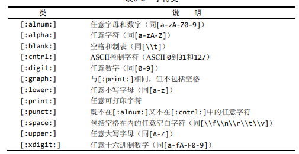

## 正则表达式搜索

正则表达式的使用方式类似模糊查询，不过把LIKE 换成了REGEXP.

示例

```sql
SELECT prod_name
FROM products
WHERE prod_name REGEXP '.000'
ORDER BY prod_name;
```

REGEXP语句告诉MySQL, REGEXP后所跟的东西作为正则表达式处理。

LIKE和REGEXP的区别：

> LIKE匹配整个列。如果被匹配的文本在列值 中出现，LIKE将不会找到它，相应的行也不被返回（除非使用 通配符）。而REGEXP在列值内进行匹配，如果被匹配的文本在 列值中出现，REGEXP将会找到它，相应的行将被返回。这是一 个非常重要的差别

MySQL特殊字符：

| 元字符 |   说明   |
| :----: | :------: |
| `\\f`  |   换页   |
| `\\n`  |   换行   |
| `\\r`  |   回车   |
| `\\t`  |   制表   |
| `\\v`  | 纵向制表 |

> `\`或`\\?` 多数正则表达式实现使用单个反斜杠转义特殊字符， 以便能使用这些字符本身。但MySQL要求两个反斜杠（MySQL 自己解释一个，正则表达式库解释另一个）

字符类：



## 数据处理函数

### 1. 常用文本处理函数

|    函数     |        说明        |
| :---------: | :----------------: |
|   Left()    |  返回串左边的字符  |
|  Length()   |    返回串的长度    |
|  Locate()   |    找出串的长度    |
|   Lower()   |   将串转换为小写   |
|   LTrim()   | 去掉串的左边的空格 |
|   Right()   |  返回串右边的字符  |
|   RTrim()   |  去掉串右边的空格  |
|  Soundex()  | 返回串的SOUNDEX值  |
| SubString() |   返回子串的字符   |
|   Upper()   |   将串转换为大写   |

### 2. 日期和时间处理函数

|     函数      |              说明              |
| :-----------: | :----------------------------: |
|   AddDate()   |    增加一个日期（天、周等）    |
|   AddTime()   |    增加一个时间（时、分等）    |
|   CurDate()   |          返回当前日期          |
|   CurTime()   |          返回当前时间          |
|    Date()     |     返回日期时间的日期部分     |
|  DateDiff()   |        计算两个日期之差        |
|  Date_Add()   |     高度灵活的日期运算函数     |
| Date_Format() |  返回一个格式化的日期或时间串  |
|     Day()     |     返回一个日期的天数部分     |
|  DayOfWeek()  | 对于一个日期，返回对应的星期几 |
|    Hour()     |     返回一个时间的小时部分     |
|   Minute()    |     返回一个时间的分钟部分     |
|    Month()    |     返回一个日期的月份部分     |
|     Now()     |       返回当前日期和时间       |
|   Second()    |      返回一个时间的秒部分      |
|    Time()     |   返回一个日期时间的时间部分   |
|    Year()     |     返回一个日期的年份部分     |

### 3. 数值处理函数

|  函数  |        说明        |
| :----: | :----------------: |
| Abs()  |     返回绝对值     |
| Cos()  | 返回一个角度的余弦 |
| Exp()  | 返回一个数的指数值 |
| Mod()  |  返回除操作的余数  |
|  Pi()  |     返回圆周率     |
| Rand() |   返回一个随机数   |
| Sin()  | 返回一个角度的正弦 |
| Sqrt() | 返回一个数的平方根 |
| Tan()  | 返回一个角度的正切 |

## 视图

### 1. 视图的规则和限制

* 和表一样，试图必须唯一命名。
* 对于可以创建的试图数目没有限制。
* 为了创建视图，必须具有足够的访问权限。
* 试图可以嵌套，即可以利用从其他视图中检索数据的查询来构造一个视图。
* ORDER BY 可以用在视图中，但如果从该视图检索数据SELECT中也包含ORDER BY， 那么该视图中的ORDER BY将被覆盖。
* 视图不能索引，也不能有关联的触发器或默认值。
* 视图可以和表一起使用。

### 2. 使用视图

* 视图创建：`CREATE VIEW` 

  ```sql
  CREATE VIEW customeremaillist AS
      SELECT cust_id, cust_name, cust_email
  FROM customers
  WHERE cust_email IS NOT NULL;
  ```

* 查看创建视图的语句：`SHOW CREATE VIEW viewname`

* 用`DROP`删除视图，语法为 `DROP VIEW viewname`

* 更新视图时，可以先使用`DROP`再使用`CREATE`。

  也可以直接用`CREATE OR REPLACE VIEW`:

  * 如果要更新的视图不存在，则第二条语句会创建一个视图；
  * 如果要更新的视图存在，则第2条更新语句会替代原有视图。

> 如果从视图检索数据时使用了一条WHERE子句，则两组子句（一组在视图中，另一组时传递给视图的）将自动组合。

### 3.视图更新

略

## 存储过程

### 1. 使用存储过程的理由

* 通过把处理封装在容易使用的单元中，简化复杂的操作。
* 由于不要求反复建立一系列处理步骤，这保证了数据的完整性。
* 简化对变动的管理。
* 提高性能：使用存储过程比使用单独的SQL语句要快。

### 2. 使用存储过程

MySQL执行存储过程的语句为`CALL`。

`CALL`接受**存储过程的名字**以及需要传递给它的任意**参数**。

例如

```sql
CALL producpricing(@pricelow
                   @pricehigh
                   @priceaverage);
```

其中，执行名为`productpricing`的存储过程，它计算并返回产品的最低、最高和平均价格。

### 3.创建存储过程

语法：

```sql
CREATE PROCEDURE 存储过程名字(
	[OUT|IN|INOUT] 参数1 参数类型，
    [OUT|IN|INOUT] 参数2 参数类型，
    .....
)
BEGIN
函数体...
END;
```

MySQL支持：

* `IN`：传递给存储过程
* `OUT`:从存储过程传出
* `INOUT`:对存储过程传入和传出

示例：

```sql
CREATE PROCEDURE productpricing(
	OUT pl DECIMAL(8,2),
    OUT ph DECIMAL(8,2),
    OUT pa DECIMAL(8,2)
)
BEGIN
SELECT MIN(prod_price)
INTO pl
FROM products;
SELECT MAX(prod_price)
INTO ph
FROM products;
SELECT AVG(prod_price)
INTO pa
FROM products;
END;
```

调用存储过程

```sql
CALL productpricing(@pricelow,
                   @pricehigh,
                   @priceaverage);
 SELECT @pricehigh, @pricelow, @priceaverage;                  
```

> MySQL变量必须以@开始

**注意：记录集是不被允许的类型，因此不能通过一个参数返回多个行和列。**

一个更复杂点的存储过程示例

```sql
CREATE PROCEDURE ordertotal(
IN onumber INT,
IN taxable BOOLEAN,
OUT ototal DECIMAL(8,2)
)
BEGIN
   DECLARE total DECIMAL(8,2);
   DECLARE taxrate INT DEFAULT 6;

   SELECT SUM(item_price * quantity)
       FROM orderitems WHERE order_num = onumber
    INTO total;

   IF taxable THEN
       SELECT total + (total /100*taxrate) INTO total;
    END IF;
   SELECT total INTO ototal;
END;
```

### 4. 删除存储过程

* 普通删除存储过程

  `DROP PROCEDURE 存储过程名称`

  当要删除的存储过程不存在时会报错。

* 仅当存在时删除

  `DROP PROCEDURE IF EXISTS 存储过程名称`

### 5. 检查存储过程

显示用来创建存储过程的CREATE语句：

`SHOW CREATE PROCEDURE 存储过程名字`

显示所有存储过程：

`SHOW PROCEDURE STATUS [LIKE 'ordertotal']`
