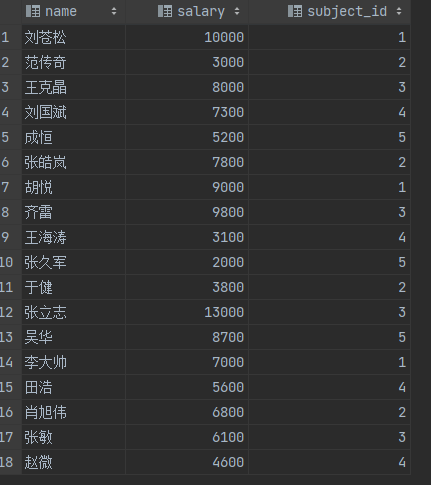
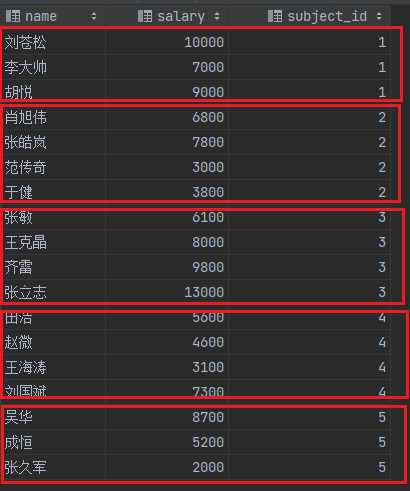
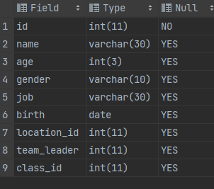
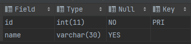
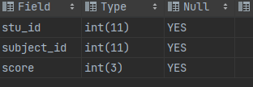
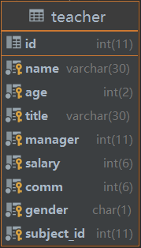

## 〇、屁话

数据库管理系统Database management system(简称DBMS)
它们都是独立可运行的软件,我们用java写的程序可以连接这些软件让其负责对数据进行维护
常见的DBMS:

* oracle
* mysql
* DB2
* SQLServer

如何操作DBMS?

* SQL语言:Structured Query Language
* SQL有执行标准:SQL92
* SQL语言是操作DBMS的语言,所有的DBMS都支持标准的SQL语言以及自身提供的可扩展SQL

连接数据库的方式:

1. 命令行(控制台)的客户端
     `show databases`;
2. 图形化界面的客户端
3. IDEA终极版提供了连接数据库的功能
4. 在JAVA中要是用JDBC连接数据库

SQL语句的分类:

* DDL:数据定义语言,用来操作数据库对象(数据库对象:表,索引,序列等都属于数据库对象)
      包含的语法:`CREATE,DROP,ALTER`
* DML:数据操作语言,用来操作表中的数据(包含的操作:对数据的增删改)
      包含的语法:`INSERT,UPDATE,DELETE`
* DQL:数据查询语言,用来查询表中的数据
      包含的语法:`SELECT`
* TCL:事务控制语言
      包含的语法:`COMMIT`,`ROLLBACK`
* DCL:数据控制语言,通常用来让DBA管理数据库使用

## 一、数据库操作

1. 查看DBMS里有多少个数据库
   `SHOW DATABASES`;

2. 新建一个数据库:
   `CREATE DATABASE 数据库名`
   例如:

```sql
CREATE DATABASE mydb;
```

3. 创建一个数据库时可以指定该数据库使用的字符集
   `CREATE DATABASE 数据库名 CHARSET=UTF8/GBK`
   例如:

```sql
CREATE DATABASE mydb2 CHARSET=UTF8
```

4. 查看数据库信息
   `SHOW CREATE DATABASE` 数据库名
   例如:

```sql
SHOW CREATE DATABASE mydb
```

5. 删除数据库
   `DROP DATABASE 数据库名`
   例如:

```sql
DROP DATABASE db1
DROP DATABASE db2
```

6. 使用某个指定的数据库:
   `USE 数据库名`
   例如:
   使用mydb这个数据库:

```sql
USE mydb;
```

## 二、表操作 

1. 创建表

   `CREATE TABLE 表名( 字段名1 数据类型, 字段名2 数据类型, ... ) `

   ```sql
   CREATE TABLE userinfo(id INT, username VARCHAR(30), password VARCHAR(30), nickname VARCHAR(30), age INT );
   ```

2. 查看表的详细信息

   `SHOW CREATE TABLE 表名`

3. 查看表结构

   `DESC 表名`

4. 删除表

   `DROP TABLE 表名`

   ```sql
   DROP TABLE user;
   ```

5. 修改表

   `ALTER TABLE 表名 ...`

   * 修改表名

     `RENAME TABLE 原表名 TO 新表名`

   * 修改表结构

     * 添加列

       `ALTER TABLE 表名 ADD 字段名 字段类型 [FIRST| AFTER 字段名]`

       * 在hero第一列上追加新列

         ```sql
         ALTER TABLE hero ADD id INT FIRST
         ```

       * 向user表中追加性别

         ```sql
         ALTER TABLE user ADD gender VARCHAR(10)
         ```

     * 删除表中字段

       `ALTER TABLE 表名 DROP 字段名`

     * 修改表中字段

       > *注意:可以修改表中字段的类型,长度信息.但是尽量不要在表中包含数据后再进行修改,* *否则可能因为表中现有数据违背该字段修改后的要求导致修改失败.*

       `ALTER TABLE 表名 CHANGE 字段名 新字段名 新字段类型`

       ```sql
       ALTER TABLE hero CHANGE age age VARCHAR(100)
       ```

6. 插入数据

   语法：`INSERT INTO 表名 [(字段1,字段2,...)] VALUES (字段1的值,字段2的值,...)`

   * 在数据库中,字符串是使用单引号的.

   * 在`INSERT`语句中未被指定的列在插入数据时，默认插入`NULL`值。如果未指定的列指定了默认值，则插入指定的默认值
   * 在`INSERT`语句中字段名可以忽略，若忽略则为全列插入，此时`VALUES`后指定的值的顺序，类型，个数必须与表中字段一致

7. 修改表中数据

   语法：`UPDATE 表名 SET 字段名1=字段值1[,字段名2=字段值2,....] [WHERE 过滤条件]`

   ```sql
   将张三的年龄改为22岁:
   UPDATE person
   SET age=22
   WHERE name='张三';    WHERE子句在这里的作用:仅选定表中name字段值为'张三'的记录
   
   将年龄等于15岁的人改为年龄36岁
   UPDATE person
   SET age=36
   WHERE age=15;		  满足WHERE条件的记录都会进行修改
   ```

   `WHERE`子句中常用的条件
   `=`，`<`，`>`，`<=`，`>=`，`<>`(不等于，`!=`不是所有数据库都支持)

   同时修改多个字段

   ```sql
   #将"李四"的名字改为"李老四"并且年龄改为55
   UPDATE person
   SET name='李老四',age=55
   WHERE name='李四'
   ```

   > 字符串的内容是严格区分空格，大小写的。

8. 删除表中数据

   语法：`DELETE [FROM] 表名 [WHERE 过滤条件]`

## 三、数据类型

**不同的数据库管理系统，数据类型不完全一致**

### 1. 数字类型

* 整数类型：`INT(m)`和`BIGINT(m)`

  `m`表示数字的长度（位数）

* 浮点类型：`DOUBLE(m,n)`

  * `m`表示整体数字的位数， `n`表示小数的位数
  * 实际插入数据时如果精度超过了可保存的范围时，会自动进行四舍五入

### 2. 字符类型

* `CHAR(n)`:定长字符串

  * n:长度，单位是**字符**。CHAR(10),该字段可以存放最多10个字符

  * 最大长度:255个字符

  * 表中每条记录该字段在磁盘上占据的空间是固定的，如果实际保存的字符不足指定的长度时，会在后面补充若干个空格来达到长度。

  * **优点:由于长度固定，因此查询速度快**

  * **缺点:磁盘占用存在浪费的情况**

* `VARCHAR(n)`:变长字符串

  * n:长度，单位是**字节**。VARCHAR(10),该字段保存的字符转换的字节最多10个。

  * 最大长度为:65535个字节

  * **优点:实际字段值占用多少字节就在磁盘上开辟多少字节。**

  * **缺点:长度不固定，因此查询性能慢**

* `TEXT(n)`:可变长字符

  n:长度，单位是**字符**。最大值为65535

### 3.日期类型

- `DATE`：可以保存年月日
- `TIME`：保存时分秒
- `DATETIME`：保存年月日时分秒
- `TIMESTAMP`: 时间戳，记录UTC时间。从1970-01-01 00:00:00到其表示的时间之间经过的毫秒

例：

```sql
CREATE TABLE userinfo(
	id INT,
	name VARCHAR(30),
	birth DATETIME,
	salary DOUBLE(7,2)
)
```

插入日期时，可以使用字符串格式，格式应当为:`yyyy-MM-dd hh:mm:ss`

- `MM`表示两个数字的"月"，`mm`表示两位数字的"分"

```sql
INSERT INTO userinfo VALUES(1,'张三','1992-08-02 11:23:56',5000.98)
```

如果日期类型使用的是`DATETIME`，那么在不指定时分秒时，默认为00:00:00

```sql
INSERT INTO userinfo VALUES(2,'李四','1989-06-30',9000)
```

`DATETIME`不能忽略年月日

```sql
INSERT INTO userinfo VALUES(3,'王五','13:25:33',12000)#报错
```

## 四、约束

约束就是为表中某个字段添加一些限制条件，只有符合条件时才可以对表中记录进行操作

**主键约束，外键约束，唯一性约束，非空约束**

### 1. 主键约束

**什么是主键(PRIMARY KEY)**：

* 该字段的值仅表达该表中唯一的一条记录

* 一张表只能有一个字段添加主键约束。该约束要求该字段:**非空且唯一**

### 2.主键约束 (NOT NULL)

添加了非空约束的字段:每条记录该字段的值都不能为NULL

例：

```sql
CREATE TABLE student(
	id INT PRIMARY KEY,
	name VARCHAR(30) NOT NULL,
	age INT(3),
	gender CHAR(1)
) 
```

* 使用`DESC`查看student表结构时可以体现出主键以及非空约束

```sql
DESC student
```

* 不能将`NULL`值插入到主键或者具有非空约束的字段上

```sql
# 当不指定id时，数据库会将NULL默认插入到id字段，这违背主键约束:
INSERT INTO student (name,age,gender) VALUES ('张三',22,'男');

# 不能将NULL值显示的插入到具有非空约束的name字段上:
INSERT INTO student VALUES(1,NULL,22,'男');
```

* 不能将重复的值插入到主键字段中

```sql
INSERT INTO student VALUES(1,'张三',22,'男');

# 不能再将1作为主键的值插入另一条记录。主键字段的值不可重复。
INSERT INTO student VALUES(1,'李四',33,'男');
```

* 主键的值可以由数据库自行维护

```sql
ALTER TABLE student CHANGE id id INT AUTO_INCREMENT;
```

* 当主键字段具有自增效果时，我们可以忽略主键值的插入

```sql
INSERT INTO student (name,age,gender) VALUES('李四',22,'男')
```

* 当主键字段具有自增效果时，我们可以显示的向ID字段插入NULL值.此时主键仍然自增(不推荐操作)

```sql
# 此时并不会将NULL值作为主键字段的值，而是使用自增的主键值。
INSERT INTO student VALUES(NULL,'王五',25,'女')
```

## 五、数据查询语言（DQL)

基本语法：

```sql
SELECT 子句
FROM 子句
JOIN... ON... 子句
WHERE 子句
GROUP BY 子句
HAVING 子句
ORDER BY 子句
```

### 1.SELECT 子句

一条DQL语句必须包含的两个子句分别为:SELECT子句和FROM子句

- SELECT 子句用于选定表中的字段，选定的字段会被包含在查询的结果集中
- FROM 子句用于指定查询的表

查看student表中所有记录，每条记录所有字段都要展示在结果集中。

```sql
SELECT * FROM student
# "*"在SELECT子句中表达的意思时查看表中所有字段。
```

SELECT子句中可以仅指定个别字段进行查询

```sql
# 查看每个学生的名字，年龄，性别
SELECT name,age,gender
FROM student
```

### 2. WHERE子句

**WHERE子句可以添加过滤条件，那么此时仅查询出满足该子句过滤条件的记录**

**比较运算符**:`=,>,>=,<,<=,<>`

例

- 查看所有大队长

  ```sql
  SELECT name,job 
  FROM student
  WHERE job='大队长'
  ```

- 查看除了'刘苍松'以外的其他老师的名字和年龄

  ```sql
  SELECT name,age
  FROM teacher
  WHERE name<>'刘苍松'
  ```

- 查看年龄在30岁以上的老师的名字和年龄(含30岁)

  ```sql
  SELECT name,age
  FROM teacher
  WHERE age>=30
  ```

#### 1) 使用OR,AND来连接多个过滤条件

- `AND`:与。都为真时才为真
- `OR`:或。都为假时才为假

例如

- 查看学生中7岁的大队长都有谁?

  ```sql
  SELECT name,age,job
  FROM student
  WHERE age=7 AND job='大队长'
  ```

- 查看班级号小于6的所有中队长都有谁?(班级号:class_id)

  ```sql
  SELECT name,job,class_id
  FROM student
  WHERE class_id<6 AND job='中队长'
  ```

#### 2) IN /NOT IN

等于列表之一

查看职位是大队长,中队长或小队长的学生?

```sql
SELECT name,job
FROM student
WHERE job='大队长' OR job='中队长' OR job='小队长'
等价
SELECT name,job
FROM student
WHERE job IN('大队长','中队长','小队长')
```

#### 3) BETWEEN...AND...

在两者之间

查看年龄在9到11岁之间的学生都有谁?

```sql
SELECT name,age
FROM student
WHERE age>=9 AND age<=11
等价
SELECT name,age
FROM student
WHERE age BETWEEN 9 AND 11
```

#### 4) DISTINCT 去重

**DISTINCT关键字必须紧跟在SELECT关键字之后**

查看学校的学生有多少种职位?

```sql
SELECT DISTINCT age,job
FROM student
```

#### 5）LIKE 模糊查询

`LIKE`中有两个通配符

- `_ `下划线表示1个字符
- `%` 百分号表示任意个字符(0---多次)

组合示意

- `%X% `字符中含有X的
- `%X` 字符以X结束
- `X%` 字符以X开始
- `_X _ `在三个字符中第二个字符为X
- `%X_` 字符中倒数第二个为X
- `X_Y` 三个字符中第一个为X，第三个为Y
- `X%Y` 字符中第一个是X，最后一个是Y

#### 6)判断NULL值

- `IS NULL` 判断某个字段的值是否为`NULL`
- `IS NOT NULL` 判断某个字段的是不为`NULL`
- **不能直接搭配"="或"<>"来判断NULL值！！！**

查看奖金(comm)为空的老师都有谁?

```sql
SELECT name,salary,comm
FROM teacher
WHERE comm=NULL
上述SQL是查询不到任何数据的!!

正确写法:
SELECT name,salary,comm
FROM teacher
WHERE comm IS NULL
```

### 3. ORDER BY子句排序

`ORDER BY` 子句只能是DQL中的最后一个子句(原因是该子句是最后执行的子句)。

作用:对结果集按照指定字段值的升序或降序进行排序

排序方式:

- 升序:`ASC` 默认不写就是升序
- 降序:`DESC`

**多字段排序时:会首先按照第一个字段排序，然后当第一个字段值相同的记录中再按照第二个字段排序以此类推**

例:

- 查看老师的工资排名? 按照工资进行降序(从大到小)

  ```sql
  SELECT name,salary,comm
  FROM teacher
  ORDER BY salary DESC
  ```

- 查看老师的奖金?按照升序(从小到大)排序

  ```sql
  SELECT name,salary,comm
  FROM teacher
  ORDER BY comm ASC
  或者
  SELECT name,salary,comm
  FROM teacher
  ORDER BY comm 
  ```

- 按照日期字段排序时，升序为从早到晚

  按照生日从远到近排序学生

  ```sql
  SELECT name,birth
  FROM student
  ORDER BY birth
  ```

- 按照老师的工资降序后再按照奖金的升序排

  ```sql
  SELECT name,salary,comm
  FROM teacher
  ORDER BY salary DESC,comm
  如果第一个字段的值没有重复值，则第二个字段排序无效
  ```

- 按照学生的年龄的升序再按照生日的降序排序

  ```sql
  SELECT name,age,birth
  FROM student
  ORDER BY age,birth
  ```

### 4. 分页查询

将一个DQL语句执行后的查询结果集分段查询出来。

当一个查询结果记录数非常多时，通常都采取分页查询的方式来分段分批的查询减少不必要的系统开销。

分页查询在SQL92标准中没有定义。意味着不同的数据库有完全不同的分页写法。

**在MySQL中是通过在ORDER BY子句后面追加LIMIT来完成分页的。**

**语法**

 `ORDER BY 字段 LIMIT 跳过的记录数,每页显示的条目数`

 `LIMIT`中两个数字的换算公式:

- `LIMIT (页数-1)*每页显示的条目数 , 每页显示的条目数`

  例如:每页显示5条，显示第三页?

  `LIMIT (3-1)*5,5 `==>` LIMIT 10,5`

  每页显示8条，显示第9页?

  `LIMIT (9-1)*8,8 `==>` LIMIT 64,8`

- 查看老师工资排名的前5名? 分析:按工资降序，分页查询，每页5条，显示第一页

  ```
  SELECT name,salary
  FROM teacher
  ORDER BY salary DESC
  LIMIT 0,5
  ```

- 按照老师奖金的降序排序后，每页显示3条，显示第5页

  ```
  SELECT name,salary,comm
  FROM teacher
  ORDER BY comm DESC
  LIMIT 12,3
  ```

### 5. DQL中使用表达式或函数的结果查询

1. 在SELECT字句中使用函数或表达式(IFNULL)

   * `IFNULL(arg1,arg2)`:如果arg1不为`NULL`函数直接返回`arg1`,若为`NULL`函数返回`arg2`

   * **任何数字与NULL进行运算结果都是NULL**

   例子：

   - 查看每个老师的年薪是多少? 月薪*12

     ```sql
     SELECT name,salary,salary*12
     FROM teacher
     ```

   - 查看每个老师的工资+奖金的总和是多少? salary+comm

     ```sql
     SELECT name,comm,IFNULL(comm,0)
     FROM teacher
     
     查看老师的工资+奖金
     SELECT name,salary,comm,salary+IFNULL(comm,0)
     FROM teacher
     ```

2. 在WHERE字句中使用函数或表达式作为过滤条件

   **比较运算中也忽略NULL值**

   - 查看年薪小于5万的老师都有谁?

     ```sql
     SELECT name,salary,salary*12
     FROM teacher
     WHERE salary*12<50000
     ```

   - 查看奖金小于3000的老师都有谁?

     ```sql
     SELECT name,salary,comm
     FROM teacher
     WHERE comm<3000
     上述DQL查询的结果集中不含有奖金字段为NULL的记录
     
     SELECT name,salary,comm
     FROM teacher
     WHERE IFNULL(comm,0)<3000
     ```

### 6. 别名

别名在SELECT子句中可以被应用于字段上，函数上或表达式上

别名也可以被应用于其他子句中，比如在FROM子句中为表取别名(后面学习关联查询详细介绍)

1. 字段名 别名

   ```sql
   SELECT name,salary*12 sal FROM teacher
   ```

2. 字段名 AS 别名

   ```sql
   SELECT name,salary*12 AS sal FROM teacher
   ```

3. 字段名 AS '别名' AS可以省略

   ```sql
   SELECT name,salary*12 AS 'sal' FROM teacher
   ```

4. 字段名 AS "别名" AS可以省略

   ```sql
   SELECT name,salary*12 AS "sal" FROM teacher
   ```

### 7. 聚合函数

聚合函数**用来统计**的。可以将一个查询结果集中的多条记录统计为一条。

**聚合函数忽略NULL值，这个在AVG和COUNT中表现最为明显**。

聚合函数:

- `MIN() `求指定字段在结果集中所有记录里的最小值
- `MAX() `求指定字段在结果集中所有记录里的最大值
- `AVG() `求指定字段在结果集中所有记录里的平均值
- `SUM()` 求指定字段在结果集中所有记录里值的总和
- `COUNT()` 不是对字段值的统计，而是对结果集中记录数的统计。统计结果集的记录数

**聚合函数的使用时，首要任务是先将需要统计的所有记录查询出来，之后再加以统计。**

- 查看老师的平均工资是多少?

  1. 先列出所有老师的工资

     ```sql
     SELECT salary FROM teacher
     ```

  2. 对salary加上聚合函数，将结果集中该字段值的所有记录统计平均数

     ```sql
     SELECT AVG(salary) FROM teacher
     ```

- 查看学校老师的最高工资，最低工资，平均工资和工资总和分别是多少?

  ```sql
  SELECT MAX(salary),MIN(salary),AVG(salary),SUM(salary)
  FROM teacher
  ```

- 查看负责课程编号1的老师的平均工资是多少?

  1. 查看负责课程编号1的老师的工资?

     ```sql
     SELECT salary FROM teacher WHERE subject_id=1
     ```

  2. 对上述结果集应用聚合函数统计结果

     ```sql
     SELECT AVG(salary) FROM teacher WHERE subject_id=1
     ```

- 查看所有老师的奖金总和和平均奖金是多少?

  ```sql
  SELECT SUM(comm),AVG(comm)
  FROM teacher
  上述DQL查询后实在奖金总和基础上除以15得到的平均值，而非18.因为有3个老师奖金为NULL
  
  可以通过搭配IFNULL来解决:
  SELECT SUM(comm),AVG(IFNULL(comm,0))
  FROM teacher
  ```

- 查看学校一共多少个老师?

  **很多数据库都对COUNT(*)进行过优化，因此统计记录数通常就用它。**

  ```sql
  SELECT COUNT(*) FROM teacher
  ```

- 查看学校年龄最大的大队长生日是哪天?

  寻找student表中所有大队长的生日中距离现在最远的

  ```sql
  SELECT MIN(birth) FROM student WHERE job='大队长'
  ```

### 8. GROUP BY分组

GROUP BY子句可以将其所在的DQL语句中的查询结果集上按照指定的字段值相同的记录进行分组，搭配聚合函数可以进行组内统计。

**分组是配合统计的，如果SELECT子句中没有聚合函数时，无需使用GROUP BY子句**

例：

1. 查看每个科目的老师的平均工资分别是多少?

   ```sql
   SELECT name,salary,subject_id
   FROM teacher
   ```

   上述SQL会得到结果集

   

2. 在DQL上添加GROUP BY子句

   ```sql
   SELECT salary,subject_id
   FROM teacher
   GROUP BY subject_id
   
   意思是将:
   SELECT salary,subject_id
   FROM teacher
   查询出的结果集按照subject_id字段值相同的记录分组
   ```

   等同于将结果集分为了五组:

   

3. 最终配合聚合函数，可以对结果集中五组数据产生五个统计结果

   ```sql
   SELECT AVG(salary),subject_id
   FROM teacher
   GROUP BY subject_id
   ```

**在SELECT子句中如果包含聚合函数,那么凡是不在聚合函数中的字段都应当出现在GROUP BY子句中**

- 查看学校每种职位的学生各多少人?以及每个职位最大的生日和最小生日?

```sql
SELECT COUNT(*) 总人数,MAX(birth) 最小生日,MIN(birth) 最大生日,job
FROM student
GROUP BY job
```

**GROUP BY可以按照多列分组。结果集中指定的这些列值的组合相同的记录看作一组**

- 查看同班同职位的学生各多少人?

```sql
SELECT COUNT(*)
FROM student
GROUP BY job,class_id
```

* 为聚合函数取别名，可便于按该字段的结果排序

  * 查看每个科目老师的平均工资，平均工资从少到多排序

    ```sql
    SELECT AVG(salary) avg,subject_id
    FROM teacher
    GROUP BY subject_id
    ORDER BY avg
    ```

  * 在分组统计中使用过滤条件

    ```sql
    SELECT AVG(salary),subject_id
    FROM teacher
    WHERE AVG(salary)>6000
    GROUP BY subject_id
    ```

* **聚合函数不能被应用于WHERE子句中**

  本质原因是过滤时机不同，WHERE子句中添加的过滤条件是在第一次从表中逐条检索数据时生效的，从而产生查询结果集。

  **实际的过滤实际应当是在从表中查询出结果集并针对该结果集分组统计得出统计结果后再进行过滤**

### 9. HAVING子句

* HAVING子句是紧跟在GROUP BY子句之后的子句，它的作用是添加过滤条件针对分组统计结果后的数据进行筛选

* HAVING子句可以利用聚合函数的统计的结果进行过滤.

查看每个科目老师的平均工资，前提是之查看平均工资高于6000的?

```sql
SELECT AVG(salary),subject_id
FROM teacher
GROUP BY subject_id
HAVING AVG(salary)>6000
```

### 10. 子查询

嵌套在其他SQL语句中的一条DQL语句，那个这个DQL就称为是子查询。

子查询常被应用于:

- DQL中 ： 可以基于一个查询结果集进行查询(最常被用于DQL语句)
- DML中 : 可以基于一个查询结果集进行增删改操作
- DDL中 ： 可以基于一个查询结果集进行数据对象操作(创建表，视图等)

#### 1）在DQL语句中使用子查询

**子查询在DQL中使用时必须使用"()"括起来**

例：

- 哪个老师的工资高于"王克晶"的工资?

  1. 查询王克晶的工资?

     ```sql
     SELECT salary FROM teacher WHERE name='王克晶'      ==>  8000
     ```

  2. 查看谁的工资高于她(工资>8000)?

     ```sql
     SELECT name,salary 
     FROM teacher
     WHERE salary>(SELECT salary FROM teacher WHERE name='王克晶')
     ```

* 查看高于老师平均工资的那些老师的工资分别是多少?

  1. 确定条件=>老师的平均工资

     ```sql
     SELECT AVG(salary) FROM teacher
     ```

  2. 基于条件查询

     ```sql
     SELECT name,salary
     FROM teacher
     WHERE salary>(SELECT AVG(salary) FROM teacher)
     ```

#### 2）子查询分类

- 单行单列子查询:查询结果集为一行一列，即:只有一个值

  通常用于过滤条件，可以搭配:`=,>,>=,<,<=,<>`使用

- 多行单列子查询:查询结果集为多行一列，即:有多个值

  通常用于过滤条件，但是要搭配:`IN,ALL,ANY`使用

  `IN`等效于"`=`"做等于判断，只不过是判断等于列表其中之一

  `ALL`和`ANY`用于"`>,>=,<,<=`"使用:

  1. `>ANY`：大于列表之一(大于列表最小的即可)
  2. `>ALL`: 大于列表所有(大于列表最大的)
  3. `<ANY`：小于列表之一(小于列表最大的即可)
  4. `<ALL`: 小于列表所有(小于列表最小的)

- 多行多列子查询:查询结果集为一个表.

  1. 常被应用于DQL语句中的FROM子句中当作一张表看待
  2. 被用作DDL语句中将一个结果集当作一张表创建出来

#### 3）多行单列子查询

例：

* 查看与"祝雷"和"李费水"在同一个班的学生都有谁？

  1. 查看"祝雷"和"乐华"的班级号是多少?

     ```sql
     SELECT class_id FROM student WHERE name IN ('祝雷','李费水')
     ```

  2. :查看与"祝雷"和"李费水"在同一个班的学生都有谁？

     ```sql
     SELECT name,class_id
     FROM student
     WHERE class_id IN (SELECT class_id FROM student WHERE name IN ('祝雷','李费水'))
     ```

* 查看比科目2和科目3老师工资都高的老师都有谁?

  1. 知道科目2和科目4老师的工资分别是多少?

     ```sql
     SELECT salary FROM teacher WHERE subject_id IN (2,4)
     ```

  2. 大于上述查询所有工资即可

     ```sql
     SELECT name,salary
     FROM teacher
     WHERE salary>ALL(SELECT salary FROM teacher WHERE subject_id IN (2,4))
     ```

#### 4)多行多列子查询

* 在DDL语句中使用

  创建一张表，表明:`teacher_salary_info`。

  该表字段:`max_sal,min_sal,avg_sal,sum_sal,subject_id`

  表中记录了每个科目老师的最高工资，最低工资，平均工资和工资总和以及对应的科目

  ```sql
  CREATE TABLE teacher_salary_info
  AS
  SELECT 
  	MAX(salary) max_sal,MIN(salary) min_sal,
  	AVG(salary) avg_sal,SUM(salary) sum_sal,subject_id
  FROM teacher
  GROUP BY subject_id
  ```

### 11.关联查询

查询结果集中的数据来自于多张表，而表与表中的数据之间存在的对应关系被称为关联关系。

两张表中的数据就可以产生关联关系，常见的关联关系有三种

- **一对一**:A表中的一条记录仅唯一对应B表中的一条记录
- **一对多**:A表中的一条记录可以对应B表中的多条记录
- **多对多**:A表与B表双向都是一对多关系就称为多对多关系

关联查询就是指联合多张表查询数据形成一个查询结果集的过程。

**在关联查询中的重中之重就是指定关联条件，也叫连接条件**

**原则上，N张表关联查询要有至少N-1个连接条件**

**缺少连接条件时会产生笛卡尔积，会将A表每条记录与B表每条记录都建立一次连接，产生巨量数据，这通常是一个无意义的结果集，要尽量避免。**

关联查询语法:

```sql
SELECT 字段
FROM 表A,表B[,表C,...]
WHERE 连接条件
AND 过滤条件
# 注意:表与表之间的连接条件必须与过滤条件同时满足！否则会产生笛卡尔积
```

例：

- 查看每个学生的名字，年龄以及其所在的班级名称和所在楼层

  1. 先确定数据来自于哪些表?

      学生信息来自于student表，班级信息来自于class表

     明确FROM子句:

     ```sql
      FROM student,class
     ```

  2. 确定两张表之间的数据关联关系 

     学生表中某条记录的class_id的值与班级表中某条记录的id值相同的建立连接关系 

     明确WHERE子句中的连接条件:

     ```sql
     WHERE student.class_id=class.id
     ```

  3. 查询相应的字段并指定对应的过滤条件...

     查询数据时要指定表名.列名来明确数据来自哪张表的字段，此时由于表名可能较长，导致SQL编写可读性差:

     ```sql
       SELECT student.name,student.age,class.name,class.floor
       FROM student,class
       WHERE student.class_id=class.id
     ```

      解决办法，为表取别名:

     ```sql
       SELECT s.name,s.age,c.name,c.floor
       FROM student s,class c
       WHERE s.class_id=c.id
     ```

- 查看每个班级的名字，所在楼层，以及班主任的名字和工资

  1. 先确定数据来自于哪些表?

     班级表class和老师表teacher
       明确FROM子句:

     ```sql
     FROM class c,teacher t
     ```

  2. 确定两张表之间的数据关联关系 

      班级表中的teacher_id字段的值与teacher表id字段值相同的记录关联在一起
       明确WHERE子句中的连接条件:

     ```sql
      WHERE c.teacher_id=t.id
     ```

  3. 查询相应的字段并指定对应的过滤条件...

     ```sql
       SELECT c.name,c.floor,t.name,t.salary
       FROM class c,teacher t
       WHERE c.teacher_id=t.id
     ```

- 在关联查询同时添加过滤条件

  **关联条件要与过滤条件同时满足。条件之间要用AND连接**

  查看"王克晶"是哪个班的班主任?

  1. 确定数据来自哪些表?

      查看的是班级信息，因此数据仅来自于班级表class

  2. 过滤条件来自哪张表?    老师的名字=王克晶
       过滤条件来自于老师表teacher：teacher.name='王克晶'

  3. 班级表与老师表的关联关系?
       class.teacher_id=teacher.id

  ```sql
  SELECT c.name,t.name 
  FROM class c,teacher t
  WHERE c.teacher_id=t.id     # 连接条件
  AND t.name='王克晶'          # 过滤条件要与连接条件同时满足!!!  
  ```

- 查看所有教**英语**的老师带的来自**上海**或**南京**的学生都有谁?

  结果集中要体现:学生的名字，年龄，所在班级名称，老师名称以及来自的城市

  ```sql
  SELECT s.name,s.age,c.name,t.name,l.name 
  FROM student s,class c,teacher t,location l,subject su
  WHERE s.class_id=c.id        	学生与班级建立关联关系
  AND c.teacher_id=t.id      		班级与老师建立关联关系
  AND t.subject_id=su.id     		老师与科目建立关联关系
  AND s.location_id=l.id     		学生与所在地建立关联关系
  AND su.name='英语' 		  	   科目为英语的记录
  AND l.name IN ('上海','南京')
  ```

**关联关系通常是建立在主外键等值连接的基础上的**

### 12.多对多关系

**两张表之间双向都是一对多就是多对多关系。多对多关系需要依靠一张关联关系表维系。**

关联关系表中有两个字段分别记录了这两张表的主键字段。

例：

* 学生表

  

* 科目表

  

* t_stu_subject_score表

  

实际查询时，写法就是三张表关联查询即可

- 查看'李费水'每门课程的成绩是多少?

  结果集中需要体现:学生名字，科目名称，考试成绩

  1. 数据来自哪些表?

     学生名字来自student表，科目名称来自subject表，考试成绩来自t_stu_subject_scroe

  2. student表与subject表本身没有关联关系，它们都与t_stu_subject_score有关系

     关联条件:student别名s    t_stu_subject_score别名sss     subject别名su

  ```sql
    s.id=sss.stu_id
    sss.subject_id=su.id
  
    SELECT s.name,su.name,sss.score
    FROM student s,subject su,t_stu_subject_score sss
    WHERE s.id=sss.stu_id
    AND sss.subject_id=su.id
    AND s.name='李费水'
  ```

### 13.内连接

**语法**

```sql
SELECT t1.xxx,t2.xxx,...
FROM 表1 t1
JOIN 表2 t2 ON 与表1的连接条件
[JOIN 表3 t3 ON 与表1或表2的连接条件]
```

内连接的查询与关联查询一致，却别在于我们将关联关系(连接条件)单独定义在JOIN后面跟的ON子句上。

优点:关联查询时结构清晰，连接条件与过滤条件分开在不同的子句定义。ON子句定义连接条件，WHERE子句定义过滤条件

例：

1. 查看每个班的班主任是谁？

   * 关联查询写法

     ```sql
     SELECT c.name,t.name
     FROM class c,teacher t
     WHERE c.teacher_id=t.id
     ```

   * 内连接写法

     ```sql
     SELECT c.name,t.name
     FROM class c
     JOIN teacher t ON c.teacher_id=t.id
     ```

2. 查看范传奇和刘苍松带的班级是哪个？

   * 关联写法

     ```sql
     SELECT c.name,t.name
     FROM class c,teacher t
     WHERE c.teacher_id=t.id     连接条件
     AND t.name IN ('范传奇','刘苍松')
     ```

   * 内连接写法

     ```sql
     SELECT c.name,t.name
     FROM class c
     JOIN teacher t ON c.teacher_id=t.id
     WHERE t.name IN ('范传奇','刘苍松')
     ```

### 14.外连接

外连接的作用是将关联查询中不满足关联条件的记录显示在结果集中。

外连接分类:

- 左外连接 `LEFT JOIN`

  左外连接是将`LEFT JOIN`左侧的表做为主表，结果集中会包含该表所有满足过滤条件的记录，当来自于`LEFT JOIN`右侧表的字段时，不满足连接条件的记录值全为NULL

- 右外连接 `RIGHT JOIN`

  右外连接是将`RIGHT JOIN`右侧的表做为主表，结果集中会包含该表所有满足过滤条件的记录，当来自于`RIGHT JOIN`左侧表的字段时，不满足连接条件的记录值全为NULL

### 15.自连接

同一张表中的一条数据可以对应多条数据。

**自连接通常用于保存具有相同属性且存在上下级关系的树状结构数据使用**。

例如：

* 公司中的组织架构
* 电商中的类别树

teacher表结构如下：



示例：

- 查看每个老师和他的领导是谁?

  ```sql
  关联查询写法:
  SELECT t.name,m.name
  FROM teacher t,teacher m
  WHERE t.manager=m.id
  
  内连接
  SELECT t.name,m.name
  FROM teacher t
  JOIN teacher m ON t.manager=m.id
  ```

- 查看刘苍松的下属都有谁?

  ```sql
  SELECT t.name
  FROM teacher t
  JOIN teacher m ON t.manager=m.id
  WHERE m.name='刘苍松'
  ```

## 附

数据库表结构


