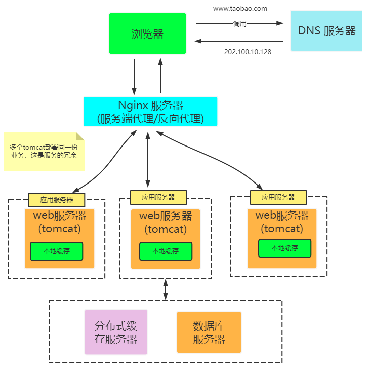

# 〇、碎

- 为什么在JDK8以后，接口中允许非抽象方法的存在了？
  - 首先接口功能也需要增强，功能的增强要靠方法，那我们假如定义了抽象方法，子类那是不是必须实现抽象方法？例如list。

```sql
# 查看数据库的最大连接数
show variables  like "%max_connections%";
# 设置数据库最大连接数
set global  max_connections = 200;
```


关于缓存击穿、缓存穿透、缓存雪崩：

* 缓存处理流程：

  

* 缓存穿透

   缓存穿透是指缓存和数据库中都没有的数据，而用户不断发起请求，如发起为id为“-1”的数据或id为特别大不存在的数据。这时的用户很可能是攻击者，攻击会导致数据库压力过大。

* 缓存击穿

     [缓存击穿](https://so.csdn.net/so/search?q=缓存击穿&spm=1001.2101.3001.7020)是指缓存中没有但数据库中有的数据（一般是缓存时间到期），这时由于并发用户特别多，同时读缓存没读到数据，又同时去数据库去取数据，引起数据库压力瞬间增大，造成过大压力

* 缓存雪崩

    [缓存雪崩](https://so.csdn.net/so/search?q=缓存雪崩&spm=1001.2101.3001.7020)是指缓存中数据大批量到过期时间，而查询数据量巨大，引起数据库压力过大甚至down机。和缓存击穿不同的是，    缓存击穿指并发查同一条数据，缓存雪崩是不同数据都过期了，很多数据都查不到从而查数据库。

反向代理：

​	正向代理是指代理客户端，反向代理指代理服务器


* 正向代理与反向代理的区别

  * 相同点：

    正向代理和反向代理所处的位置都是客户端和真实服务器之间，所做的事情也都是把客户端的请求转发给服务器，再把服务器的响应转发给客户端。

  * 不同点

    - 正向代理是**客户端的代理**，服务器不知道真正的客户端是谁；反向代理是服**务器的代理**，客户端不知道真正的服务器是谁
    - 正向代理一般是**客户端架设**的；反向代理一般是**服务器架设**的
    - 正向代理主要是用来解决**访问限制问题**；反向代理则是提供**负载均衡、安全防护**等作用。二者都能提高访问速度

# 一、互联网架构的演进的历程
## 单体架构


## Web服务器和数据库服务器分开


## 本地缓存和分布式缓存应用


## 服务冗余和nginx负载均衡

在多台服务器上分别部署Tomcat，使用反向代理软件（Nginx）把请求均匀分发到每个Tomcat中。
此处假设Tomcat最多支持100个并发，Nginx最多支持50000个并发，那么理论上Nginx把请求分
发到500个Tomcat上，就能抗住50000个并发。其中涉及的技术包括：Nginx、HAProxy，



* Nginx代理的是谁？(服务端的服务器)
* Nginx代理的作用什么？(请求转发,负载均衡)
* 这种架构下Web服务器多了，可以承载的并发也大了，并发多了请求的类型也就多了，此时可能就会有大量的请求击穿缓存去访问数据库，数据库的压力就会巨增，那如何解决这个问题呢？

## 数据库读写分离

把数据库划分为读库和写库，读库可以有多个，通过同步机制把写库的数据同步到读库，对于需要
查询最新写入数据场景，可通过在缓存中多写一份，通过缓存获得最新数据。


其中涉及的技术包括：Mycat，它是数据库中间件，可通过它来组织数据库的分离读写和分库分表，
客户端通过它来访问下层数据库，还会涉及数据同步，数据一致性的问题。当业务逐渐变多，出现
不同业务之间的访问量差距较大，不同业务直接竞争数据库，且性能会逐步降低。

## 按业务进行分库

把不同业务的数据保存到不同的数据库中，使业务之间的资源竞争降低，对于访问量大的业务，可以
部署更多的服务器来支撑。


这样同时导致跨业务的表无法直接做关联分析，对于这种方案，随着用户数的增长，单机的写库会逐渐
会达到性能瓶颈。

## 大表拆成小表

比如针对评论数据，可按照商品ID进行hash，路由到对应的表中存储；针对支付记录，可按照小时创建表，
每个小时表继续拆分为小表，使用用户ID或记录编号来路由数据。只要实时操作的表数据量足够小，请求
能够足够均匀的分发到多台服务器上的小表，那数据库就能通过水平扩展的方式来提高性能。其中前面提
到的Mycat也支持在大表拆分为小表情况下的访问控制。


这种做法显著的增加了数据库运维的难度，对DBA的要求较高。数据库设计到这种结构时，已经可以称为分布
式数据库，但是这只是一个逻辑的数据库整体，数据库里不同的组成部分是由不同的组件单独来实现的，如分
库分表的管理和请求分发，由Mycat实现，SQL的解析由单机的数据库实现，读写分离可能由网关和消息队列来
实现，查询结果的汇总可能由数据库接口层来实现等等，这种架构其实是MPP（大规模并行处理）架构的一类
实现。

数据库和Tomcat都能够水平扩展，可支撑的并发大幅提高，随着用户数的增长，最终单机的Nginx会成为瓶颈。

## LVS或F5让多个Nginx负载均衡

由于瓶颈在Nginx，因此无法通过两层的Nginx来实现多个Nginx的负载均衡。此时采用LVS和F5作为网络负载
均衡解决方案，如图所示：


其中LVS是软件，运行在操作系统内核态，可对TCP请求或更高层级的网络协议进行转发，因此支持的协议更丰富，
并且性能也远高于Nginx，可假设单机的LVS可支持几十万个并发的请求转发；F5是一种负载均衡硬件，与LVS提
供的能力类似，性能比LVS更高，但价格昂贵。由于LVS是单机版的软件，若LVS所在服务器宕机则会导致整个后端
系统都无法访问，因此需要有备用节点。可使用keepalived软件模拟出虚拟IP，然后把虚拟IP绑定到多台LVS服
务器上，浏览器访问虚拟IP时，会被路由器重定向到真实的LVS服务器，当主LVS服务器宕机时，keepalived软件
会自动更新路由器中的路由表，把虚拟IP重定向到另外一台正常的LVS服务器，从而达到LVS服务器高可用的效果。
此种方案中，由于LVS也是单机的，随着并发数增长到几十万时，LVS服务器最终会达到瓶颈，此时用户数达到千万
甚至上亿级别，用户分布在不同的地区，与服务器机房距离不同，导致了访问的延迟会明显不同。

## DNS轮询实现机房的负载均衡
在DNS服务器中可配置一个域名对应多个IP地址，每个IP地址对应到不同的机房里的虚拟IP。当用户访问
www.taobao.com时， DNS服务器会使用轮询策略或其他策略，来选择某个IP供用户访问。此方式能实现机
房间的负载均衡，至此，系统可做到机房级别的水平扩展，千万级到亿级的并发量都可通过增加机房来解决，
系统入口处的请求并发量不再是问题。


随着数据的丰富程度和业务的发展，检索、分析等需求越来越丰富，单单依靠数据库无法解决如此丰富的需求


## 大应用拆成小应用

按照业务板块来划分应用代码，使单个应用的职责更清晰，相互之间可以做到独立升级迭代。这时候应用之间可
能会涉及到一些公共配置，可以通过分布式注册和配置中心(nacos,...)来解决。


不同应用之间存在共用的模块，由应用单独管理会导致相同代码存在多份，导致公共功能升级时全部应用代码都
要跟着升级。

##  抽离微服务实现工程复用

如用户管理、订单、支付、鉴权等功能在多个应用中都存在，那么可以把这些功能的代码单独抽取出来形成一个
单独的服务来管理，这样的服务就是所谓的微服务，应用和服务之间通过HTTP、TCP或RPC请求等多种方式来访问
公共服务，每个单独的服务都可以由单独的团队来管理。此外，可以通过Dubbo、SpringCloud等功能，提高务的稳定性和可用性。如图所示：


## 总结(Summary)

## 思维导图
https://www.processon.com/view/link/636f425b6376897f2b1a8757

## FAQ分析

* 单体架构你觉得存在什么缺陷？（容量、计算、故障）
* 为什么要使用分布式架构？(增加容量、高并发、高性能、高可用)
* 分布式架构有什么劣势？(设计的难度、维护成本)
* 为什么要使用缓存？(减少数据库访问压力、提高性能)
* 使用缓存时要注意什么问题？(一致性、淘汰算法、击穿、雪崩)
* 如何理解反向代理？(服务端代理，是服务端服务器的一种代理机制，请求转发)
* 反向代理如何实现负载均衡？(轮询，轮询+权重，哈希IP)
* 什么是读写分离、读写分离的目的是什么？(单机数据库有瓶颈、读写频次，并发能力)
* 读写分离后可能会带来什么问题？（数据同步）
* 当我们向写库写数据时还要做什么？(写缓存、数据同步到读库)
* 为什么要进行分库、分表，有哪些分表策略？(业务数据可靠性、查询性能)
* 何为服务，有什么是微服务？(服务-软件要解决的问题，可以提供的功能。微服务-服务中的共性再抽象，以实现更好的重用)
* 哪种互联网架构设计最好？(没有最好，只有更好，脱离业务谈就够就是耍流氓)
* 如何理解分布式架构中的水平分？(MVC，服务冗余，表中记录也可以按id或时间进行水平分)
* 如何理解分布式架构中的垂直分？(服务拆分-商品系统，订单系统，…)

## 案例

https://www.processon.com/view/link/636f4193f346fb2b796c1540

# 二、数据库技术增强

## 核心要点

* 常见术语
* 数据库及表的设计
* 索引的设计
* 数据库中的事务、锁应用

## 数据库常见术语

* DB (Database):数据库
* DBMS(Database Management System)：数据库管理系统
* SQL(Structured Query Language )：结构化的查询语言

## 数据库的设计

* 语法
* 数据库名字(规范)
* 数据库的字符集(utf8mb4/utf8mb4_general_ci)
* 数据库中表的数量(information_schema.tables)

**常见问题分析(FAQ)**

* MySQL中创建数据库的语法是怎样的？

通过 `help 'create database'` 方式查看创建数据库的语法。

```sql
CREATE {DATABASE | SCHEMA} [IF NOT EXISTS] db_name
[create_specification] ...

create_specification:
[DEFAULT] CHARACTER SET [=] charset_name
| [DEFAULT] COLLATE [=] collation_name

```

* `{}`内容表示必须出现一个

* `[]`为可选内容

* `COLLATE`：指定字符集

  * 查看MySQL自带的字符集

    ```sql
    SHOW variables like '%collation_%';
    ```

* MySQL如何基于语法创建数据库？

```sql
CREATE DATABASE IF NOT EXISTS JSDTN2208  CHARACTER SET  utf8mb4;
```
```sql
CREATE DATABASE IF NOT EXISTS JSDVN2208  COLLATE  utf8mb4_general_ci;
```

* 如何查看MySQL中自带的字符集？

```sql
show variables like '%collation_%'
```

* 如何删除MySQL中的数据库？

首先通过 help 'drop database' 方式查询删除数据库的语法。

```sql
DROP {DATABASE | SCHEMA} [IF EXISTS] db_name
```
基于语法实现数据库的删除

```sql
DROP DATABASE IF EXISTS JSDTN2208;
```

* 如何打开数据库?

```sql
use JSDTN2208;
```

* 如何查看数据库中有哪些表？

```sql
show tables;
```

* 如何统计指定数据库中有多少张表？(mysql5.7)

```sql

select table_schema,count(*) tables
from information_schema.tables
where table_schema='JSDVN2207'
group by table_schema;

```

## 数据库中表的设计

* 语法
* 表及字段名字
* 表中字段的类型
* 表中字段常用约束
* 表中字段的默认值(default)
* 表中字段的描述(含义-comment)
* 表中字段的数量(宽表/窄表)
* 表的设计范式与反范式

**常见问题分析**

* 如何查看创建表的语法？

```sql
 help 'create table'
```

案例分析：打开JSDTN2208数据库，然后在库中创建学生表(student)

```sql
use jsdtn2208
```

```sql
drop table if exists student;
create table if not exists student
(
    id bigint auto_increment comment '自增id-主键',
    first_name varchar(50) not null comment '学生名字',
    last_name varchar(20) not null comment '学生姓',
    phone varchar(15) not null comment '手机号',
    email varchar(50) unique comment '邮箱',
    birthday date comment '出生日期',
    create_time datetime default current_timestamp comment '注册日期',
    primary key (id) comment '非空并且唯一',
    unique key (phone) comment '假如有值，它的值必须唯一'
)engine = InnoDB character set utf8mb4;
```

* MySql中常用的数据类型有哪些？

1. 字符串类型 (`char`,`varchar`,`text`,...)

2. 日期/时间类型(`date`,`time`,`datetime`,`timestamp`,...)

3. 数值类型(`tinyint`,`int`,`bigint`,`decimal`,...)

4. 二进制类型(`blob`,`mediumblob`,`longblob`,...)

5. 其它(`enum`,`set`,`json`,...)

   示例：

   ```sql
   CREATE TABLE tb_enum(
       id INT AUTO_INCREMENT PRIMARY KEY ,
       tech ENUM('JAVA', 'SQL', 'Mybatis')
   )ENGINE=InnoDB CHARACTER SET utf8mb4;
   INSERT INTO tb_enum VALUES(null, 'Java');
   INSeRT INTO tb_enum VALUES(null, 'SQL');
   
   CREATE TABLE tb_set(
       id INT AUTO_INCREMENT PRIMARY KEY,
       tech SET('JAVA', 'SQL', 'MyBatis')
   )ENGINE=InnoDB CHARACTER SET utf8mb4;
   
   INSERT INTO tb_set VALUES (null, 'JAVA,SQL,Mybatis');
   INSERT INTO tb_set VALUES (null, 'JAVA');
   # INSERT INTO tb_set VALUES (null, 'JAVA, C++');
   
   CREATE TABLE tb_json(
       id INT AUTO_INCREMENT PRIMARY KEY,
       jsonstr JSON
   )ENGINE=InnoDB CHARACTER SET utf8mb4;
   INSERT INTO tb_json VALUES(null, '{"id":1, "name":"尚进"}');
   ```

其中,查看具体类型的使用可以应用` help 'bigint'`;

* MySQL中数据类型的应用有什么原则吗？

1. 尽量选择简单数据类型(例如存储整数用int不用varchar)
2. 尽量使用最小数据类型(例如能用tinyint不用int)
3. 假如要存储小数可以考虑使用decimal类型。
4. 尽量避免使用text、blob等大字段类型(假如需要使用则尽量放到一张表中)

* MySql表中常用的字段约束有哪些？

1. 非空约束(not null)：字段的值不允许为空
2. 主键约束(primary key)：字段值不允许为空并且唯一
3. 唯一约束(unique key)：字段值必须唯一
4. 检查约束(check)：字段值需要在指定范围(但是数据库之间的兼容不好)
5. 外键约束(foreign key)：字段值需要参考引用表中的字段值。

案例应用(创建课程分类表category,课程表course并相关约束进行应用)

```sql
drop table if exists category;

create table if not exists category
(
id int auto_increment comment '主键值',
category_name varchar(100)  not null comment '分类名称',
primary key (id),
unique key (category_name)
)engine=InnoDB character set utf8mb4;

```

```sql
drop table if exists course;

create table if not exists course 
( 
id bigint auto_increment comment '主键id',
name varchar(100) not null comment '课程名称',
credit tinyint not null  comment '学分',
category_id int comment '分类id',
primary key (id),
unique key (name),
check (credit between 0 and 100),
foreign key (category_id) references category (id)
)engine=InnoDB character set utf8mb4;

```

```sql

insert into category (id,category_name) values (null,'Database');
insert into course(id,name,credit,category_id) values (null,'MySQL','70',1);
insert into course(id,name,credit,category_id) values (null,'Oracle','10',1);

```


* 如何理解宽表和窄表这个概念？

​	宽表和窄表的定义一般由企业内部开发规范进行定义(例如超出40个字段定义宽表)。

1. 宽表就是表中字段比较多的表(字段越多维护越困难，甚至会影响查询效率)
2. 窄表就是表中字段比较少的表(维护简单、太少可能会导致大量的表关联)

* 如何理解表设计时的三大范式？

​	范式是一种设计规范，一种关系模式，可以对表的设计起到一个指导性作用。

1. 第一范式(1NF)：描述的是字段名不可再分(原子性)。例如姓名可再分为姓和名，这属于可再分。
2. 第二范式(2NF): 首先要满足1NF，然后不存在非主键字段对主键字段的部分依赖。
3. 第三范式(3NF): 首先要满足1NF，然后不存在非主键字段对主键字段的传递依赖。

范式应用案例分析：

1. 分析如下表的设计是否满足第一范式？

创建一张教师表，具体代码如下：

```sql
create table teacher(
   id int auto_increment,
   name varchar(50) not null comment '姓名',
   primary key (id)
)engine=InnoDB character set utf8mb4;
```
在teacher表的设计中，对于name字段其实可再分为姓和名，按照第一范式的的定义来讲，
这个设计不满足第一范式(例如我们现在统计姓张的老师的数量)，我们可以将这个设计
调整为如下方案：

```sql
create table if not exists teacher
(
   id int auto_increment,
   first_name varchar(50) not null comment '名',
   last_name varchar(50) not null comment '姓',
   primary key (id)
)engine=InnoDB character set utf8mb4;

```

2. 分析如下表的设计是否满足第二范式？

创建一张成绩表，代码设计如下：

```sql
create table if not exists score(
   sid bigint comment '学生编号',
   cid bigint comment '课程编号',
   cname varchar(50) not null comment '课程名',
   score int not null comment '成绩',
   primary key (sid,cid)
)engine=InnoDB character set utf8mb4;

```
此表设计不满足第二范式，这里表中的cname依赖于cid，但不依赖于sid，
存在部分依赖。假如要满足第二范式，可调整为如下方案:

```sql
create table if not exists score
(
   sid bigint comment '学生编号',
   cid bigint comment '课程编号',
   score int not null comment '成绩',
   primary key (sid,cid)
)engine=InnoDB character set utf8mb4;

```
3. 分析如下设计是否满足第三范式？

创建一个部门表，其代码如下：
```sql
create table if not exists departments
(
  id int auto_increment comment '部门编号',
  name varchar(100) not null comment '部门名称',
  city varchar(20) not null comment '所在城市',
  street_address VARCHAR(40) not null '街道',
  postal_code VARCHAR(12) default '' comment '邮编',
  primary key (id)
)engine=InnoDB character set utf8mb4;

```
此表的设计不满足第三范式，因为存在传递依赖，这里的邮编依赖于街道，
街道又依赖于部门id，所以这里存在传递依赖.假如希望这个表的设计满
足第三范式，可以将部门地址信息写到locations表，然后departments表
再与locations建立关系，例如：

```sql
create table if not exists locations
(
  id int auto_increment comment '地址编号',
  city varchar(20) not null comment '城市',
  street_address VARCHAR(40) not null comment '街道',
  postal_code VARCHAR(12) default '' comment '邮编',
  primary key (id)
)engine=InnoDB character set utf8mb4;

```

```sql
create table if not exists departments
(
id int auto_increment comment '部门编号',
name varchar(100) not null comment '部门名称',
location_id int,
unique key (name),
primary key (id),
foreign key (location_id) references locations(id)
)engine=InnoDB character set utf8mb4;

```

* 如何理解表设计时的反范式？

  范式设计为我们进行表设计提供一些指导性思想，但实际项目中有时为了提高查询
  效率，可能会在表中适当的添加一些冗余字段。就类似于将课程名添加到成绩表中，
  这样查询成绩表时可以直接查询出课程名，不需要再去关联课程表进行查询了。但
  是这种冗余可能会带来更新的复杂性。例如更新课程表的课程名时，还要去更新
  成绩表中的课程名。

## 总结(Summary)